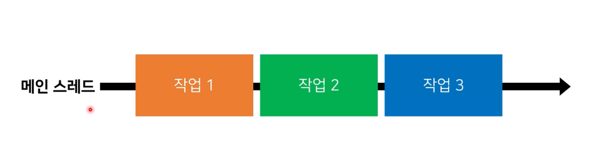
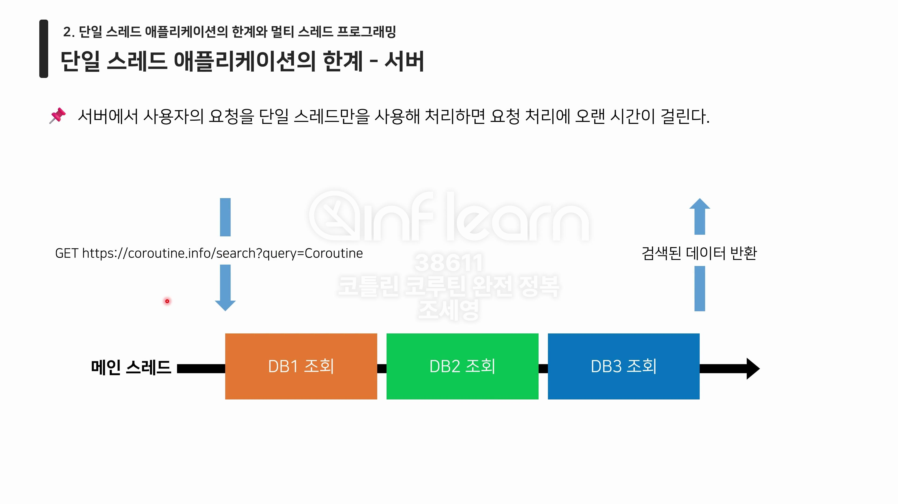
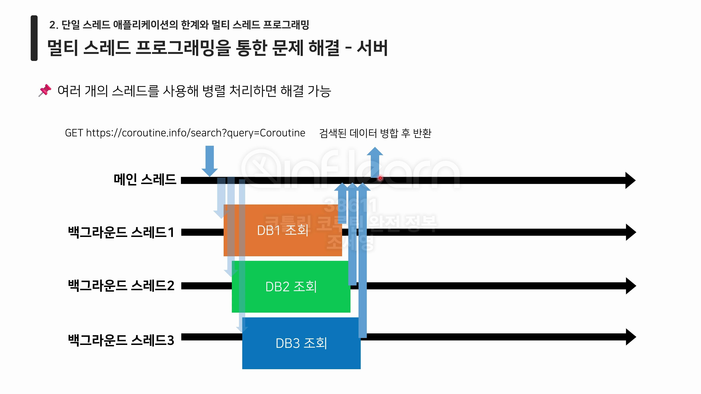

# :pushpin: 코틀린 코루틴 완전 정복

## :seedling: 스레드 기반 작업의 한계와 코루틴의 등장

### 1. JVM의 프로세스와 스레드
- Kotlin 애플리케이션의 실행 진입점은 main 함수를 통해 만들어진다.
- main 함수를 실행 요청하면, JVM은 프로세스를 시작하고 메인(main) 스레드를 생성해 코드를 실행한 후 종료한다.

```kotlin
fun main() {
    println("[${Thread.currentThread().name}] 시작")
    Thread.sleep(1000L)
    println("[${Thread.currentThread().name}] 종료")
}
```


### 2. 단일 스레드 애플리케이션의 한계와 멀티 스레드 프로그래밍
**단일 스레드 애플리케이션이란?**
- 스레드 하나만 사용해 실행되는 애플리케이션
- 스레드는 한 번에 하나의 작업 밖에 수행하지 못한다. 메인 스레드 또한 예외가 아니다.



**단일 스레드 애플리케이션의 한계 - 안드로이드**
- 안드로이드 애플리케이션의 경우 메인 스레드에서 사용자의 입력을 받고 UI를 그리는 작업을 반복적으로 한다.
- 만약 메인 스레드가 오래 걸리는 작업에 의해 점유되면, 앱이 버벅이고 ANR이 발생한다.

**단일 스레드 애플리케이션의 한계 - 서버**
- 서버에서 사용자의 요청을 단일 스레드만을 사용해 처리하면 요청 처리에 오랜 시간이 걸린다.



**멀티 스레드 프로그래밍이란?**
- 여러 개의 스레드를 사용해 작업을 처리하는 프로그래밍 기법

**멀티 스레드 프로그래밍을 통한 문제 해결 - 안드로이드**
- 다른 스레드를 추가로 사용해 오래 걸리는 작업을 처리하면 문제를 해결할 수 있다.

**멀티 스레드 프로그래밍을 통한 문제 핵결 - 서버**
- 여러 개의 스레드를 사용해 병렬 처리하면 해결 가능

