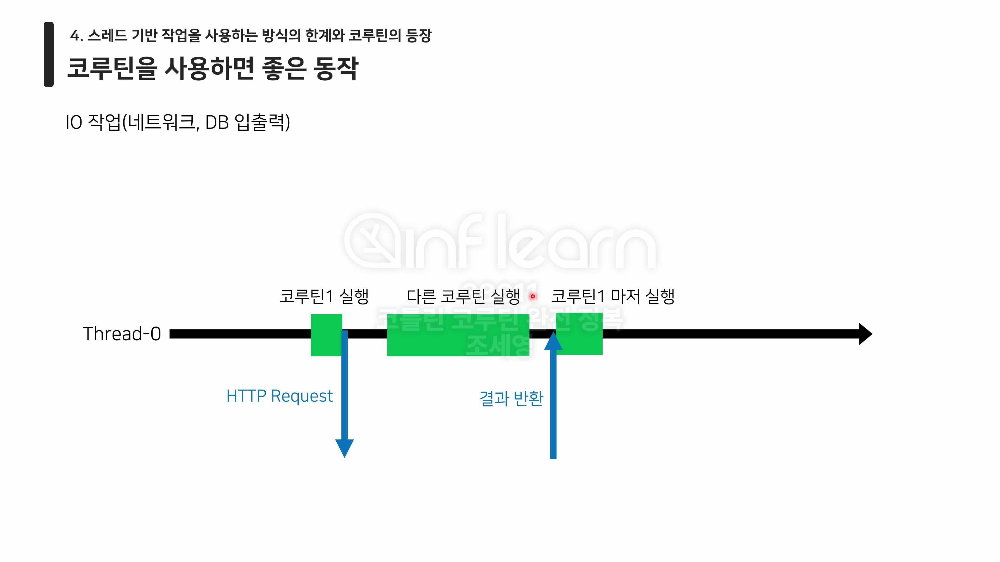

# :pushpin: 코틀린 코루틴 완전 정복

## :seedling: 스레드 기반 작업의 한계와 코루틴의 등장

### 1. JVM의 프로세스와 스레드
- Kotlin 애플리케이션의 실행 진입점은 main 함수를 통해 만들어진다.
- main 함수를 실행 요청하면, JVM은 프로세스를 시작하고 메인(main) 스레드를 생성해 코드를 실행한 후 종료한다.

```kotlin
fun main() {
    println("[${Thread.currentThread().name}] 시작")
    Thread.sleep(1000L)
    println("[${Thread.currentThread().name}] 종료")
}
```


### 2. 단일 스레드 애플리케이션의 한계와 멀티 스레드 프로그래밍
**단일 스레드 애플리케이션이란?**
- 스레드 하나만 사용해 실행되는 애플리케이션
- 스레드는 한 번에 하나의 작업 밖에 수행하지 못한다. 메인 스레드 또한 예외가 아니다.


**단일 스레드 애플리케이션의 한계 - 안드로이드**
- 안드로이드 애플리케이션의 경우 메인 스레드에서 사용자의 입력을 받고 UI를 그리는 작업을 반복적으로 한다.
- 만약 메인 스레드가 오래 걸리는 작업에 의해 점유되면, 앱이 버벅이고 ANR이 발생한다.

**단일 스레드 애플리케이션의 한계 - 서버**
- 서버에서 사용자의 요청을 단일 스레드만을 사용해 처리하면 요청 처리에 오랜 시간이 걸린다.


**멀티 스레드 프로그래밍이란?**
- 여러 개의 스레드를 사용해 작업을 처리하는 프로그래밍 기법

**멀티 스레드 프로그래밍을 통한 문제 해결 - 안드로이드**
- 다른 스레드를 추가로 사용해 오래 걸리는 작업을 처리하면 문제를 해결할 수 있다.

**멀티 스레드 프로그래밍을 통한 문제 핵결 - 서버**
- 여러 개의 스레드를 사용해 병렬 처리하면 해결 가능


### 3. 스레드, 스레드 풀을 사용한 멀티 스레드 프로그래밍
1. Thread를 사용한 멀티 스레드 프로그래밍

```java
public class Thread implements Runnable {}
```

```kotlin
class ExampleThread : Thread() {
    override fun run() {
        println("[${Thread.currentThread().name}] 시작")
        Thread.sleep(2000L)
        println("[${Thread.currentThread().name}] 종료")
    }
}

fun main() {
    println("[${Thread.currentThread().name}] 시작")
    ExampleThread().start()
    Thread.sleep(1000L)
    println("[${Thread.currentThread().name}] 종료")
}
```

간단한 버전 
```kotlin
fun main() {
    println("[${Thread.currentThread().name}] 시작")
    thread {
        println("[${Thread.currentThread().name}] 시작")
        Thread.sleep(2000L)
        println("[${Thread.currentThread().name}] 종료")
    }
    Thread.sleep(1000L)
    println("[${Thread.currentThread().name}] 종료")
}
```


**Thread를 사용한 멀티 스레드 프로그래밍의 장점**
1. 간단하게 병렬 처리가 가능하다.

**Thread를 사용한 멀티 스레드 프로그래밍의 한계**
1. Thread의 start 함수를 호출할 때마다 새로운 스레드가 생성되고 재사용이 어렵다.
-> 스레드는 비싼 자원이다. 재사용이 어려운 것은 치명적이다.
2. 개발자가 스레드 생성과 관리에 대한 책임을 가진다.
-> 개발자의 실수나 오류로 인해 메모리 누수가 일어날 수 있다.
-> 프로그램이 복잡해질수록 스레드의 생성과 관리를 직접 하는 것은 불가능에 가까워진다.

**문제 해결 방법**
- 한번 생성한 스레드를 간편하게 재사용할 수 있어야 한다.
- 스레드의 관리를 미리 구축한 시스템에서 해야한다.
    - 스레드 관리 책임을 시스템에 넘긴다.

> Executor 프레임웍이 등장

**Executor 프레임웍이란?**
- 스레드의 집합인 스레드풀을 미리 생성해놓고, 작업을 요청받으면 쉬고 있는 스레드에 작업을 분배할 수 있는 시스템

```java
public interface ExecutorService extends Executor { }
```


**Executor 프레임웍의 의의**
1. 개발자가 더이상 스레드를 직접 관리하지 않도록 했다.
-> 개발자가 할 일은 스레드 개수 지정과 작업 제출 뿐이다.
2. 스레드의 재사용을 손쉽게 가능하게 만들었다.

**Executor 프레임웍의 한계**
- 스레드 블로킹이 일어난다.
  - 스레드 블로킹이란: 스레드가 사용될 수 없는 상태에 있는 것을 뜻함

**이후의 멀티스레드 프로그래밍과 한계**
1. CompletableFuture를 사용해 콜백 형식으로 문제 해결 -> 콜백 지옥 생김, 예외 처리 어려움 
2. RxJava를 사용해 결과값을 데이터 스트림으로 처리 -> 여전히 발생하는 스레드 블로킹
> 작업이 스레드를 기반으로 동작한다는 한계를 가짐 

### 4. 스레드 기반 작업을 사용하는 방식의 한계와 코루틴의 등장
**스레드 기반 작업의 문제**
1. 스레드 기반 작업들은 작업의 전환이 어렵고, 전환에 드는 비용이 비싸다.
2. 간단한 작업에서는 앞서 본 콜백 방식을 사용하거나 체이닝 함수를 사용하는 방식으로 
스레드 블로킹 문제를 해결할 수 있지만, 실제 애플리케이션은 작업 간의 종속성이 복잡해 스레드 블로킹이 발생하는 것은 필연적이다.


**코루틴을 사용한 스레드 블로킹 문제 해결**
- 코루틴에서는 `코루틴`이라 불리는 작업 단위를 사용한다.
  - 코루틴은 스레드의 사용 권한을 양보할 수 있다.
  - 즉, 스레드에 붙였다 뗐다 할 수 있는 작업 단위

-> 코루틴은 경량 스레드라고 불린다


**코루틴을 사용하면 좋은 동작**
- IO 작업 (네트워크, DB 입출력)


**코루틴을 사용해도 성능이 비슷한 작업**
- CPU 바운드 작업
  - 이미지, 동영상의 인코딩 혹은 디코팅
  - 대용량 데이터 변환

스레드 기반 작업 vs 코루틴

| | 입출력 (IO) 작업 | CPU 바운드 작업 |
|---|---|---|
|스레드 기반 작업|느림|비슷|
|코루틴|빠름|비슷|


