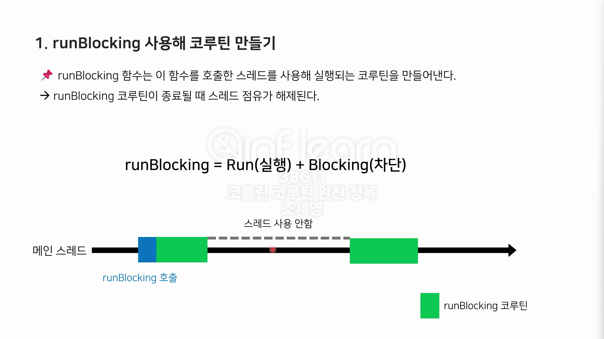
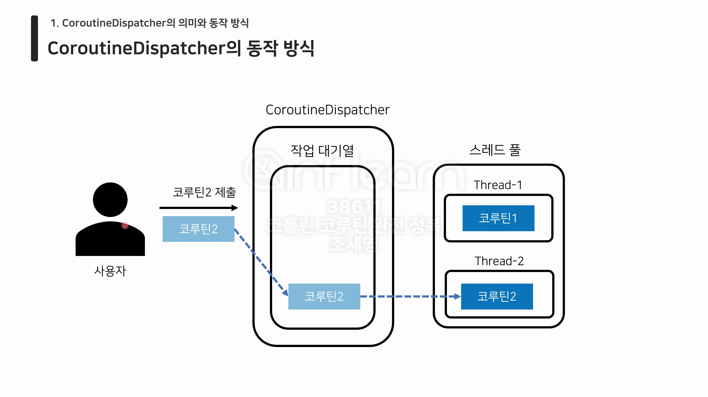
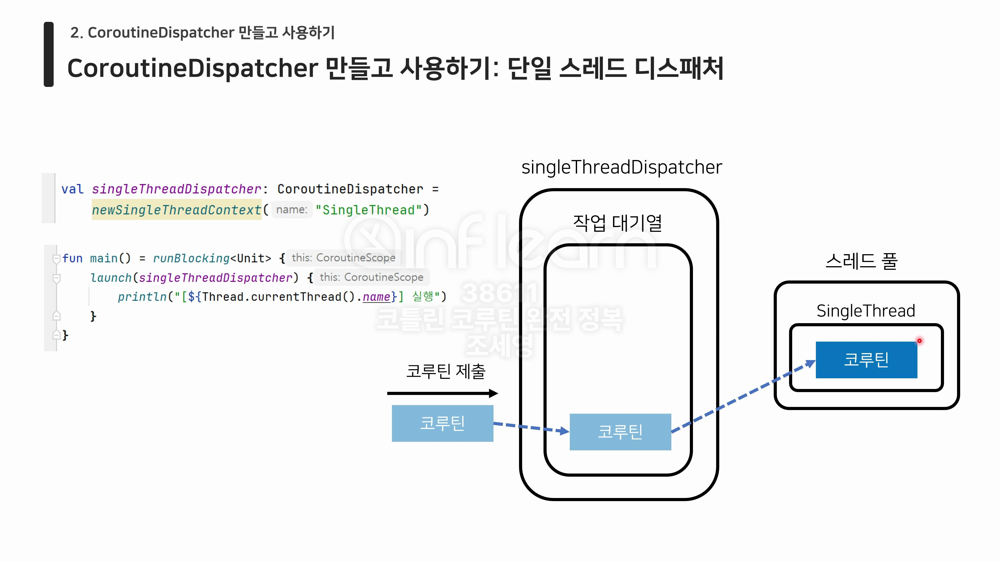
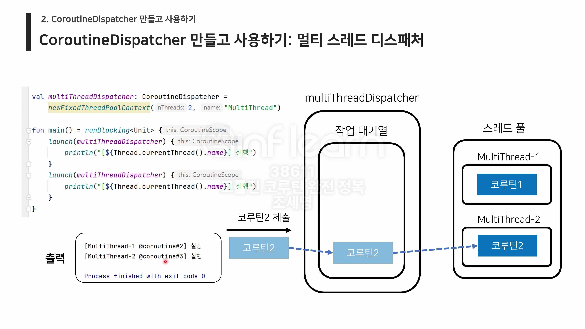

# :pushpin: 코틀린 코루틴 완전 정복
## :seedling: Hello Coroutines

### 첫 코루틴 실행하기
1. runBlocking 사용해 코루틴 만들기
- runBlocking 함수는 이 함수를 호출한 스레드를 사용해 실행되는 코루틴을 만들어낸다.
- runBlocking 코루틴이 종료될 때 스레드 점유가 해제된다.

**runBlocking = Run(실행) + Blocking (차단)**



### CoroutineDispatcher의 의미와 동작 방식
CoroutineDispatcher의 의미
- Dispatch (보내다) + er: 보내는 주체
- Coroutine + Dispatcher: 코루틴을 보내는 주체
- CoroutineDispatcher: 코루틴을 스레드로 보내 실행시키는 객체



CoroutineDispatcher 만들고 사용하기: 단일 스레드 디스패처
```kotlin
val singleThreadDispatcher: CoroutineDispatcher =
    newSingleThreadContext("SingleThread")
```



CoroutineDispatcher 만들고 사용하기: 멀티 스레드 디스패처

```kotlin
val multiThreadDispatcher: CoroutineDispatcher =
    newFixedThreadPoolContext(2, "MultiThread")
```


