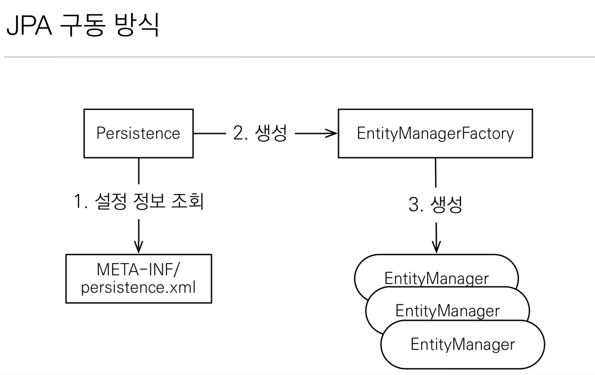

## JPA 실습

### JPA 구동 방식

### 객체와 테이블을 생성하고 매핑하기

- @Entity: JPA가 관리할 객체
- @Id: 데이터베이스 PK와 매핑 

### 주의

- 엔티티 매니저 팩토리는 하나만 생성해서 애플리케이션 전체에서 공유
- 엔티티 매니저는 쓰레드간에 공유X (사용하고 버려야한다).
- JPA의 모든 데이터 변경은 트랜잭션 안에서 실행

### JPQL 소개

- 가장 단순한 조회 방법
    - EntityManager.find()
    - 객체 그래프 탐색 (a.getB().getC())
- 나이가 18살 이상인 회원을 모두 검색하고 싶다면?

### JPQL

- JPA를 사용하면 엔티티 객체를 중심으로 개발
- 문제는 검색 쿼라
- 검색을 할 때도 테이블이 아닌 엔티티 객체를 대상으로 검색
- 모든 DB 데이터를 객체로 변환해서 검색하는 것은 불가능
- 애플리케이션이 필요한 데이터만 DB에서 불러오려면 결국 검색 조건이 포함된 SQL이 필요 

### JPQL

- JPA는 SQL을 추상화한 JPQL이라는 객체 지향 쿼리 언어 제공
- SQL과 문법 유사, SELECT, FROM, WHERE, GROUP BY, HAVING, JOIN 지원
- JPQL은 엔티티 객체를 대상으로 쿼리
- SQL은 데이터베이스 테이블을 대상으로 쿼리 
- 테이블이 아닌 객체를 대상으로 검색하는 객체 지향 쿼리
- SQL을 추상화해서 특정 데이터베이스 SQL에 의존 X
- JPQL을 한다미로 정의하면 객체 지향 SQL

