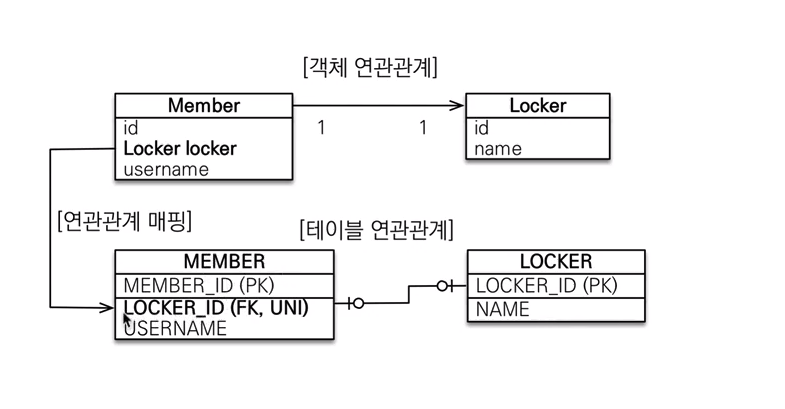
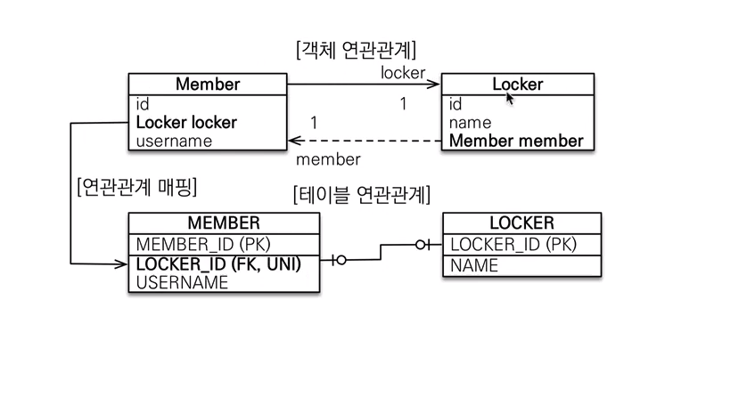
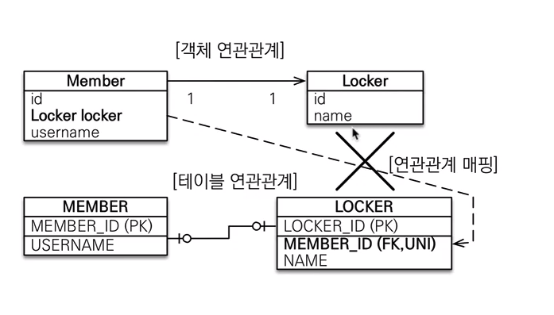
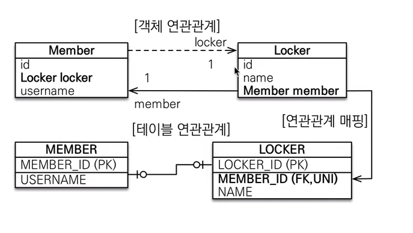

# :book: 자바 ORM 프로그래밍 기본편 

## :pushpin: 일대일[1:1]

### 일대일 관계

- 일대일 관계는 그 반대도 일대일

- 주 테이블이나 대상 테이블 중에 외래 키 선택 가능

    - 주 테이블에 외래 키
    - 대상 테이블에 외래 키
- 외래 키에 데이터베이스 유니크(UNI) 제약조건 추가 

### 일대일: 주 테이블에 외래 키 단방향

- 다대일(@ManyToOne) 단방향 매핑과 유사 

### 일대일: 주 테이블에 외래 키 양방

- 다대일 양방향 매핑처럼 외래 키가 있는 곳이 연관관계의 주인
- 반대편은 mappedBy 적용

### 일대일: 대상 테이블에 외래 키 단방향

- 단방향 관계는 JPA 지원 X
- 양방향 관계는 지원

### 일대일: 대상 테이블에 외래 키 양방향

### 일대일 정리

- 주 테이블에 외래 키
    - 주 객체가 대상 객체의 참조를 가지는 것처럼 주 테이블에 외래 키를 두고 대상 테이블을 찾음
    - 객체지향 개발자 선호
    - JPA 매핑 편리
    - 장점: 주 테이블만 조회해도 대상 테이블에 데이터가 있는지 확인 가능
    - 단점: 값이 없으면 외래 키에 null 허용
    
- 대상 테이블에 외래 키
    - 대상 테이블에 외래 키가 존재
    - 전통적인 데이터베이스 개발자 선호
    - 장점: 주 테이블과 대상 테이블을 일대일에서 일대다 관계로 변경할 때 테이블 구조 유지
    - 단점: 프록시 기능의 한계로 지연 로딩으로 설정해도 항상 즉시 로딩됨
    