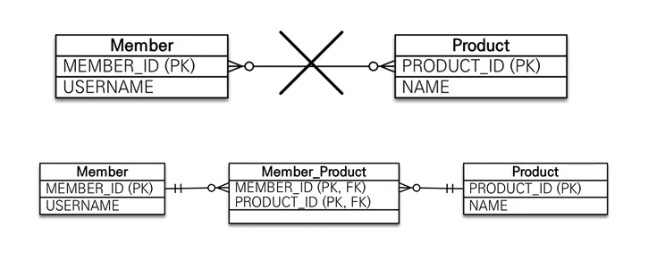
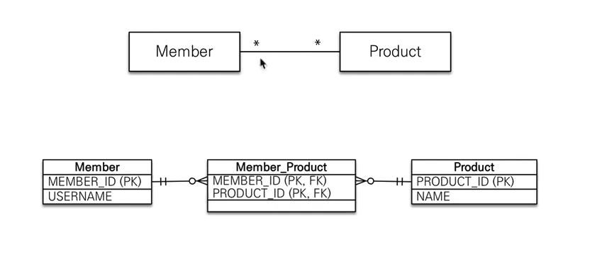
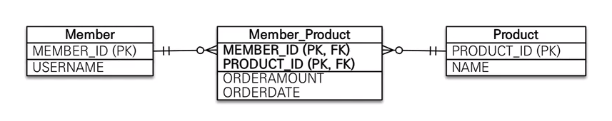
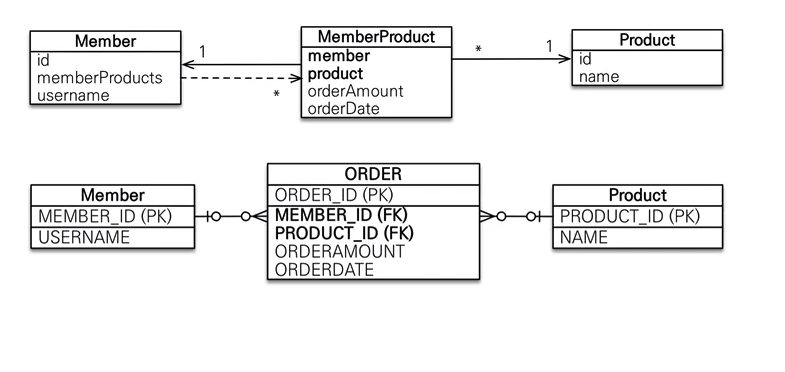

# :book: 자바 ORM 프로그래밍 기본편 

## :pushpin: 다대다 [N:M]

### 다대다

- 관계형 데이터베이스는 정규화된 테이블 2개로 다대다 관계를 표현할 수 없음
- 연결 테이블을 추가해서 일대다, 다대일 관계로 풀어내야함

- 객체는 컬렉션을 사용해서 객체 2개로 다대다 관계 가능

### 다대다 매핑

- @ManyToMany 사용
- @JoinTable로 연결 테이블 지정
- 다대다 매핑: 단방향, 양방향 가능

### 다대다 매핑의 한계

- 편리해 보이지만 실수에서 사용 X
- 연결 테이블이 단순히 연결만 하고 끝나지 않음
- 주문시간, 수량 같은 데이터가 들어올 수 있음

### 다대다 한계 극복

- 연결 테이블용 엔티티 추가(연결 테이블을 엔티티로 승격)
- @ManyToMany -> @OneToMany, @ManyToOne

