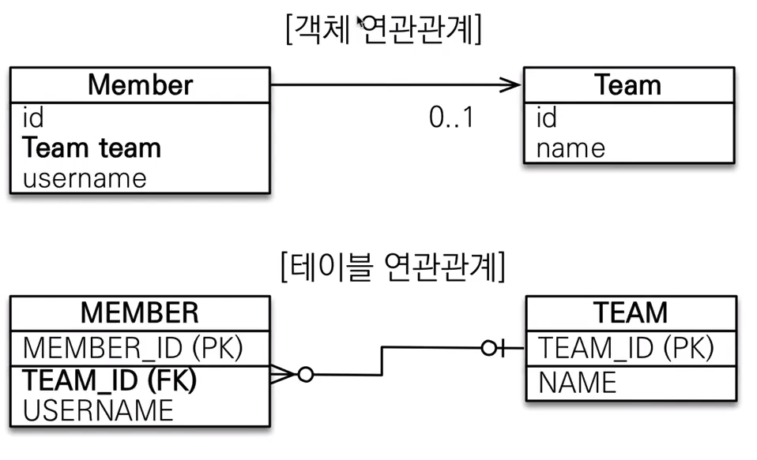

# :book: 자바 ORM 프로그래밍 기본편 

## :pushpin: 연관관계 매핑

> 목표

- 객체와 테이블 연관관계의 차이를 이해
- 객체의 참조와 테이블의 외래 키를 매핑
- 용어 이해
    - 방향(Direction): 단방향, 양방향
    - 다중성(Multiplicity): 다대일(N:1), 일대다(1:N), 일대일(1:1), 다대다(N:M) 이해
    - 연관관계의 주인(Owner): 객체 양방향 연관관계는 관리 주인이 필요
    

### 연관관계가 필요한 이유

> 객체지향 설계의 목표는 자율적인 객체들의 협력 공동체를 만드는 것이다.' - 조영호 (객체지향의 사실과 오해)


### 예제 시나리오

1. 회원과 팀이 있다.
2. 회원은 하나의 팀에만 소속될 수 있다.
3. 회원과 팀은 다대일 관계다.


### 객체를 테이블에 맞추어 모델링 (연관관계가 없는 객체)


### 객체를 테이블에 맞추어 모델링

> 참조 대신에 외래 키를 그대로 사용 

```
@Entity
public class Member {

    @Id @GeneratedValue
    @Column(name = "MEMBER_ID")
    private Long id;

    @Column(name = "USERNAME")
    private String name;

    @Column(name = "TEAM_ID")
    private Long teamId;
}

```

````
@Entity
public class Team {

    @Id
    @GeneratedValue
    @Column(name = "TEAM_ID")
    private Long id;
    private String name;
}

````

> 외래 키 식별자를 직접 다룸

````
// 팀 저장 
Team team = new Team();
team.setName("Real Madrid")
em.persist(team);

// 회원 저장
Member member = new Memmber();
member.setUsername("크리스티아누 호날두");
member.setTeamId(team.getId());
em.persist(member);
````

> 식별자로 다시 조회, 객체 지향적인 방법은 아니다.

````
// 조회 
Member findMember = em.find(Member.class, member.getId());

// 연관관계가 없음 
Team findTeam = em.find(Team.class, team.getId());
````

> 객체를 테이블에 맞추어 데이터 중심으로 모델링하면, 협력 관계를 만들 수 없다.

- 테이블은 외래 키로 조인을 사용해서 연관된 테이블을 찾는다.
- 객체는 참조를 사용해서 연관된 객체를 찾는다.
- 테이블과 객체 사이에는 이런 큰 간격이 있다.


## 단방향 연관관계


### 객체 지향 모델링

> 객체 연관관계 사용



> ORM 매핑


````
@Entity
public class Member {

    @Id @GeneratedValue
    @Column(name = "MEMBER_ID")
    private Long id;

    @Column(name = "USERNAME")
    private String username;

//  @Column(name = "TEAM_ID")
//  private Long teamId

    @ManyToOne
    @JoinColumn(name = "TEAM_ID")
    private Team team;  // 멤버는 여러명, 팀은 하나 (ManyToOne)
}
````

> 연관관계 저장

````
// 팀 저장
Team team = new Team();
team.setName("Real Madrid");
em.persist(team);

// 회원 저장
Member member = new Member();
member.setName("크리스티아누 호날두);
member.setTeam(team);   // 단방향 연관관계 설정, 참조 저장
em.persist(member):

````

> 연관관계 수정

````
// 새로운 팀B
Team teamB = new Team();
teamB.setName("맨체스터 유나이티드");
em.persist(teamB);

// 호날두에 새로운 팀 설정
member.setTeam(teamB);
````