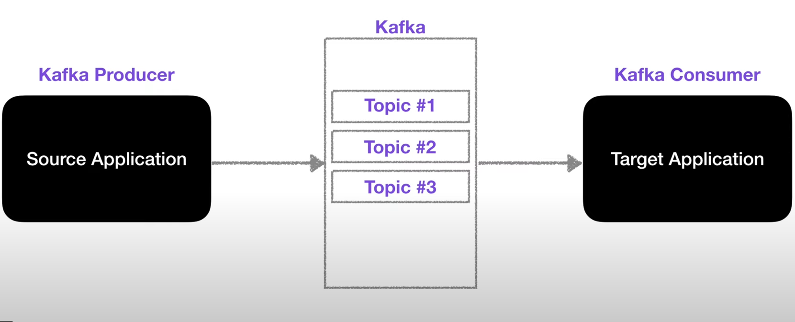
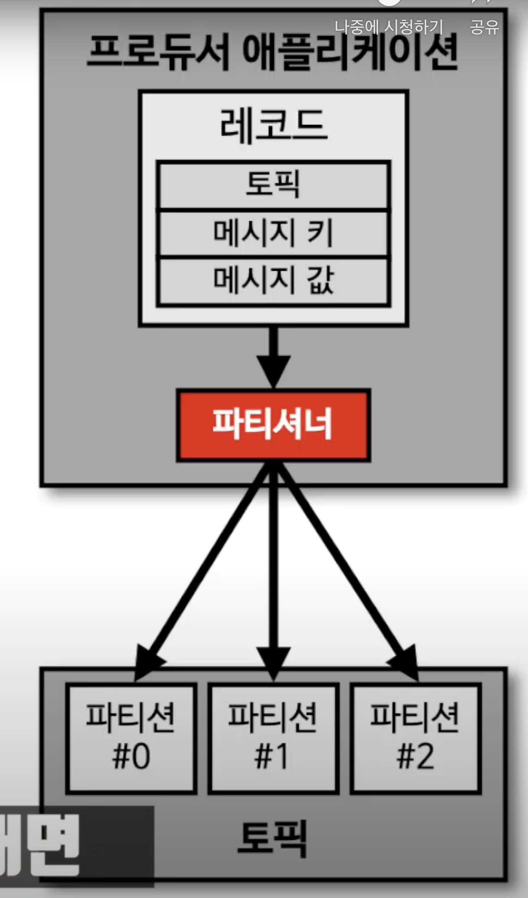

## :pushpin: 아파치 카프카 for beginners

### :seedling: 아파치 카프카 개요 및 설명

### Before Kafka

### After Kafka

### Kafka feature

### Topic
- 카프카에는 다양한 데이터가 들어갈 수 있는데 데이터가 들어가는 공간을 `토픽`이라고 부름
- 카프카에서는 토픽을 여러개 생성할 수 있음
- 토픽은 데이터베이스의 테이블이나 파일시스템의 폴더와 유사한 성질을 가지고 있다.
- 이 토픽에 `프로듀서`가 데이터를 넣게되고 `컨슈머`는 데이터를 가져가게됨
- 토픽은 이름을 가질 수 있는데 목적에 따라 `클릭로그`, `send_sms`, `location_log` 등과 같이 무슨 데이터를 담는지 명확하게 명시하면 추후 유지보수시 편리

### 파티션
- 하나의 `토픽`은 `여러개의 파티션으로 구성`될 수 있음
- 첫번째 파티션은 0번부터 시작

#### 파티션이 여러개인 경우
- 프로듀서가 데이터를 보낼 때 키를 지정할 수 있음
  - 키가 `null`이고 기본 파티셔너 사용할 경우 -> 라운드 로빈(Round robin)으로 할당
  - 키가 있고 기본 파티셔너 사용할 경우 -> 키의 해시(hash) 값을 구하고 특정 파티션에 할당
- 주의사항: 파티션을 늘릴 수 있지만 줄일 수는 없음

#### Partition의 record는 언제 삭제되는가?
- log.retention.ms: 최대 record 보존 시간
- log.retention.byte: 최대 record 보존 크기 (byte)

## broker & replication & ISR 
### 브로커 
- **카프카가 설치되어 있는 서버 단위**를 말한다.
- 보통 3개 이상의 broker로 구성하여 사용하는 것을 권장함

### replication
- replication, 즉 `복제`는 클러스터에서 서버가 장애가 생길 때 카프카의 `가용성`을 보장하는 가장 좋은 방법
- `replication`은 `파티션(partition)의 복제`를 뜻함 
- 브로커 개수에 따라서 replication 개수가 제한됨
  - 브로커 개수가 3이면 replication은 4가 될 수 없다
  - 원본 파티션: Leader partition
  - 복제본 파티션: Follower partition
- replication은 파티션의 고가용성을 위해 사용됨
- replication 개수가 늘어나면 그만큼 브로커의 리소스 사용량도 많아진다.
- 3개 이상의 브로커를 사용할때 replication의 개수는 3으로 설정하는 것을 추천

### ISR
- Leader, Follower partition을 합쳐서 `ISR` (In Sync Replica)라고 볼 수 있음 

### 파티셔너

- `파티셔너`는 카프카 프로듀서의 중요개념 중 하나
- **프로듀서가 데이터를 보내면** 무조건 `파티셔너`를 통해서 브로커로 데이터가 전송된다.
- `파티녀서`는 **데이터를 토픽에 어떤 파티션에 넣을지 결정하는 역할**을 함
- 레코드에 포함된 `메시지 키` 또는 `메시지 값`에 따라 `파티션의 위치`가 결정되게 됨
- 동일한 메시지 키를 가진 경우 동일한 해쉬 로직을 생성하여 동일한 파티션에 들어가기 때문에 순서를 지켜서 데이터를 처리할 수 있다는 장점이 있다.
- 메시지 키가 없는 경우는 라운드 로빈으로 파티션에 들어간다.
- 카프카에서는 커스텀 파티셔너를 만들 수 있도록 파티셔너 인터페이스를 제공함 