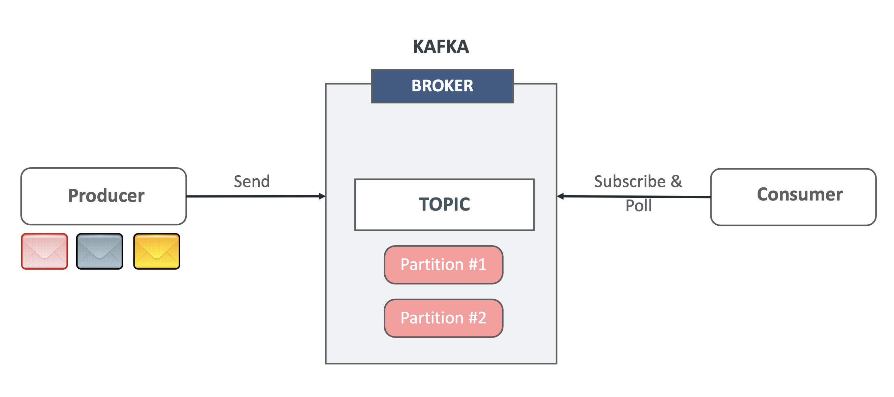
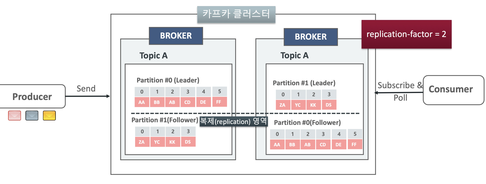

# :pushpin: Kafka Topic, Producer, Consumer 이해 및 CLI로 실습해보기

### 카프카 개요

### 토픽(Topic) 개요
- Topic은 Partition으로 구성된 일련의 로그 파일
  - RDBMS의 Table과 유사한 기능
  - Topic은 Key와 Value 기반의 메시지 구조이며 Value로 어떤 타입의 메시지도 가능(문자열, 숫자값, 객체, Json, Avro, Protobuf 등)
  - 로그 파일과 같이 연속적으로 추가되는 발생하는 데이터를 저장하는 구조
- Topic은 시간의 흐름에 따라 메시지가 순차적으로 물리적인 파일에 write됨

### 토픽과 파티션
- Topic은 1개 이상의 파티션을 가질 수 있음
- Topic의 Partition은 카프카의 병렬 성능과 가용성 기능의 핵심 요소이며, 메시지는 병렬 성능과 가용성을 고려한 개별 파티션에 분산 저장됨

### 토픽과 파티션, 오프셋
- 개별 파티션은 정렬되고, 변경할 수 없는 일련의 레코드로 구성된 로그 메시지
- 개별 레코드는 offset으로 불리는 일련 번호를 할당받음
- 개별 파티션은 다른 파티션과 완전히 독립적임
- 개별 파티션내에서 정렬되고 offset이 할당됨

### 토픽과 파티션의 병렬 분산 처리
- 메시지는 병렬 성능과 가용성을 고려한 방식으로 토픽내의 개별 파티션들에 분산 저장됨
- 토픽의 파티션들은 단일 카프카 브로커뿐만 아니라 여러개의 카프카 브로커들에 분산 저장됨

