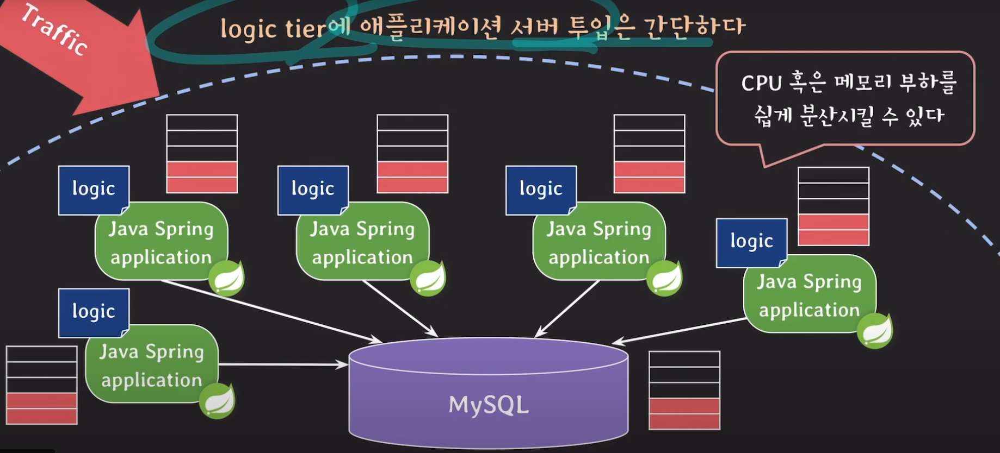
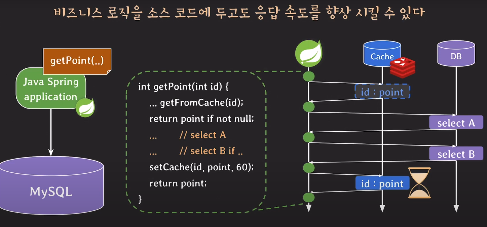

## :pushpin: 인프런 시니어 백엔드 개발자가 알려주는 데이터베이스 개론 & SQL
### Three-tier architecture
- 오늘날의 IT 회사들은 일반적으로 client-server architecture의 한 종류인
`three-tier architecture` 모델로 서비스를 개발한다

**Presentation tier**
- 사용자에게 보여지는 부분을 담당하는 tier

**Logic tier**
- 서비스와 관련된 기능과 정책 등등 비즈니스 로직을 담당하는 tier

**Data tier**
- 데이터를 저장하고 관리하고 제공하는 역할을 하는 tier

### 비즈니스 로직이란?
e.g 당근마켓의 비즈니스 로직
- 회원 가입 / 탈퇴
- 상품 리스트업 알고리즘
- 상품 정보 업로드 기능
- 상품 검색 기능
- 메시지 기능
- ...

### 데이터
e.g 당근마켓의 데이터
- 회원 정보
- 상품 정보
- 판매 / 구매 내역
- 지역 정보
- ...

### Stored procedure
- RDBMS에 저장되고 사용되는 프로시저
- 주된 사용 목적은 비즈니스 로직 구현

### stored procedure 장점
- application에 transparent 하다
- network traffice을 줄여서 응답 속도를 향상시킬 수 있다
- 여러 서비스에서 재사용 가능하다
- 민감한 정보에 대한 접근을 제한할 수 있다

### stored procedure의 단점 & 실무에서 쓰기에 조심스러운 이유
- stored procedure를 쓰게 되면 유지 관리 보수 비용이 커진다
  - 소스코드 봤다가 프로시저 코드 봤다가...
  - 버전 관리를 둘 다 해줘야 한다
  - 프로시저 관련 문법을 잘 알아야 한다

- DB 서버를 추가하는 것은 간단한 작업이 아니다

- logic tier에 애플리케이션 서버 투입은 간단하다

- stored procedure가 언제나 transparent인건 아니다
- transparent 하다고 무조건 좋은 것도 아니다
- 재사용 가능하다는 것이 양날의 검이 될수도... (통제되지 않는 사용으로 모두에게 문제가 발생할 수 있다)
- 비즈니스 로직을 소스코드에 두고도 응답 속도를 향상시킬 수 있다

- 응답 속도를 향상시키면서 DB 부하까지도 줄일 수 있다
- stored procedure가 민감한 정보에 대한 접근을 완벽히 제한할 순 없다
- DB 혹은 테이블 접근을 막으면 개발 및 CS 업무의 신속함이 떨어진다

이외에도
- procedure로는 복잡하고 유연한 코드를 작성하기 어렵다
- 오늘날의 프로그래밍 언어는 훨씬 다양하고 강력한 기능들을 제공한다
- procedure는 가독성이 떨어진다
- procedure는 디버깅이 어렵다

