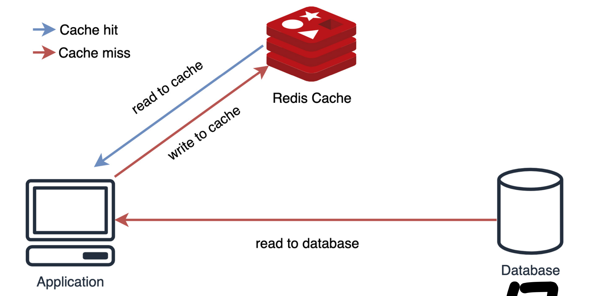
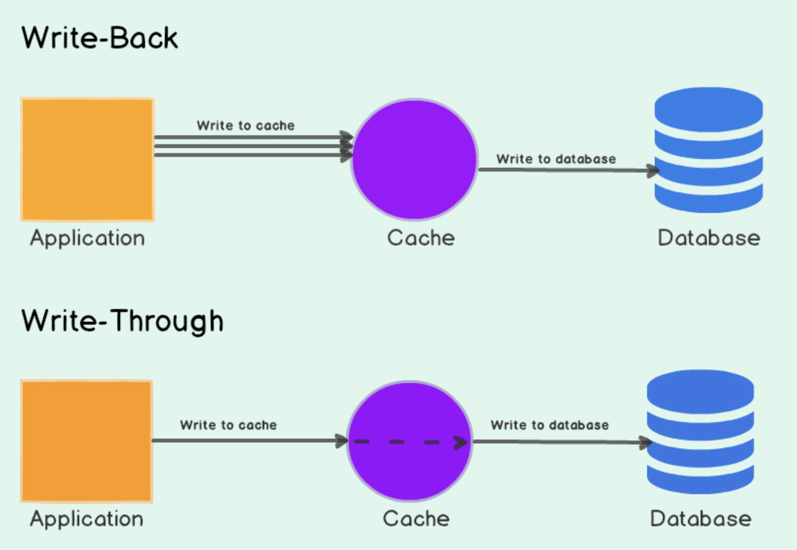
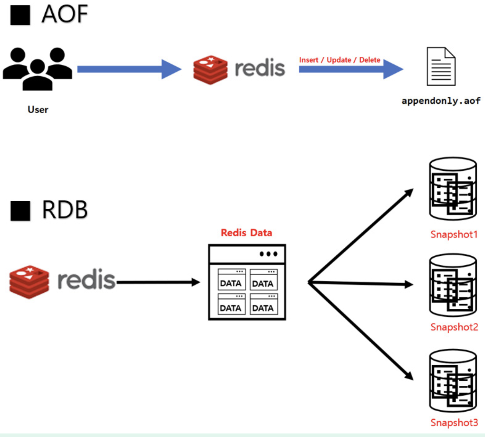
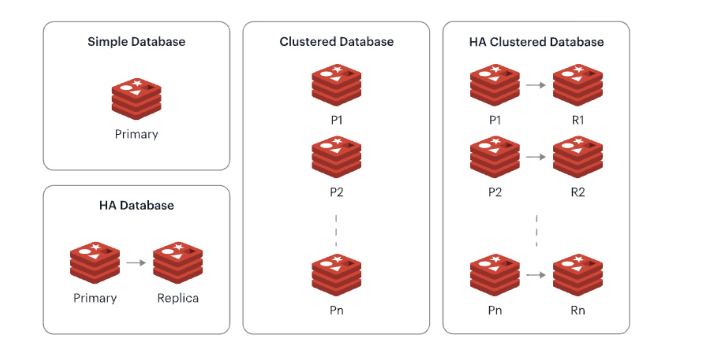

# :pushpin: Redis

## :seedling: Section 4. Redis와 MemCached
### MemCached
- Redis보다 더 빠르고 분산 데이터 처리가 가능하다.
- 더 적은 메타데이터를 사용하기 때문에 메모리 소비가 적다. (조금 더 빠르다)
- 다양한 타입을 지원하지 않고 데이터 영속성이 보장이 안된다. (문자열만 지원)
- 또한 시장의 파이가 Redis에 비해 작고 이로 인해서 업데이트 및 버그 수정이 느리다.

-> 그러니 맘 편하게 Redis를 사용하자

## :seedling: Section 5. 반드시 알아야하는 캐싱 전략
### 캐싱 전략 Look_Aside

- 읽기 작업에 최적화되어 있다.
- 캐시가 있다면 캐시를 내려주고, 없다면 DB를 조회 후 캐시를 재설정 및 결과로 사용한다.
- 과도한 트래픽 상황 즉 *Thundering Herd* 상황에 대해서 갑작스런 DB 부하가 몰릴 수 있으니 캐시 조회 시에 TTL을 확인하여 재할당하거나 다른 방어 로직을 추가해두자.

### 캐싱 전략 Write

**1. Write-Back (Write-Behind)**
- Write-Back 전략은 Redis를 InMemory DB로 활용하는 대표적인 방법
  - 보통 `Cron`과 함께 사용이 되고 `Bulk`로 데이터를 처리할 수 있는 방법
  - `Keys`보다는 `Scan`을 주로 활용하여 Redis 부하를 줄이자
  - 대표적으로 사용 가능한 형태: 좋아요와 같은 기능

**2. Write-Through**
- 데이터를 `Redis`와 `DB`에 동시에 저장하는 방법
- DB에 있는 데이터와 Redis에 있는 데이터의 일관성이 유지된다는 장점이 있다.
- Redis와 DB에 똑같은 데이터를 저장하는 것이기 때문에 2개의 Write 요청이 발생하는 것은 단점
- Write-Throuhg는 데이터를 DB와 Redis에 모두 저장하는 방법으로 Look-Aside와 가장 많이 사용이 되는 형태이다.

3. 파레토 형태는 절대 무시해서는 안된다. 캐시를 적극적으로 활용하자

## :seedling: Section 6. RDB vs AOF
### RDB vs AOF

1. **RDB**: `Cron`의 형태로 데이터를 `SnapShot`하여 저장을 한다. 
   - 스케쥴러의 형태이기 때문에 일부 데이터 유실 가능
   - 하지만 빠르고 효과적이다.
2. **AOF**: 모든 요청을 `커맨드`의 형태로 저장을 한다.
   - 영속성을 절대적으로 보장하지만 빈번한 처리라 리소스가 더 소요가 된다.
3. 무엇을 사용할지는 저장하는 데이터의 형태에 따라 다르다.

## :seedling: Section 7. Redis의 아키텍처
### Single Instance & Replication Instance

### HA와 고가용성
- HA: 고가용성 

### Redis의 Sync 과정

### Sentinel과 합의 과정과 홀수 노드를 선정해야 하는 이유

### Cluster과 효율적인 키 관리 기법
1. 고가용성(HA): 장애 상황에 대해서 자동 조치를 해주는 환경을 의미
2. Redis의 동기화 과정: ID 그룹과 OffSet을 통해서 동기화 진행여부를 결정 및 진행한다.
- ID가 다르다면: 전체 동기화
- ID가 같고 OffSet에 차이가 있다면 부분 동기화 진행

### 아키텍처
1. **단일 인스턴스**: 가장 빠르고 적용이 매우 쉽다. 또한 `RDB`나 `AOF`도 활용이 가능하기 때문에 데이터 유실 걱정도 없다. 하지만 고가용성이 보장되지 않는다.
2. **Replication**: `Replica`라는 복제본을 가지며 동작한다. 오프셋을 통해서 데이터를 지속적으로 비동기식으로 복제를 진행한다.
- 고가용성을 보장하지 않기 때문에 장애 상황시에 다음과 같이 수동으로 복구를 해야한다.
  - NO ONE 커멘드를 활용하여 복제에 대한 연결을 제거
  - 애플리케이션 코드를 수정
- 읽기 작업에 대한 분산 처리가 가능하기 때문에 성능 향상을 노릴 수 있다.
3. **Sentinel**: *레디스 인스턴스들의 모니터링 시스템*을 의미한다. 인스턴스 장애시에는 `쿼럼`이라는 합의 과정을 통해 자동으로 복제 인스턴스를 메인 인스턴스로 승급시켜준다.
4. **Cluster**: `샤딩 기법`을 활용해서 데이터를 분산 저장하는 아키텍처이다. `해시슬롯`이라는 방법을 통해서 샤드키의 위치를 효과적으로 관리한다. 

## :seedling: Section 8. Redis의 Pub/Sub 모델
### Redis Pub/Sub
1. Redis의 Pub/Sub은 휘발성 데이터이다. 메시지 수신을 보장하지 않고 유실이 가능하다.
2. Pub/Sub은 모든 인스턴스에게 전달이 된다.
3. Pub/Sub보다는 Stream 형태를 추천하며 Pub/Sub이 관심있다면 대표적인 Kafka에 대해서도 알아보자.

## :seedling: Section 9. Redis Script
### Script를 활용한 Redis Atomic 처리하는 방법
1. *Lua Script*라는 형태를 활용하여 여러가지 요청을 *Atomic*하게 처리 가능하다.
2. 주로 비동기식으로 요청을 받는 상황에서 매우 유용하게 활용이 가능하다.
   - *Eval*이라는 커맨드를 참고하자