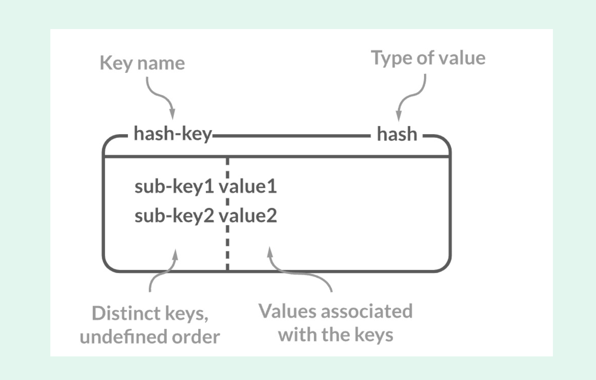

# :pushpin: Redis를 야무지게 사용하는 방법 

### Redis가 뭐야?

### Redis Collection String
Redis는 하나의 Key에 대해서 여러개의 value를 가질 수가 있고 value는 다양한 타입을 지원한다.

- `Redis`는 기본적으로 다양한 타입을 지원
- `SET`: 데이터를 그냥 문자열로 저장하는 방법, 이진 데이터도 포함되기 때문에 이미지도 저장 가능
- `SETNX`: key가 존재하지 않는 경우에 대해서만 새로운 key를 저장, 일반적인 SET에 비해 성능 차이가 조금 더 우수함
- `MSET`: Redis에서의 Bulk Write 방법, 네트워크 IO를 줄여주기 때문에 성능적으로 우수
- NX와 M을 조합하여 `MSETNX`로도 활용 가능
- `INCRBY`, `DECRBY`는 데이터가 정수형인 경우에 대해서 유효하게 동작 가능 

### Redis Collection List
- 일반적인 Linked List 형태로 Head와 Tail에 데이터를 삽입할 때 압도적인 성능을 보장
- 많이 사용되지는 않지만 Job Queue 또는 Pub/Sub 모델을 구현하는데 있어 일부 사용이 되며, `BRPOP`, `BLPOP`과 함께 사용이 되기도 한다.

### Redis Collection Set
- **특정 Key에 대한 여러개의 Value를 고유하게 저장할 때 사용이 된다.**
- 이때 `Sorted Set`이라는 부분도 존재를 하게 되는데, 해당 타입은 *랭킹*과 같은 기능을 구현하는데 있어서 매우 효과적이다.
- `ZADD`, `ZRANGE` 같은 명령어를 Sorted Set에 활용해보고 `SADD`, `SREM`, `SSCAN`, `SMISMEMBER` 같은 명령어를 일반 Set에 적용해보자.

### Redis Collection Hashes

#### 명령어
- `HSET`
  - HSET user-1 email_test test@naver.com
- `HSETNX`, `HMEST`
- `HGET`
  - HGET user-1 email_test
- `HMGET`
- `HSCAN`
- `HEXISTS`
- HKEYS with * (Redis는 싱글 스레드 방식으로 동작하기 때문에 HKEYS는 사용하면 안된다)

1. RDB와 유사한 형태로 데이터를 저장하는 타입이다.
- **Key**: **PK**
- **Field**: **Column**
- **Value**: **Raw**

2. 대표적으로 `HSET`, `HGET`이 존재하며 `HSCAN`, `HEXISTS` 같은 좀더 효과적인 명령어가 존재한다.
3. 부디 `Keys` 명령어를 적용하였다가 팀장님에게 혼나지말자.
- 카카오, 쿠팡 사례를 참고하자