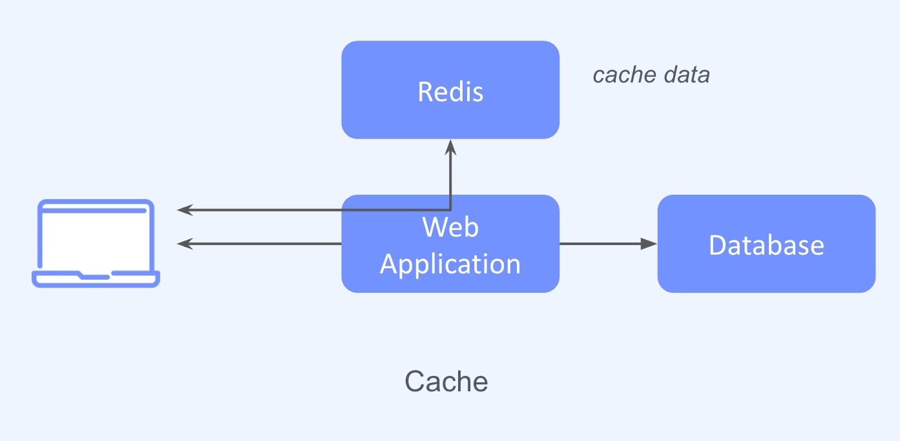

## :pushpin: Redis

### :seedling: Redis 소개
- Remote Dictionary Server
- in-memory 
- key-value
- 오픈소스 데이터베이스 (C언어로 구현)

### :seedling: Redis 특징
1. in-memory database 
   - 디스크가 아닌 메모리에 저장
   - 빠른 데이터 처리 속도
2. Persistent on Disk
   - 메모리에 있는 데이터를 데이터베이스에 저장하여 운용할 수 있음 (가용성이나 백업을 위한 조치)
   - `RDB`(Snapshot)
     - Redis Database의 약자
     - 일종의 데이터베이스 백업 방식 
     - 1시간 단위로 전체 백업 또는 일일단위로 백업
   - `AOF`(Append Only File)
   - 기본 설정으로는 RDB가 설정되어 있음
   - 단순 캐시 용도라면 RDB나 AOF를 끄고 사용할 수 있음. 단 중요하다면 두개 다 설정도 가능
3. key/value
4. data types
5. single thread

### :seedling: Data types
- 키에 대해서 어떤 데이터를 저장할 것인지에 따라 접근 
  - Strings
  - Lists
  - Sets
  - Hashes
  - Sorted sets
  - ...

### :seedling: Single Thread

- 클라이언트로부터 전달받은 명령을 Single Thread로 처리
- 동시에 여러 명령어를 처리하는 것이 아니라 하나씩 순차적으로 처리 
- 싱글 스레드 방식
- 싱글 스레드 구조이지만 초당 10만 건까지 지연없이 처리 가능하다고함

### :seedling: Thead IO (6.0 이상)
- I/O 부분에 별도의 멀티 스레드 적용  
- multiple threads for i/o
- 기존에 명령 처리 부분은 싱글 스레드로 처리

### :seedling: 활용 사례

1. Cache

2. Session Store

3. Pub/Sub

4. Message Queue
5. Geospatial (지리공간 데이터 ex. 위경도 정보)
6. leader board (사용자들간 점수 순위표, Sorted Set이란 데이터 타입을 통해 손쉽게 구현)

### :seedling: 요약
- **in-memory**
- **persistent Disk**
- **key/value**
- **data types**
- **single thread**

