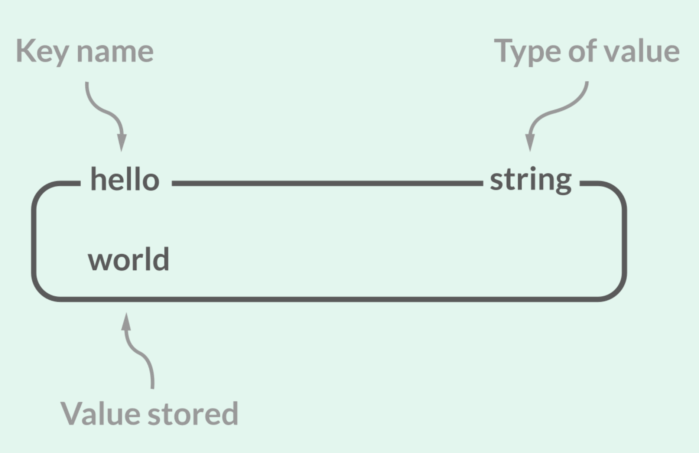
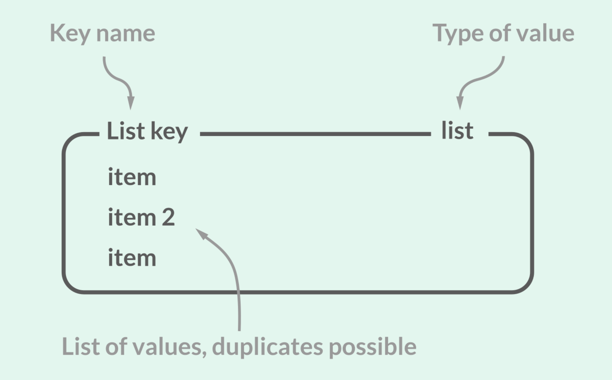

# :pushpin: Redis를 야무지게 사용하는 방법 

### Redis가 뭐야?

### Redis Collection String
Redis는 하나의 Key에 대해서 여러개의 value를 가질 수가 있고 value는 다양한 타입을 지원한다.

- `Redis`는 기본적으로 다양한 타입을 지원
- `SET`: 데이터를 그냥 문자열로 저장하는 방법, 이진 데이터도 포함되기 때문에 이미지도 저장 가능
- `SETNX`: key가 존재하지 않는 경우에 대해서만 새로운 key를 저장, 일반적인 SET에 비해 성능 차이가 조금 더 우수함
- `MSET`: Redis에서의 Bulk Write 방법, 네트워크 IO를 줄여주기 때문에 성능적으로 우수
- NX와 M을 조합하여 `MSETNX`로도 활용 가능
- `INCRBY`, `DECRBY`는 데이터가 정수형인 경우에 대해서 유효하게 동작 가능 

### Redis Collection List
- 일반적인 Linked List 형태로 Head와 Tail에 데이터를 삽입할 때 압도적인 성능을 보장
- 많이 사용되지는 않지만 Job Queue 또는 Pub/Sub 모델을 구현하는데 있어 일부 사용이 되며, `BRPOP`, `BLPOP`과 함께 사용이 되기도 한다.

