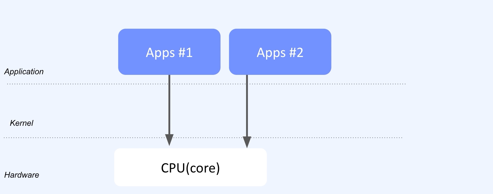
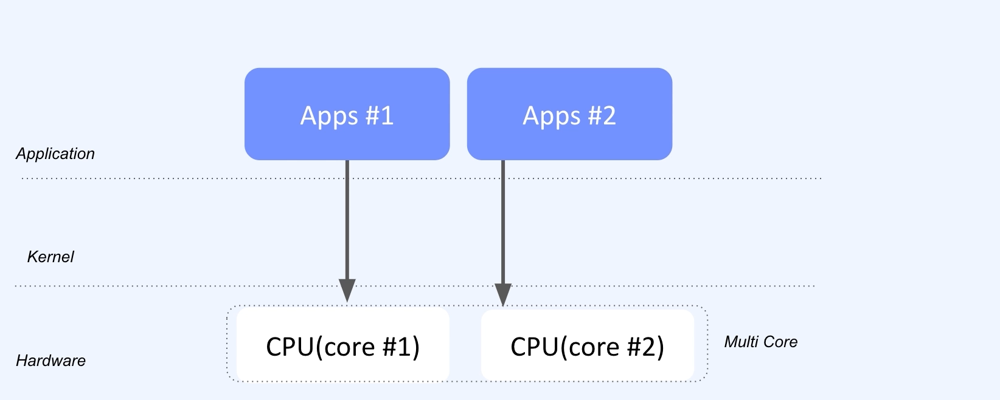
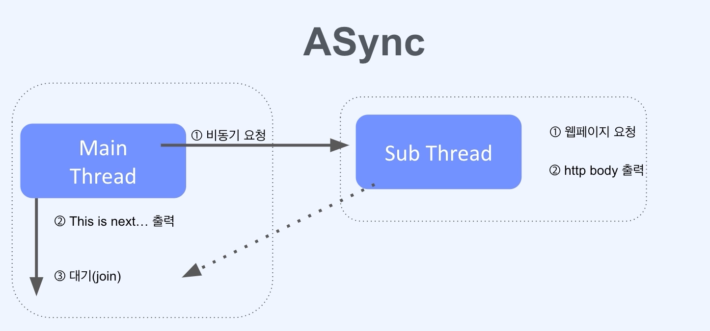

## :pushpin: Spring Webflux
### :seedling: Spring Webflux
- Reactive Stream API non-block, asynchronous
  - 마이크로서비스 GW
  - WebSocket
  - 실시간 채팅 서비스

### :seedling: CPU Bound vs I/O Bound
#### CPU Bound


- Context Switching

#### CPU
- `Register`
- `ALU`

#### Multi Core


#### I/O Bound
- `Input` / `Output`


### :seedling: Sync와 block non-block

Sync
1. Request
2. Response
3. Next ...

예시
```java
public class SynchronousExample {
    public static void main(String[] args) throws IOException, InterruptedException {
        HttpClient client = HttpClient.newHttpClinet();
        HttpRequest request = HttpRequest.newBuilder()
                .uri(URI.create("https://www.naver.com"))
                .build();
        
        HttpResponse<String> response =
                client.send(request, HttpResponse.BodyHandlers.ofString());
        
        System.out.println(response.body());
    }
}
```

ASync
1. Request
2. Next ...

예시
```java
public class AsynchronousExample {
    public static void main(String[] args) {
        HttpClient client = HttpClient.newHttpClinet();
        HttpRequest request = HttpRequest.newBuilder()
                .uri(URI.create("https://www.naver.com"))
                .build();
        
        CompletableFuture<HttpResponse<String>> future =
                client.sendAsync(request, HttpResponse.BodyHandlers.ofString());
        
        System.out.println("This is Next...");
        
        future.thenApply(HttpResponse::body)
                .thenAccept(System.out::println)
                .join();
    }
}
```




### Block / Non-Block
- 주로 i/o와 관련된 작업들을 말함

### Blocking


예시
```java
public static void main(String[] args) {
    int port = 8080;
    try (ServerSocket serverSocket = new ServerSocker(port)) {
        System.out.println("Started server and port " + port);
        
        while (true) {
            Socket clientSocket = serverSocket.accept();
            System.out.println("Connected Client: " + clientSocket.getInetAddress());
            
            BufferedReader reader = new BufferedReader(new InputStreamReader(clientSocket.getInputStream()));
            String inputLine = reader.readLine();
            System.out.println("Received messsage: " + inputLine);
            
            clientSocket.close();
            System.out.println("Closed Client: " + clientSocket.getInetAddress());
        }
    } catch (IOException e) {
        e.printStacktrace();
    }
}
```

### Non Blocking


예시
```java
public static void main(String[] args) {
    int port = 8090;
    try (ServerSocketChannel serverSocketChannel = ServerSocketChannel.open()) {
        serverSocketChannel.bind(new InetSocketAddress(port));
        serverSocketChannel.configureBlocking(false);
        System.out.println("Started server and port " + port);
        
        while (true) {
            System.out.println(LocalTime.now());
            
            SocketChannel clientChannel = serverSocketChannel.accept();
            if (clientChannel == null) {
                Thread.sleep(500);
                continue;
            }
            
            System.out.println("Connectec Client: " + clientChannel.getRemoteAddress());
            
            ByteBuffer buffer = ByteBuffer.allocate(1024);
            int bytesRead = clientChannel.read(buffer);
          
            ...
        }
    } catch (IOException e) {
        e.printStacktrace();
    }
}
```

### I/O Multiplexing
1. register event
2. wait
3. event
4. i/o request


### :seedling: Spring MVC vs Webflux

Servlet Stack
- `Servlet Containers`
- `Servlet API`
- `Spring Security`
- `Spring MVC`
- `Spring Data Repositories` (JDBC, JPA, NoSQl)

Reactive Stack
- `Netty`, `Servlet 3.1 + Containers`
- `Reactive Streams Adapters`
- `Spring Security Reactive`
- `Spring Webflux`
- `Spring Data Reactive Repositories  (Mongo, Cassandra, Redis, Couchbase, R2DBC)

#### Spring MVC


#### Spring Webflux

