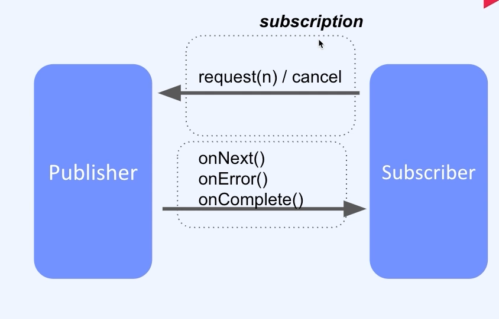

## :pushpin: Spring Webflux
### :seedling: Reactor 이론
### Reactive Stream
- Reactive Stream (specification)

### 구성요소
1. stream
   a. publisher
   b. subscriber
   c. subscription
   d. processor
2. asynchronous
3. back pressure

### Project reactor
- Pivotal에서 만든 오픈소스
- Reactive Stream을 위한 자바 라이브러리 

### Reactor 요약
1. Reactive Stream (스펙)
   - Asynchronous Stream processing
   - Nonblocking backpressure
2. Publisher, Subscriber, Subscription, Processor
3. Reactor (이를 구현한 프로젝트 리액터를 스프링 웹플럭스에서 활용함)

### publisher
1. Flux
   a. 0-N개 아이템을 가질 수 있는 데이터 스트림
   b. onNext(~N), onComplete, onError
2. Mono
   a. 0개 또는 1개의 아이템을 가지는 데이터스트림
   b. onNext(0-1), onComplete, onError