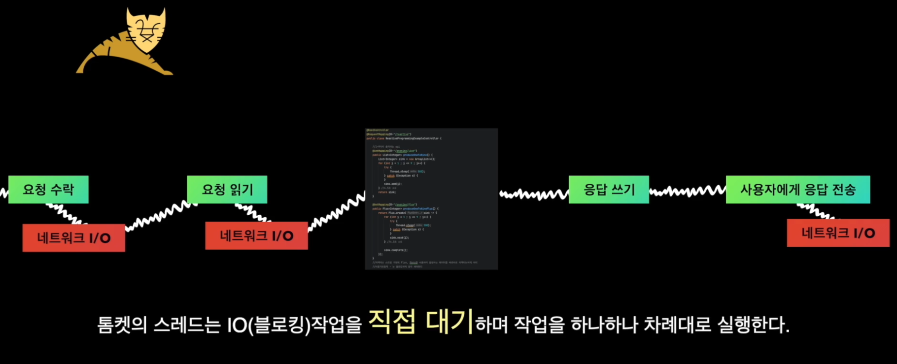
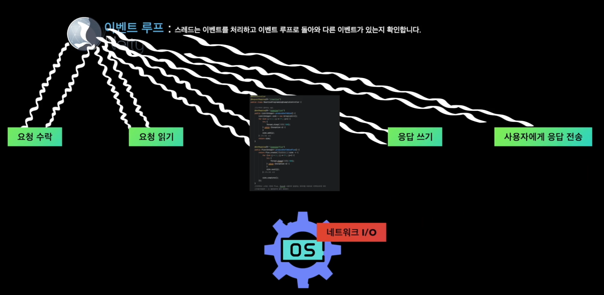
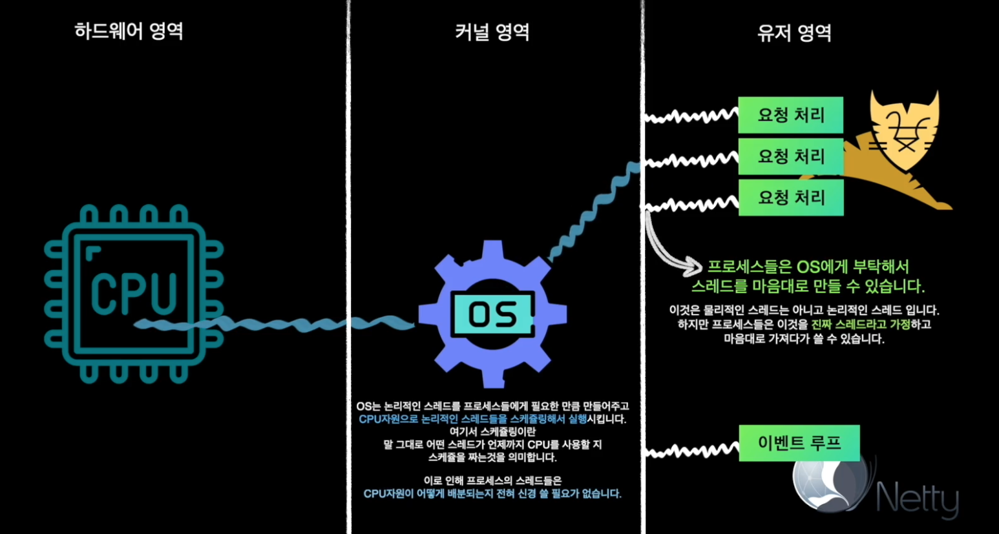

# :pushpin: Spring Webflux + LLM 실전 구현

## :seedling: Spring WebFlux란?
- 저희가 WebFlux를 사용하고 싶다는건 리액티브한 서비스를 만들고 싶다고 말하는 것과 같습니다.
- WebFlux는 리액티브한 서비스를 쉽게 개발할 수 있도록 도와주는 스프링 프레임워크 라이브러리 입니다.
- 리액티브 서비스에서는 비동기 웹 서버의 활용이 중요한데, Webflux는 Netty와 같은 비동기 웹 서버와 스프링 애플리케이션을 자연스럽게 통합할 수 있도록 지원합니다.
- 이 외에도 스트림 방식의 데이터 처리, 논 블로킹 API 제공 등 다양한 리액티브 기능들을 포함하고 있습니다.


### 1. 리액티브 프로그래밍이란?
#### 리액티브한 서비스란?
- '리액티브하다'는 것은 **요청에 빠르고 효율적으로 반응한다**라는 의미입니다.
- 사용자의 요청이 들어왔을 때 자원을 효율적으로 활용하여 신속하게 처리하고, 즉각 즉각 반응하는 서비스
- 이렇게 '리액티브'하게 만들기 위해서는 **비동기 웹 서버**의 활용이 필수적

#### 왜 리액티브한 서비스에 비동기 웹 서버가 필수일까?
여기 치킨을 시키고 기다리는 두 사람이 있습니다.
두 사람은 각각 Tomcat이라는 방과 Netty라는 방에 들어가 있습니다.

#### 동기 블로킹 방식 (Tomcat이라는 방의 사람)
- 이 사람은 치킨이 도착할 때까지 아무것도 하지 않고 문 앞에서 기다립니다.
- 이 사람은 치킨을 시켰으면 치킨이 올 때까지 문 앞에서 기다리고 치킨과 동기적(Synchronous)으로 동작합니다.
- 여기서 아무것도 하지 않고 방문 앞에서 기다리고 있는 상황을 블로킹이라고 합니다. (치킨이 올때까지 블로킹)

#### 비동기 논블로킹 방식 (Netty라는 방의 사람)
- 이 사람은 치킨이 도착할 때까지 TV도 보고 문자도 보냅니다.
- 이 사람은 치킨을 시킨 후에 치킨이 오는걸 기다리지 않고 치킨과 비동기적(Asynchronous)으로 동작합니다.
  - 기존 스프링이 Tomcat/Servlet과 완벽히 통합되는 것처럼 Webflux는 Netty와 완벽한 통합을 지원한다.
  - WebClient, R2DBC 등 다양한 비동기 API와 쉽게 연동 가능
  - Publisher-Subscriber 패턴 (리액티브 스트림즈 구현체 - Flux Mono)을 기반으로 Netty의 이벤트 루프 패턴과 자연스럽게 통합
  - Stream 통신을 통해 결과물이 부분적으로 완성될 떄마다 사용자에게 즉시 전달 가능

### 2. 스레드란?
- 하나의 작업 흐름을 실행시켜 주는 것

#### Tomcat



- 톰켓의 스레드는 IO(블로킹) 작업을 직접 대기하며 작업을 하나하나 차례대로 실행한다.
- 톰켓은 하나의 요청을 하나의 스레드가 처리한다.

#### Netty


- 이벤트 루프: 스레드는 이벤트를 처리하고 이벤트 루프로 돌아와 다른 이벤트가 있는지 확인한다.
- Netty의 스레드는 한 개의 요청을 처리하고 작업을 끝내는게 아니라 이벤트 루프에서 이벤트를 끝없이 처리한다.

1. 우리 코드를 포함한 애플리케이션의 작업 흐름을 실행시켜주는 것이 스레드이다.
2. Netty는 적은 수의 스레드만을 사용하기 때문에 블로킹에 매우 취약하다.

#### 스레드 동작 방식



```text
1. 우리 프로세스(웹 서버)에서 스레드를 원하는 만큼 생성하고 마음대로 이용할 수 있다. 
(이 스레드는 OS가 알아서 스케쥴링 해주기 때문에 CPU 자원 분배를 신경 쓸 필요가 없다)

2. 스레드를 너무 많이 생성하면 컨텍스트 스위칭 비용 등이 발생하기 때문에 Netty는 물리적인 스레드와 같은 개수의 스레드만을 사용한다.
```

### 3. 블로킹과 비동기 프로그래밍이란?
#### 논 블로킹 vs 블로킹
- `I/O 블로킹(Blocking)`이란 작업을 처리하는 스레드가 외부 리소스의 처리를 기다려야해서 작업이 중지된 채로 기다리고 있는 상태

#### 블로킹
- DB 조회 
> userRepository.selectAllFromUser()

- 네트워크 IO
> restTemplate.exchange(...)

- 파일 IO
> FileInputStream, FileOutputStream

#### 논블로킹
- 객체 생성
> User user = new User();

- 복잡한 로직 처리

- 우리 스레드가 직접 처리해야 하는 모든 작업

#### 이 블로킹을 회피하는 비동기 프로그래밍이란?
- 순서대로 동기적으로 작업하면서 블로킹이 완료될 때까지 기다리지 않고 특정 작업은 다른 스레드나 OS 등에 맡겨버리고
다음 작업부터 하는 것을 비동기 프로그래밍이라고 한다.

#### 비동기로 블로킹 작업을 논 블로킹 처리를 하는 예시
1. 자바스크립트의 setTimeout(): 브라우저 백그라운드 스레드가 대기
2. 자바의 CompletableFuture: 우리가 지정한 스레드가 대기
3. Netty의 이벤트 루프 패턴: OS의 I/O 다중화 메커니즘이 대기 
4. Subscriber - Publisher 패턴 구현체인 Flux, Mono: 스케쥴러 스레드가 대기

#### Subscriber - Publisher 패턴이란?
- 한글로 구독자 - 발행자
- Flux를 구독하면 발행이 시작된다.
- 이 간단한 개념이 Subscriber - Publisher 패턴이다.

#### Flux로 어떻게 블로킹을 회피할 수 있을까?
1. 스레드 1개만 사용해서는 절대로 블로킹을 회피할 수 없다. Reactor의 스케쥴러를 사용해서 
스레드를 추가 할당해야지만 블로킹 회피가 가능하다.

2. 스케쥴러가 제공하는 스레드는 톰켓의 스레드처럼 어느정도 블로킹 되어도 괜찮다. 
이 스레드는 우리가 원하는 곳에 마음대로 사용할 수 있다

3. 스케쥴러가 제공하는 스레드가 중요한 스레드 (이벤트 루프 스레드) 대신 대기하는 것이 블로킹 회피의 기본적인 전략이다.

#### 정리
- Flux에는 데이터가 들어 있는게 아니라 함수 코드 덩어리가 들어있음. 그래서 구독을 해서 함수를 실행시키는 순간부터 데이터가 발행된다.
- 스레드가 1개라면 Flux만으로는 어떻게 해도 블로킹을 회피할 수 없다. 스케쥴러로 추가 스레드를 할당하여 대신 작업시켜야 한다.

#### WebFlux의 기본적인 사용법, Flux와 Mono
- Flux, Mono는 크게 [데이터 흐름 시작, 데이터 가공, 구독]의 흐름으로 이루어진다.
- Flux는 0개 이상의 무한정 데이터를 방출한다.
- Mono는 0개, 1개의 데이터만 방출한다.