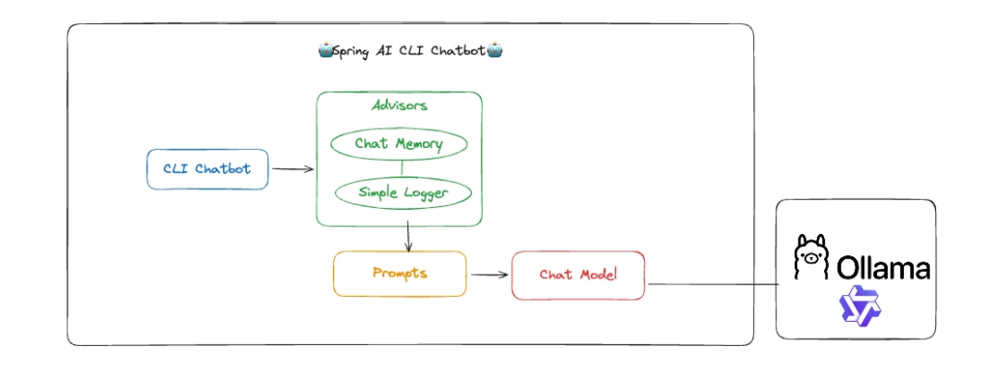
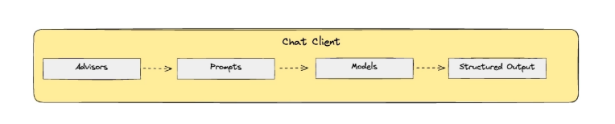
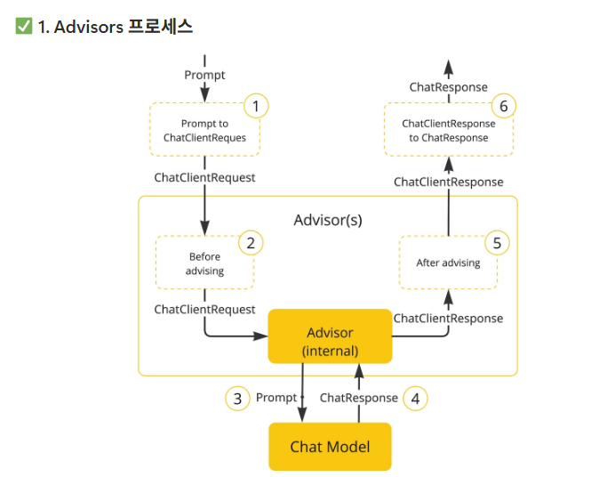

# :push: 실무에 바로 적용하는 Spring AI: Spring 서비스에 챗봇, RAG, MCP 도입하기

## :seedling: 섹션 6. 실무에 쓰는 챗봇 만들기 - 대화 기억부터 CS문의 자동 분류까지

Spring AI Prompt란 무엇?
ChatClient
```text
Advisors → Prompts → Models → structured Output
```

- 흔히 AI에게 질문을 던질 때 하나의 긴 텍스트 문장만 보낸다고 생각함
- 하지만 Spring AI에서 AI 모델로 전달되는 최종 형태는 문자열이 아니라 Prompt라는 전용 객체임
- Prompt 객체의 내부 구조
  - List<Message>: 대화의 맥락을 구성하는 여러 종류의 메시지 묶음
  - ChatOptions: 온도(Temperature), 사용할 모델명(GPT-4)와 같은 AI 실행 옵션

Chat Options란 무엇일까?
- 스마트폰 카메라를 사용할 때도 자동모드로 찍을 수도 있지만 더 퀄리티 높은 사진 촬영을 위해 프로모드로 들어가서 ISO, 셔터 스피드, 화이트 밸런스 같은 상세값을 조절함
- Chat Options: AI 모델의 프로 모드 설정이라고 생각하면 됨
- AI가 답변을 생성할 때 얼마나 창의적일지, 얼마나 길게 말할지 등 응답의 특성을 제어할 수 있는 공통 옵션 설정

핵심 공통 옵션
**Temperature(온도)**
- 응답이 얼마나 창의적이고 무작위적으로 생성될지 결정
- 0.0 ~ 0.3 (낮은 온도): 매우 결정적이고 일관된 응답, 언제 물어봐도 똑같이 정답을 말해야 하는 사실 기반 답변, 데이터 분류, 코드 생성에 적합
- 0.4 ~ 0.7 (중간 온도): 균형 잡힌 응답, 일반적인 대화나 정보 제공용 챗봇에 가장 많이 쓰는 표준값
- 0.8 ~ 1.0 (높은 온도): 창의적이고 다양한 응답, 엉뚱하고 기발한 생각이 필요한 스토리텔링, 소설 쓰기, 아이디어 브레인스토밍에 적합 

**Output Length (최대 길이 제한)**
- 모델이 한번에 생성할 수 있는 최대 토큰 수를 제한 

**Sampling Controls (샘플링 제어)**
- AI가 다음에 올 단어(토큰) 후보군을 추려내는 고도의 필터링 기법
- Top-K (상위 K개 필터링)
  - 다음 토큰을 선택할때 확률이 가장 높은 상위 K개의 토큰으로만 후보군을 제한
  - 값이 클수록 다양한 단어가 섞여나와 다양성이 증가하고, 작을수록 늘 쓰던 단어만 써서 결정적인 답변이 나옴
  - OpenAI의 모델(GPT 시리즈)들은 이 Top-K 옵션을 지원하지 않음
- Top-P (누적 확률 필터링)
  - 후보 단어들을 확률 높은 순으로 줄 세운 뒤, 누적 확률이 P(예: 90%)를 초과하기 전까지만 동적으로 단어 후보군을 선택
  - 상위 90%의 안전한 단어들 안에서만 고르게 하므로 문맥이 꼬이지 않으면서도 자연스러운 변화를 줌


### Spring AI Prompts - 프롬프트 엔지니어링 9가지 패턴
1. Zero-Shot Prompting (제로샷 프롬프팅): 사전 정보나 예시없이 AI에게 곧바로 질문을 던지는 가장 기본적인 방식

```java
@AiService
public interface QAService {
    @Prompt("이탈리아의 수도는 어디야?")
    String answer();
}
```

2. Few-Shot Prompting (퓨샷 프롬프팅): AI에게 1개(One-Shot) 또는 여러 개의 정답 예시를 미리 보여주고 ㅓ패턴을 학습시킨 뒤 질문을 던지는 방식

```java
@Prompt("""
        Q: 2 + 2는? A: 4
        Q: 3 + 5는? A: 8
        Q: {{question}} A:
        """)
String solve(@V("question") String question);
```

3. Role & System Prompting (역할 및 시스템 프롬프팅): 시스템 프롬프트를 사용해 AI에게 '페르소나(직업, 성격, 톤앤매너)'를 부여

```java
@Prompt(system = "너는 아주 정중하고 핵심만 말하는 10년 차 내과 의사야.")
String respondTo(String userQuestion);
```

4. Step-Back Prompting (한걸음 물러서기 프롬프팅): AI가 섣불리 대답하기 전에, 상황을 먼저 객관적으로 분석하고 성찰하도록 유도함

```java
@Prompt("""
        답변하기 전에, 다음 상황을 주의 깊게 먼저 생각해 봐: {{situation}}
        자, 이제 이 상황에서 가장 좋은 조언은 무엇일까?
        """)
String analyze(@V("situation") String situation);
```

5. Chain-of-Thought, CoT (생각의 사슬 프롬프팅): 단순히 답만 뱉는게 아니라 문제를 해결하는 과정을 단계별로 풀어서 설명하도록 지시하는 방식

```java
@Prompt("""
        다음 문제를 단계별로 차근차근(step-by-step) 해결해줘:
        {{problem}}
        
        정답:
        """)
String solveStepwise(@V("problem") String problem);
```

6. Self-Consistency Prompting (자기 일관성 프롬프팅): CoT(생각의 사슬) 프롬프트를 여러번 반복해서 호출한 뒤, 가장 많이 나온 (일관된) 답변을 최종 정답으로 채택하는 방식

7. Tree-of-Thoughts, ToT (생각의 나무 프롬프팅): 하나의 문제에 대해 여러가지 해결책을 먼저 제안하게 하고, 그중 가장 좋은 것을 스스로 선택해 평가하게 만드는 방식

```java
@Prompt("""
        이 문제를 해결할 수 있는 3가지 다른 접근법을 제안해봐:
        {{challenge}}
        
        그런 다음, 3가지 중 가장 좋은 방법을 하나 고르고 그 이유를 설명해줘.
        """)
String solveWithToT(@V("challenge") String challenge);
```

8. Automatic Prompt Engineering (자동 프롬프트 엔지니어링): 내가 쓴 부실한 프롬프트를 AI에게 던져서 "네가 더 완벽한 프롬프트로 다듬어봐"라고 시키는 방식

```java
@Prompt("""
        너는 세계 최고의 프롬프트 엔지니어의 역량을 가졌어. 다음 프롬프트의 명확성과 효과를 극대화해줘
        {{originPrompt}}
        """)
String optimizePrompt(@V("originalPrompt") String originalPrompt);
```

9. Code Prompting (코드 프롬프팅): 사용자의 입력을 기반으로 코드를 생성하거나 분석하도록 요청하는 방식

```java
@Prompt("""
        다음 요구사항을 수행하는 Java 함수를 작성해줘:
        {{description}}
        
        Java Code:
        """)
String generateCode(@V("description") String description);
```

### CLI 챗봇 개발 환경 아키텍쳐




1. Advisors 프로세스
- 사용자가 입력한 순수한 형태의 질문을 Spring AI 내부에서 처리하고 다루기 쉬운 ChatClientRequest 객체로 변환
- 이곳에 등록된 여러 Advisor들이 개입하여 요청 데이터를 검사하거나 변경함
  - 예시: SimpleLoggerAdvisor는 이 단계에서 AI에게 어떤 질문(Prompt)을 보낼 예정인지 로그를 남기고, 다른 Advisor는 질문에 추가적인 컨텍스트나 시스템 프롬프트를 덧붙이는 작업을 함
- Advisor들을 거치며 최종적으로 완성된 요청이 실제 AI 모델(OpenAI, Gemini 등)로 전송됨
- 답변을 사용자에게 최종 반환하기 전에 Advisor들이 다시 한번 개입
  - 예시: SimpleLoggerAdvisor는 이 단계에서 AI가 어떤 답변을 생성했는지 토큰을 얼마나 사용했는지 등을 로그로 출력함. 다른 Advisor들은 답변을 특정 포맷으로 파싱하거나 검증함
- 모든 Advisor의 처리가 끝난 내부 응답 객체를 최종적으로 개발자(또는 사용자)가 받게될 표준 ChatResponse 형태로 변환하여 반환하면서 전체 프로세스가 종료됨



2. SimpleLoggerAdvisor 객체 생성
- 이름 그대로 로깅(Logging)을 담당
- 우리가 작성한 프롬프트가 실제로 어떤 형태의 JSON으로 변환되어 AI에게 날아가는지 그리고 AI가 대답을 생성하는데 걸린 시간과 정확한 응답 데이터가 무엇인지를 디버깅 콘솔에 전부 찍어줌

3. chatMemory 객체 생성
- 우리가 API를 통해 백엔드 서버에서 AI를 직접 호출할 때 LLM API는 무상태로 동작함. 즉 기억을 하지 못함
- 우리가 새로운 질문을 던질 때마다 과거에 나누었던 대화 기록 전체를 프롬프트에 덧붙여서 같이 보내야함
- 하나하나 우리가 붙이는 것은 불가능하기 때문에 Advisor를 활용하여 쉽게 구현할 수 있음
  - 대화 기록(히스토리)을 차곡차곡 저장해두는 '수첩'
  - 스프링에서는 기본적으로 메모리에 저장하는 InMemoryChatMemory를 제공

4. MessageChatMemoryAdvisor 객체 생성
- 짧은 질문만 던지더라도 해당 Advisor가 대답을 가로채서 기존의 대화 기록을 끼워넣은 다음 최종 프롬프트를 AI에게 대신 전달해줌