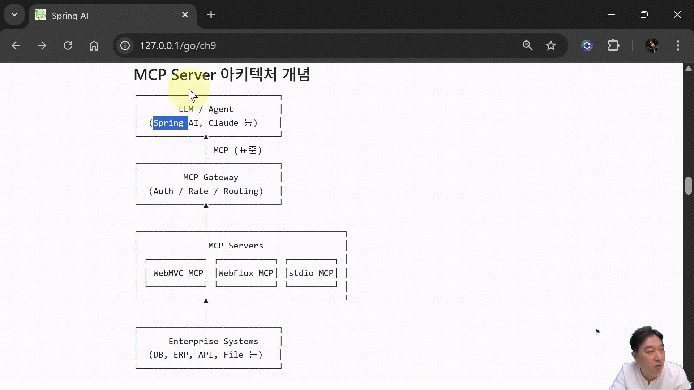

## :pushpin: Chapter 9. MCP (Model Context Protocol) 

### MCP (Model Context Protocol)
- Model Context Protocol(MCP)는 AI 모델이 외부 도구, 데이터, 리소스와 구조화된 방식으로 상호작용할 수 있게 해주는 표준화된 프로토콜
- 모델과 현실 세계(데이터베이스, API, 파일 시스템 등)를 연결하는 통합 인터페이스 역할을 하며 다양한 전송 메거니즘을 지원해 유연한 통신 패턴을 제공함 
- Spring AI는 MCP 전용 부트 스타터와 Java 애노테이셔능ㄹ 통해 MCP를 정밀히 지원 
- 이를 통해 Spring 개발자는 MCP 서버를 호스트하거나 MCP 클라이언트로서 외부 모델과 연동하는 애플리케이션을 구축할 수 있음 

### Context
- Context 정보란 특정 대상(정보, 데이터, 애플리케이션 등)을 더 잘 이해하고 활용하기 위해 필요한 주변 상황, 맥락, 환경적 정보를 의미
- 단순 데이터 이상의 '정보의 정보' 또는 '상황 정보'로 AI, 프로그래밍, 컴퓨팅 등 다양한 분야에서 작업의 이해도와 정확도를 높이는데 필수적인 요소
- 즉 AI 모델이 사용자의 질문을 정확히 이해하도록 돕는 채팅 기록, 사용자 선호도, 관련 문서 등의 주변 정보를 의미함 

### MCP
- MCP는 메시지 직렬화 및 전송을 위한 다양한 구성요소(예: McpTransport)와 전송 프로토콜(STDIO, HTTP/SEE, Streamable-HTTP 등)을 지원

### 왜 MCP가 필요한가?
- 지식 갱신의 한계 극복
  - 대규모 언어 모델(LLM)은 학습 시점까지의 정적 지식에 의존. MCP를 통해 모델은 실시간 데이터 소스에 접근하여 최신 정보를 활용할 수 있음
- 전문 도메인 통합
  - 의료 기록, ERP, CRM 등 조직 내부의 전용 데이터 소스와 표준화된 방식으로 연결함으로써 도메인 특화 지식을 손쉽게 통합할 수 있음
-  개발 복잡도 감소
  - 다양한 데이터 소스 통합 로직을 프로토콜 수준에서 추상화

즉 MCP Server는 LLM과 기업 시스템 사이에서 Context, Tool, Resource를 안전하게 연결하는 역할을 함

### MCP Server가 필요한 이유
- LLM은 기본적으로 내부 데이터(DB, ERP)에 접근할 수 없음
- 사내 api 호출 방식이 시스템마다 다름
- 보안 및 접근 제어가 어려움
- LLM 벤더별 연동 방식 차이

### MCP Server의 핵심 구성 요소
- Tool: LLM이 실행할 수 있는 함수 (상태 변경 가능)
- Resource: LLM이 참고하는 읽기 전용 Context 데이터
- Prompt: 사전 정의된 도메인 업무 프롬프트 (선택)

**MCP Server 아키텍처 개념**

