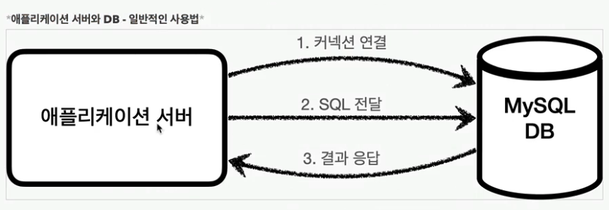
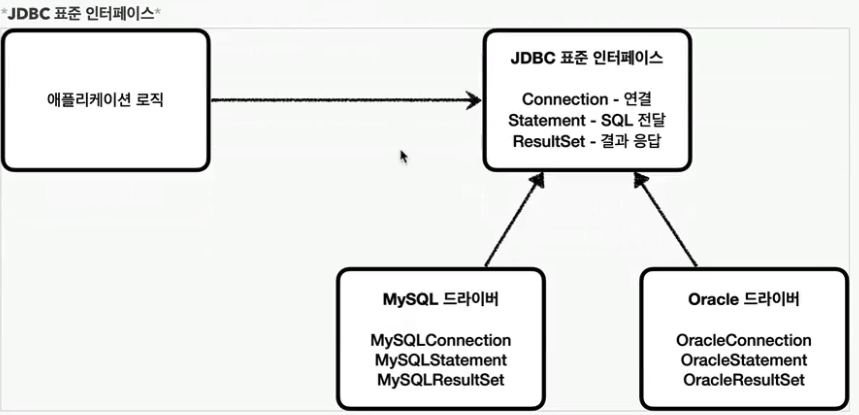

# :book: [인프런] 김영한 스프링 DB 1편 - 데이터 접근 핵심 원리 

## :pushpin: JDBC 이해

### JDBC 등장 이유
- 애플리케이션을 개발할 때 중요한 데이터는 대부분 데이터베이스에 보관한다.
- 클라이언트가 애플리케이션 서버를 통해 데이터를 저장하거나 조회하면 애플리케이션 서버는 다음 과정을 통해서 데이터베이스를 사용한다.

1. 커넥션 연결: 주로 TCP/IP를 사용해서 커넥션을 연결한다.
2. SQL 전달: 애플리케이션 서버는 DB가 이해할 수 있는 SQL을 연결된 커넥션을 통해 DB에 전달한다.
3. 결과 응답: DB는 전달된 SQL을 수행하고 그 결과를 응답한다. 애플리케이션 서버는 응답 결과를 활용한다.

#### 애플리케이션 서버와 DB - DB 변경
- 문제는 각각의 데이터베이스마다 커넥션을 연결하는 방법, SQL을 전달하는 방법, 그리고 결과를 응답받는 방법이 모두 다르다는 점
- 참고로 관계형 데이터베이스는 수십개가 있다.
- 여기에는 2가지 큰 문제가 있다.
  - 데이터베이스를 다른 종류의 데이터베이스로 변경하면 애플리케이션 서버에 개발된 데이터베이스 사용 코드도 함께 변경해야 한다.
  - 개발자가 각각의 데이터베이스마다 커넥션 연결, SQL 전달, 그리고 그 결과를 응답받는 방법을 새로 학습해야 한다.
- 이런 문제를 해결하기 위해 JDBC라는 자바 표준이 등장한다.

### JDBC 표준 인터페이스

JDBC(Java Database Connectivity)는 자바에서 데이터베이스에 접속할 수 있도록 하는 자바 API다. JDBC는 데이터베이스에서 자료를 쿼리하거나 업데이트하는 방법을 제공한다.
대표적으로 다음 3가지 기능을 표준 인터페이스로 정의해서 제공한다.
- java.sql.Connection: 연결
- java.sql.Statement: SQL을 담은 내용
- java.sql.ResultSet: SQL 요청 응답

