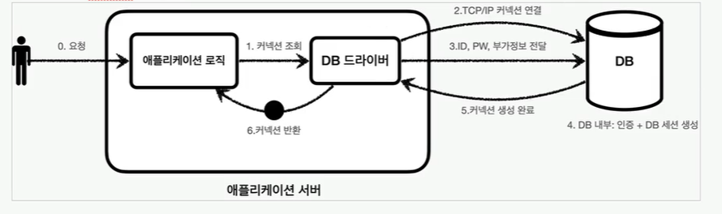
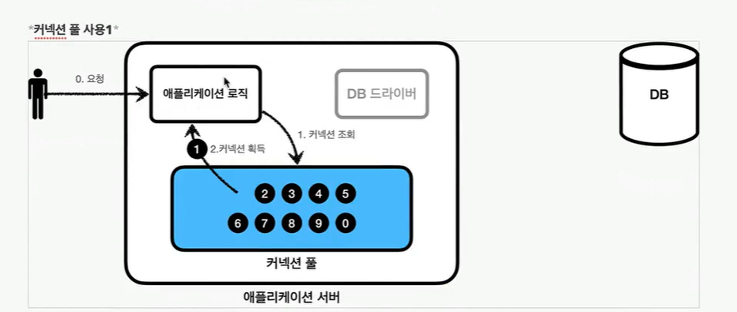
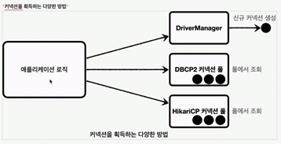

# :book: [인프런] 김영한 스프링 DB 1편 - 데이터 접근 핵심 원리
## :pushpin: 커넥션풀과 데이터소스 이해

### 커넥션 풀 이해


데이터베이스 커넥션을 획득할 때는 다음과 같은 복잡한 과정을 거침

1. 애플리케이션 로직은 DB 드라이버를 통해 커넥션을 조회
2. DB 드라이버는 DB와 `TCP/IP` 커넥션을 연결한다. 물론 이 과정에서 3 way handshake 같은 TCP/IP 연결을 위한 네트워크 동작이 발생한다.
3. DB 드라이버는 TCP/IP 커넥션이 연결되면 ID, PW와 기타 부가정보를 DB에 전달한다.
4. DB는 ID, PW를 통해 내부 인증을 완료하고, 내부에 DB 세션을 생성한다.
5. DB는 커넥션 생성이 완료되었다는 응답을 보낸다.
6. DB 드라이버는 커넥션 객체를 생성해서 클라이언트에 반환한다.

- 이렇게 커넥션을 새로 만드는 것도 과정도 복잡하고 시간도 많이 소모되는 일
- DB는 물론이고 애플리케이션 서버에서도 'TCP/IP' 커넥션을 새로 생성하기 위한 리소스를 매번 사용해야 함
- SQL을 실행하는 시간뿐만 아니라 커넥션을 새로 만드는 시간이 추가되기 때문에 결과적으로 응답 속도에 영향을 줌
- 이런 문제를 해결하는 아이디어가 바로 커넥션을 미리 생성해두고 사용하는 커넥션 풀이라는 방법
- 커넥션 풀은 이름 그대로 커넥션을 관리하는 풀(수영장 풀)이다.

### 커넥션 풀 초기화
- 애플리케이션을 시작하는 시점에 커넥션 풀은 필요한 만큼 커넥션을 미리 확보해서 풀에 보관
- 기본값은 보통 10개
- 커넥션 풀에 들어있는 커넥션은 TCP/IP로 DB와 커넥션이 연결되어 있는 상태이기 때문에 언제든지 즉시 SQL을 DB에 전달할 수 있음


1. 애플리케이션 로직에서는 이제 DB 드라이버를 통해서 새로운 커넥션을 획득하는 것이 아님
2. 커넥션 풀을 통해 이미 생성되어 있는 커넥션을 객체 참조로 가져다 쓰기만 하면 됨
3. 커넥션 풀에 커넥션을 요청하면 커넥션 풀은 자신이 가지고 있는 커넥션 중에 하나를 반환함
4. 애플리케이션 로직은 커넥션 풀에서 받은 커넥션을 사용해서 SQL을 데이터베이스에 전달하고 그 결과를 받아서 처리함
5. 커넥션을 모두 사용하고 나면 커넥션을 종료하는 것이 아니라, 다음에 다시 사용할 수 있도록 해당 커넥션을 그대로 커넥션 풀에 반환하면 된다.
6. 여기서 주의할 점은 커넥션을 종료하는 것이 아니라 커넥션이 살아있는 상태로 커넥션 풀에 반환해야 한다는 것이다.


### 정리
- 적절한 커넥션 풀 숫자는 서비스의 특징과 애플리케이션 서버 스펙, DB 서버 스펙에 따라 다르기 때문에 성능 테스트를 통해서 정해야함
- 커넥션 풀은 서버당 최대 커넥션 수를 제한할 수 있음 (DB에 무한정 연결이 생성되는 것을 막아주어 DB를 보호하는 효과)
- 커넥션 풀은 얻는 이점이 매우 크기 때문에 실무에서는 기본으로 사용
- 커넥션 풀은 직접 구현할 수도 있지만 오픈소스 커넥션 풀 사용
- 대표적인 커넥션 풀 오픈소스는 `common-dbcp2`, `tomcat-jdbc-pool`, `HikariCP` 등
  - 스프링부트 2.0부터는 기본 커넥션 풀로 `hikariCP`를 제공함.


### DataSource 이해
- 커넥션을 얻는 방법은 JDBC 'DriverManager'를 직접 사용하거나 커넥션 풀을 사용하는 등 다양한 방법이 존재



- 예를 들어서 애플리케이션 로직에서 'DriverManager'를 사용해서 커넥션을 획득하다가 'HikariCP' 같은 커넥션 풀을 사용하도록 변경하면
커넥션을 획득하는 애플리케이션 코드도 함께 변경해야 한다. 의존관계가 DriverManager로 변경되기 때문이다. 둘의 사용법도 조금씩 다를 것이다.

### 커넥션을 획득하는 방법을 추상화
- 자바에서는 이런 문제를 해결하기 위해 javax.sql.DataSource 라는 인터페이스를 제공
- DataSource는 커넥션을 획득하는 방법을 추상화하는 인터페이스
- 이 인터페이스의 핵심 기능은 커넥션 조회 하나

```java
import java.sql.Connection;

public interface DataSource {
    Connection getConnection() throws SQLException;
}
```
- 대부분의 커넥션 풀은 DataSource 인터페이스를 이미 구현해두었음. 따라서 개발자는 DBCP2 커넥션 풀, HikariCP 커넥션 풀의 코드를 직접 의존하는 것이 아니라
DataSource 인터페이스에만 의존하도록 애플리케이션 로직을 작성하면 됨
- 커넥션 풀 구현 기술을 변경하고 싶으면 해당 구현체로 갈아끼우기만 하면 된다.
- DriverManager는 DataSource 인터페이스를 사용하지 않는다. 이런 문제를 해결하기 위해 스프링은 DriverManager도 DataSource를 사용할 수 있도록 DriverManagerDataSource라는
DataSource를 구현한 클래스를 제공한다.
- 자바는 DataSource를 통해 커넥션을 획득하는 방법을 추상화했다. 애플리케이션 로직은 DataSource 인터페이스에만 의존하면 된다.
덕분에 DriverManagerDataSource를 통해서 DriverManager를 사용하다가 커넥션 풀을 사용하도록 코드를 변경해도 애플리케이션 로직은 변경하지 않아도 된다.

#### DriverManager
```text
DriverManager.getConnection(URL, USERNAME, PASSWORD);
DriverManager.getConnection(URL, USERNAME, PASSWORD);
```

#### DataSource
```java
void dataSourceDriverManager() throws SQLException {
    DriverManagerDataSource dataSource = new DriverManagerDataSource(URL, USERNAME, PASSWORD);
    useDataSource(dataSource);
}

private void useDataSource(DataSource dataSource) throws SQLException {
    Connection con1 = dataSource.getConnection();
    Connection con2 = dataSource.getConnection():
}
```

- DriverManager는 커넥션을 획득할 때마다 URL, USERNAME, PASSWORD 같은 파라미터를 계속 전달함
- 반면에 DataSOurce를 사용하는 방식은 처음 객체를 생성할 때만 필요한 파라미터를 넘겨두고, 커넥션을 획득할 때는 dataSource.getConnection()만 호출하면 된다.

### 설정과 사용의 분리
- 애플리케이션을 개발해보면 보통 설정은 한 곳에서 하지만 사용은 수많은 곳에서 하게 된다.