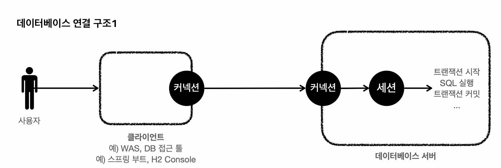
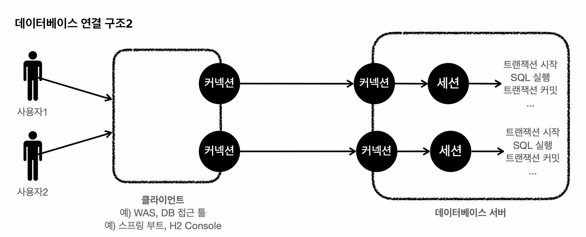

# :book: [인프런] 김영한 스프링 DB 1편 - 데이터 접근 핵심 원리
## :pushpin: 트랜잭션 이해

### 트랜잭션 - 개념 이해
- 데이터를 저장할 때 단순히 파일에 저장해도 되는데 데이터베이스에 저장하는 이유는?
- 여러가지 이유가 있지만 가장 대표적인 이유는 데이터베이스는 트랜잭션이라는 개념을 지원
- 트랜잭션을 이름 그대로 번역하면 거래라는 뜻
- 데이터베이스에서 트랜잭션은 하나의 거래를 안전하게 처리하도록 보장해주는 것을 뜻함

5000원 계좌 이체
1. A의 잔고를 5000원 감소
2. B의 잔고를 5000원 증가

계좌 이체라는 거래는 이렇게 2가지 작업이 합쳐져서 하나의 작업처럼 동작해야함.
데이터베이스가 제공하는 트랜잭션 기능을 사용하면 1,2 둘 다 함께 성공해야 저장하고
중간에 하나라도 실패하면 거래 전의 상태로 돌아갈 수 있다.

모든 작업이 성공해서 데이터베이스에 정상 반영하는 것을 커밋(Commit)
작업 중 하나라도 실패해서 거래 이전으로 되돌리는 것을 롤백(Rollback)

### 트랜잭션 ACID
트랜잭션은 ACID를 보장해야 한다.
- 원자성(Atomicity)
  - 트랜잭션 내에서 실행한 작업들은 마치 하나의 작업인 것처럼 모두 성공하거나 모두 실패해야한다.
- 일관성(Consistency)
  - 모든 트랜잭션은 일관성 있는 데이터베이스 상태를 유지해야 한다. 예를 들어 데이터베이스에서 정한 무결성 제약 조건을 항상 만족해야 한다.
- 격리성(Isolation)
  - 동시에 실행되는 트랜잭션들이 서로에게 영향을 미치지 않도록 격리한다. 예를 들어 동시에 같은 데이터를 수정하지 못하도록 해야한다. 격리성은 동시성과 관련된 성능 이슈로 인해 트랜잭션 격리 수준을 선택할 수 있다.
- 지속성(Durability)
  - 트랜잭션을 성공적으로 끝내면 그 결과가 항상 기록되어야 한다. 중간에 시스템 문제가 발생해도 데이터베이스 로그 등을 사용해서 성공한 트랜잭션 내용을 복구해야한다.

트랜잭션은 원자성, 일관성, 지속성을 보장한다. 문제는 격리성인데 격리성을 완벽히 보장하려면 트랜잭션을 거의 순서대로 실행해야 한다.
이렇게 하면 동시 처리 성능이 매우 나빠진다. 이런 문제로 인해 ANSI 표준은 트랜잭션의 격리 수준을 4단계로 나누어 정의했다.

### 트랜잭션 격리 수준 (Isolation level)
- READ UNCOMMITED (커밋되지 않은 읽기)
- READ COMMITED (커밋된 읽기)
- REPEATABLE READ (반복 가능한 읽기)
- SERIALIZABLE (직렬화 가능 )

### 데이터베이스 연결 구조와 DB 세션 

- 사용자는 웹 애플리케이션 서버(WAS)나 DB 접근 툴 같은 클라이언트를 사용해서 데이터베이스 서버에 접근할 수 있다. 
- 클라이언트는 데이터베이스 서버에 연결을 요청하고 커넥션을 맺게 된다. 이때 데이터베이스 서버는 내부에 세션이라는 것을 만든다.
- 그리고 앞으로 해당 커넥션을 통한 모든 요청은 이 세션을 통해서 실행하게 된다.
- 개발자가 클라이언트를 통해 SQL을 전달하면 현재 커넥션에 연결된 세션이 SQL을 실행한다.
- 세션은 트랜잭션을 시작하고, 커밋 또는 롤백을 통해 트랜잭션을 종료한다. 그리고 이후에 새로운 트랜잭션을 다시 시작할 수 있다.
- 사용자가 커넥션을 닫거나 DBA(DB 관리자)가 세션을 강제로 종료하면 세션은 종료된다.



- 커넥션 풀이 10개의 커넥션을 생성하면 세션도 10개 만들어짐




### 트랜잭션 - DB 예제 1
#### 트랜잭션 사용법
- 데이터 변경 쿼리를 실행하고 데이터베이스에 그 결과를 반영하려면 커밋 명령어인 'commit'을 호출하고,
결과를 반영하고 싶지 않으면 롤백 명령어인 'rollback' 을 호출하면 된다.
- 커밋을 호출하기 전까지는 임시로 데이터를 저장하는 것이다. 따라서 해당 트랜잭션을 시작한 세션(사용자)에게만 변경 데이터가 보이고
다른 세션(사용자)에게는 변경 데이터가 보이지 않는다.
- 등록, 수정, 삭제 모두 같은 원리로 동작한다. 등록, 수정, 삭제는 간단히 변경이라고 표현할 수 있다.

#### 커밋하지 않은 데이터를 다른 곳에서 조회할 수 있다면 어떤 문제가 발생할까?
- 예를 들어서 커밋하지 않은 데이터가 보인다면 세션2는 데이터를 조회했을때 신규 회원 1,2가 보일 것이다. 
- 따라서 신규 회원 1, 신규 회원 2가 있다고 가정하고 어떤 로직을 수행할 수 있다. 
- 그런데 세션 1이 롤백을 수행하면 신규 회원 1, 신규 회원 2의 데이터가 사라진다. 
- 따라서 데이터 정합성에 큰 문제가 발생한다.
- 세션 2에서 세션1이 아직 커밋하지 않은 변경 데이터가 보인다면, 세션 1이 롤백했을 때 심각한 문제가 발생할 수 있다.
- 따라서 커밋 전의 데이터는 다른 세션에서 보이지 않는다.

#### 세션1 신규 데이터 추가 후 commit
- 세션1이 신규 데이터를 추가한 후에 `commit`을 호출했다.
- commit으로 새로운 데이터가 실제 데이터베이스에 반영된다. 데이터의 상태도 임시 -> 완료로 변경되었다.
- 이제 다른 세션에서도 회원 테이블들을 조회하면 신규 회원들을 확인할 수 있다.

#### 세션1 신규 데이터 추가 후 rollback
- 세션1이 신규 데이터를 추가한 후에 commit 대신 rollback을 호출했다.
- 세션1이 데이터베이스에 반영한 모든 데이터가 처음 상태로 복구된다.
- 수정하거나 삭제한 데이터도 'rollback'을 호출하면 모두 트랜잭션을 시작하기 직전의 상태로 복구된다.

### 트랜잭션 - DB 예쩨 2
#### 자동 커밋, 수동 커밋
자동 커밋
- 자동 커밋으로 설정하면 각각의 쿼리 실행 직후에 자동으로 커밋을 호출한다.
- 따라서 커밋이나 롤백을 직접 호출하지 않아도 되는 편리함이 있다.
- 하지만 쿼리를 하나하나 실행할 때마다 자동으로 커밋이 되어버리기 때문에 우리가 원하는 트랜잭션 기능을 제대로 사용할 수 없다.

```sql
set autocommit true; // 자동 커밋 모드 설정 
insert into member(member_id, money) values ('data1', 10000); // 자동 커밋
insert into member(member_id, money) values ('data2', 10000); // 자동 커밋
```

- 따라서 commit이나 rollback을 직접 호출하면서 트랜잭션 기능을 제대로 수행하려면 자동 커밋을 끄고 수동 커밋을 사용해야한다.

#### 수동 커밋 설정
```sql
set autocommit false;
insert into member(member_id, money) values ('data3', 10000);
insert into member(member_id, money) values ('data4', 10000);
commit;
```

- 보통 자동 커밋 모드가 기본으로 설정된 경우가 많기 때문에 수동 커밋 모드로 설정하는 것을 트랜잭션을 시작한다고 표현할 수 있다.
- 수동 커밋 설정을 하면 이후에 꼭 commit이나 rollback을 호출해야한다.
- 수동 커밋 모드나 자동 커밋 모드는 한번 설정하면 해당 세션에서는 계속 유지된다. 중간에 변경하는 것은 가능하다.