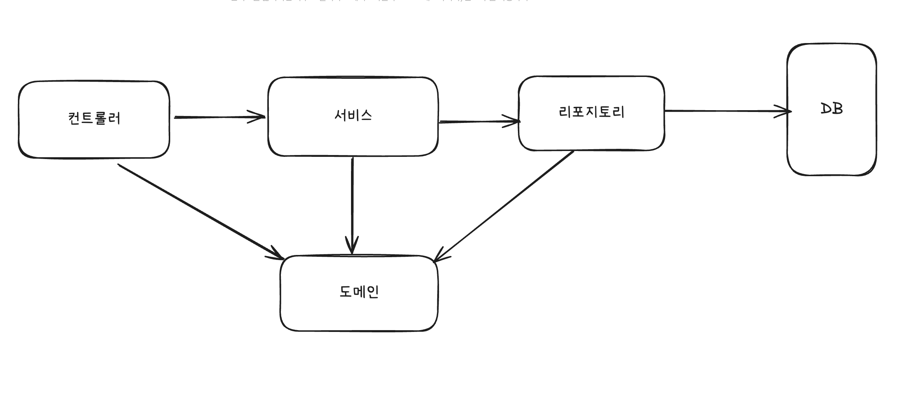

# :book: 스프링 입문 - 코드로 배우는 스프링 부트, 웹 MVC, DB 접근 기술 (김영한)
## :pushpin: 회원 관리 예제

### 비즈니스 요구사항 정리
- 데이터: 회원 ID, 이름
- 기능: 회원 등록, 조회
- 아직 데이터 저장소가 선정되지 않음 (가상의 시나리오)

### 일반적인 웹 애플리케이션 계층 구조

- 컨트롤러: 웹 MVC의 컨트롤러 역할
- 서비스: 핵심 비즈니스 로직 구현
- 리포지토리: 데이터베이스에 접근, 도메인 객체를 DB에 저장하고 관리
- 도메인: 비즈니스 도메인 객체, 에) 회원, 주문, 쿠폰 등등 주로 데이터베이스에 저장하고 관리됨

### 회원 리포지토리 테스트 케이스 작성
- 개발한 기능을 실행해서 테스트할 때 자바의 main 메서드를 실행하거나 웹 애플리케이션의 컨트롤러를 통해서 해당 기능을 실행한다.
이러한 방법은 준비하고 실행하는데 오래 걸리고, 반복 실행하기 어렵고 여러 테스트를 한번에 실행하기 어렵다는 단점이 있다.
자바는 JUnit이라는 프레임워크로 테스트를 실행해서 이런 문제를 해결한다. 