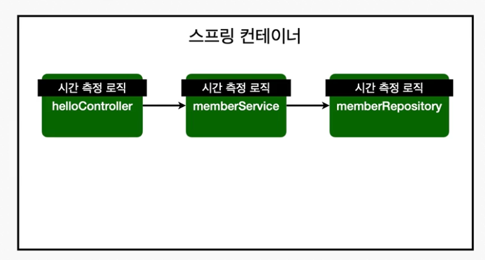
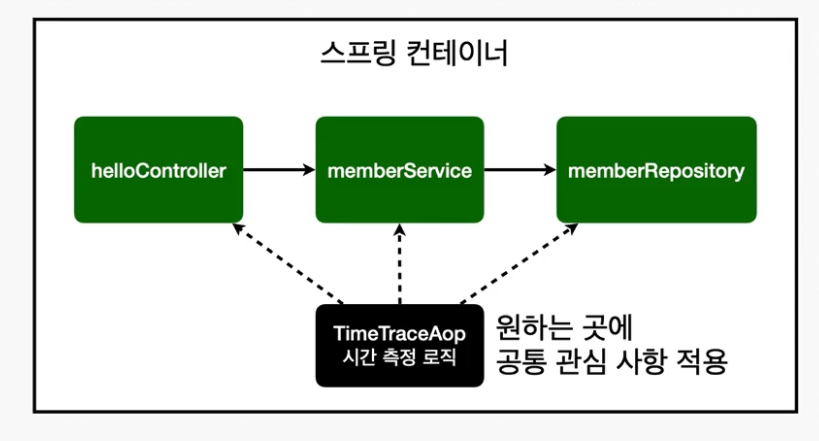
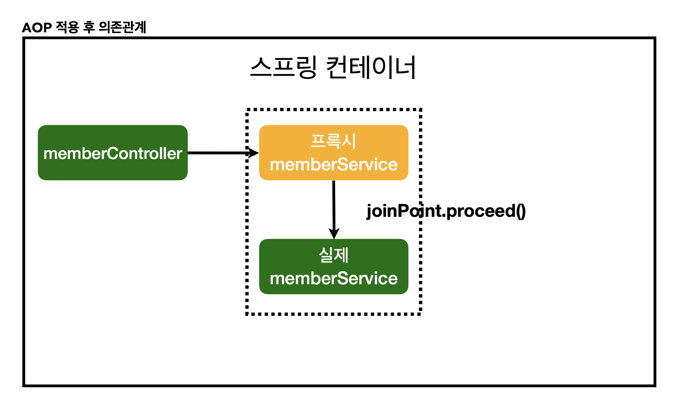
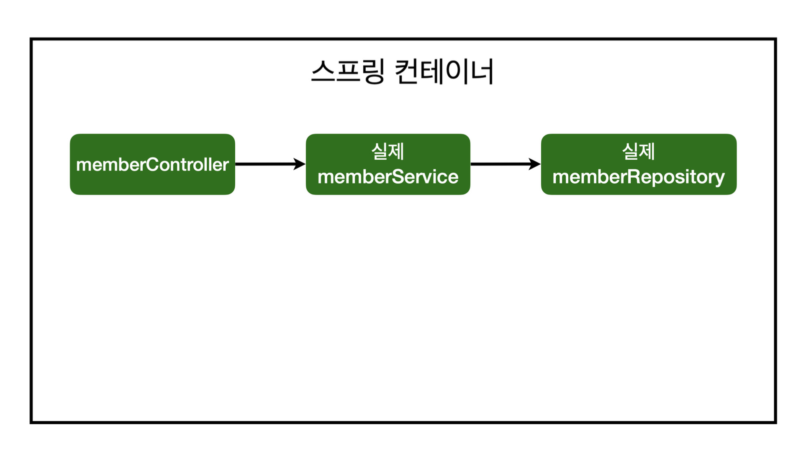
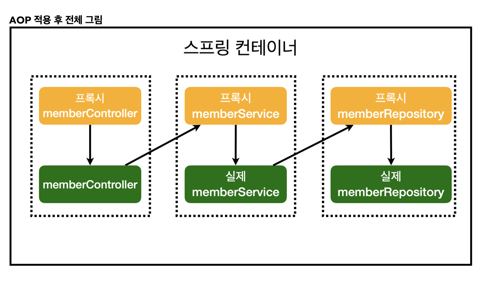

# :book: 스프링 입문 - 코드로 배우는 스프링 부트, 웹 MVC, DB 접근 기술 (김영한)
## :pushpin: AOP

### AOP가 필요한 상황
- 모든 메소드의 호출 시간을 측정하고 싶다면?
- 공통 관심 사항(cross-cutting concern) vs 핵심 관심 사항(core concern)
- 회원 가입 시간, 회원 조회 시간을 측정하고 싶다면?

문제
- 회원가입, 회원 조회에 시간을 측정하는 기능은 핵심 관심 사항이 아니다.
- 시간을 측정하는 로직은 공통 관심 사항이다.
- 시간을 측정하는 로직과 핵심 비즈니스의 로직이 섞여서 유지보수가 어렵다.
- 시간을 측정하는 로직을 별도의 공통 로직으로 만들기 매우 어렵다.
- 시간을 측정하는 로직을 변경할 때 모든 로직을 찾아가면서 변경해야 한다.

### AOP 적용
- AOP: Aspect Oriented Programming
- 공통 관심사항(cross-cutting concern) vs 핵심 관심 사항 (core concern) 분리

### 스프링 AOP 동작 방식 설명

AOP 적용 전 전체그림

AOP 적용 후 전체그림

실제 proxy가 주입되는지 콘솔에 출력해서 확인하기