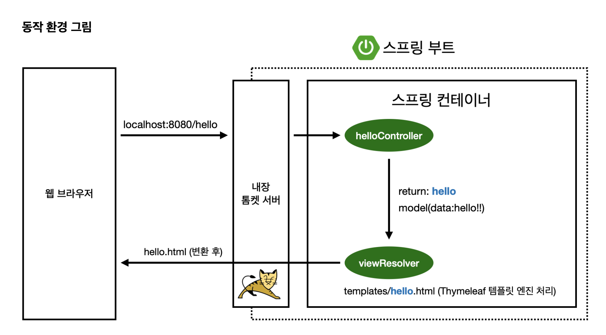
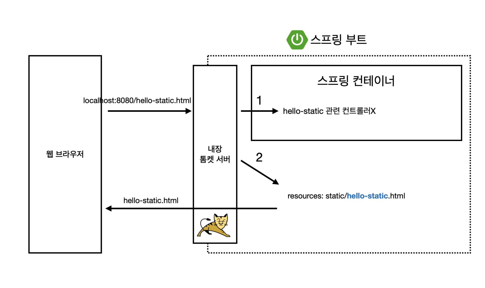
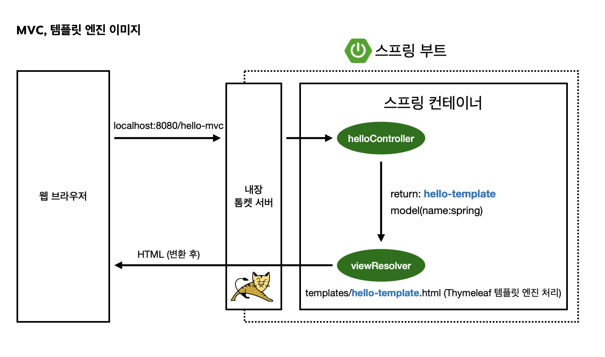
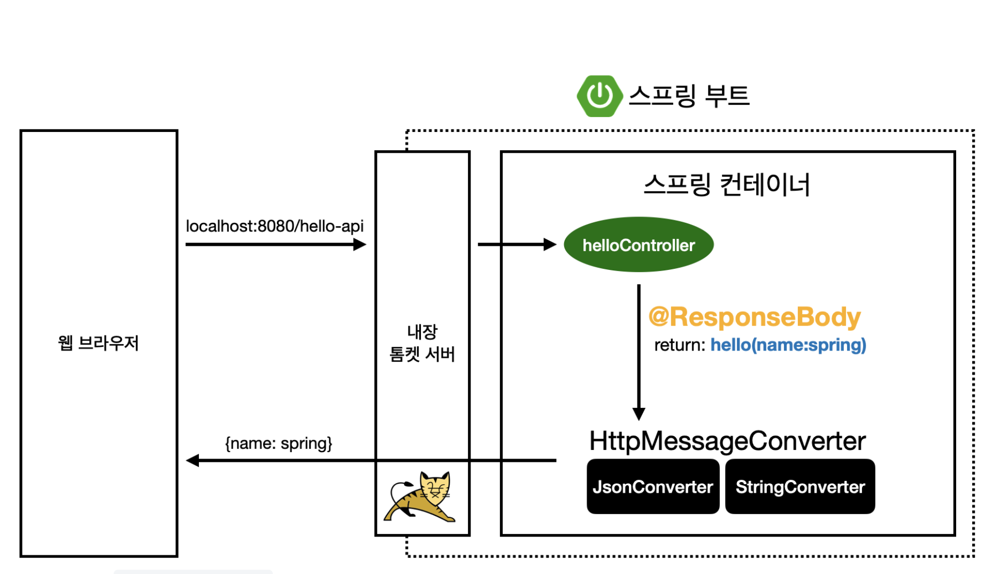

# :book: 스프링 입문 - 코드로 배우는 스프링 부트, 웹 MVC, DB 접근 기술 (김영한)
## :pushpin: 프로젝트 환경설정

### 사전 준비물
- Java11
- IDE: IntelliJ 또는 Eclipse  설치

### 스프링부트 스타터 사이트로 이동해서 스프링 프로젝트 생성
- https://start.spring.io

### 라이브러리 살펴보기
*Gradle은 의존 관계가 있는 라이브러리를 함께 다운로드 한다.*

*스프링 부트 라이브러리*
- spring-boot-starter-web
  - spring-boot-starter-tomcat: 톰캣 (웹서버)
  - spring-webmvc: 스프링 웹 MVC
  
- spring-boot-starter-thymeleaf: 타임리프 템플릿 엔진(View)
  
- spring-boot-starter (공통): 스프링 부트 + 스프링 코어 + 로깅
  - spring-boot
    - spring-core
  - spring-boot-starter-logging
    - logback, slf4j

*테스트 라이브러리*
- spring-boot-starter-test
  - junit: 테스트 프레임워크 (junit5)
  - mockito: 목 라이브러리
  - assertj: 테스트 코드를 좀 더 편하게 작성하게 도와주는 라이브러리
  - spring-test: 스프링 통합 테스트 지원 

### view 환경 설정
- resources/static/index.html
- 스프링 부트가 제공하는 Welcome Page 기능
- static/index.html을 올려두면 Welcome page 기능을 제공한다.

컨트롤러에서 리턴 값으로 문자를 반환하면 뷰 리졸버(viewResolver)가 화면을 찾아서 처리한다.
- 스프링부트 템플릿엔진 기본 viewName 매핑
- `resources:templates/` + {ViewName} + `.html`

- 참고: spring-boot-devtools 라이브러리를 추가하면 html 파일을 컴파일만 해주면 서버 재시작 없이 view 파일 변경이 가능

### 빌드하고 실행하기
콘솔로 이동

1. `./gradlew build`
2. `cd build/libs`
3. `java -jar hello-spring-0.0.1-SNAPSHOT.jar`
4. 실행 확인

### 스프링 웹개발 기초
- 정적 컨텐츠
- MVC와 템플릿 엔진
- API

### 정적 컨텐츠

### MVC와 템플릿 엔진
- MVC: Model, View, Controller

### API

`@ResponseBody`를 사용
- HTTP의 `BODY`에 문자 내용을 직접 반환
- `viewResolver` 대신에 `HttpMessageConverter`가 동작
- 기본 문자 처리: `StringHttpMessageConverter`
- 기본 객체 처리: `MappingJackson2HttpMessageConverter`
- byte 처리 등등 기타 여러 HttpMessageConverter가 기본으로 등록되어 있음 

참고: 클라이언트의 HTTP Accept 헤더와 서버의 컨트롤러 반환 타입 정보 둘을 조합해서 HttpMessageConverter가 선택된다.