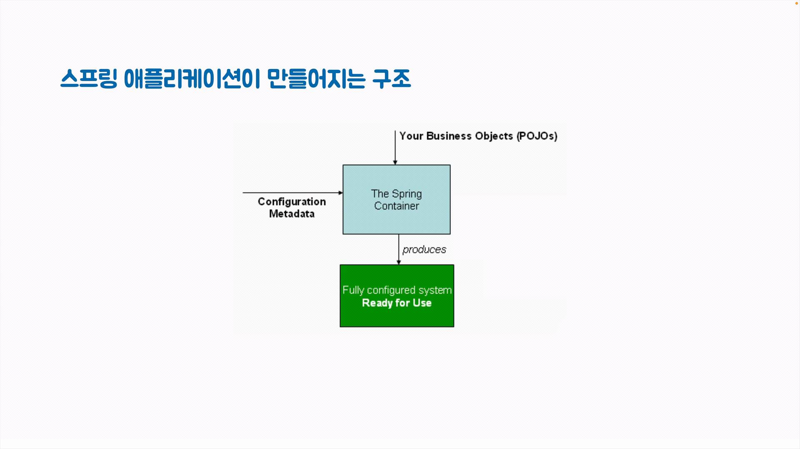
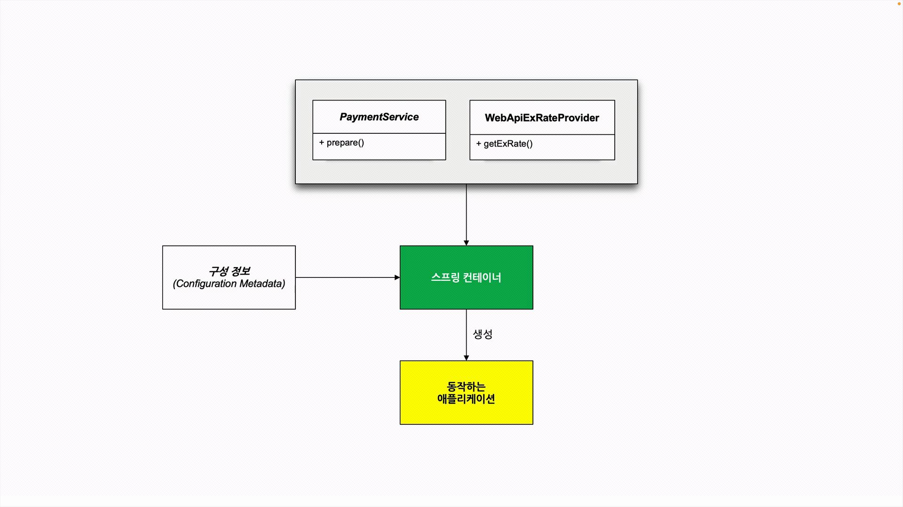

# pushpin: 토비의 스프링6
## :seedling: 트랜잭션 프록시

#### OrderService에서 기술 관련 코드 제거
- 데이터 기술이 변경되어도 기존 코드는 영향을 받지 않음
- TransactionTemplate, PlatformTransactionManager와 같은 기술과 연관된 코드가 계속 등장함
- 트랜잭션의 시작과 종료는 보통 애플리케이션 서비스 메소드 실행 전후

```java
public Order createOrder(String no, BigDecimal total) {
    return new TransactionTemplate(transactionManager).execute(status -> {
        Order order = new Order(no, total);
        
        orderRepository.save(order);
        
        return order;
    });
}
```

#### 트랜잭션 테스트
- 트랜잭션이 필요한 곳에 정확하게 적용되었는지 테스트하기는 매우 어려움
- JDBC처럼 자동 커밋이 되거나 Spring Data JPA처럼 기본 리포지토리 구현에서 트랜잭션을 알아서 적용해주는 기술을 사용할 때 트랜잭션이 바르게 적용되지 않은 것을 놓치기 쉬움
- 모든 작업이 성공하면 하나의 트랜잭션으로 진행된 것인지 여러개의 트랜잭션으로 쪼개진 것인지 확인하기 어려움
- 트랜잭션 중간에 실패하는 케이스를 만들 수 있다면 롤백 여부로 확인할 수 있음


#### 트랜잭션 프록시
- 데코레이터 패턴: 오브젝트의 코드를 변경하지 않고 새로운 기능을 런타임에 부여하는 디자인패턴 
  


- 프록시 패턴: 타깃을 대신해서 존재하며 접근을 제거하거나 보안, 지연, 원격 접속 등의 기능을 제공 


- 트랜잭션 프록시
  - OrderService 인터페이스 추출
  - 트랜잭션 부가 기능을 제공하는 OrderServiceTxProxy 프록시


#### 트랜잭션 프록시 적용
- 동일한 OrderService 인터페이스를 구현한 프록시를 OrderClient에 주입


#### 스프링이 만들어주는 트랜잭션 프록시
- `@Transactional` 애노테이션이 붙은 클래스의 메소드가 트랜잭션 안에서 실행되도록 프록시를 만들어줌

#### 스프링의 프록시 AOP
- AOP는 스프링에서 그다지 성공하지 못한 핵심 기술 중의 하나
- 활용 용도가 제한적이면서 막상 사용하기는 매우 어려움 
- 스프링이 만들어 놓은 트랜잭션과 보안 기술에서는 유용하게 활용
- 직접 활용하려면 꽤 많은 학습이 필요함
- AOP는 아니더라도 데코레이터/프록시 패턴의 동작원리를 이해하고 필요한 곳에 활용할 수 있음


#### 스프링 학습 방법
스프링으로 어떻게 개발할 것인가?
스프링 애플리케이션 개발은
- 애플리케이션 코드를 설계하고 스프링 빈(bean) 선정
- 구성정보 메타데이터 작성
- 스프링 컨테이너 준비





#### 스프링 구성정보 메타데이터
- 스프링 빈의 정의 (클래스, 이름, 생성자, 프로퍼티, 오토와이어링)
- 애노테이션 기반 구성정보 (@Component, @Autowired)
- 자바 기반 구성정보 (@Configuration, @Bean)
- 자동 구성정보 (@AutoConfiguration) - SpringBoot

#### 스프링이 제공하는 인프라 빈 활용
- 스프링부트의 자동 구성과 프로퍼티 설정을 통해서 활용 가능
- 자동 구성에 의해 내부에서 만들어지는 빈의 구조를 이해
- 프로퍼티 구성 정보를 이용한 커스터마이징
- @Bean 오버라이딩을 이용한 구성
- @Enable로 시작하는 기능

#### 스프링의 각 모듈 기술 활용
- 스프링과 이에 대응되는 스프링 부트의 기능을 함께 학습
- 테스트
- 데이터 액세스 (JDBC, JPA)
- 웹 MVC
- REST Client (4가지)
- 태스크 실행, 스케줄링
- 캐시
- 리액티브

#### 스프링이 지원하는 언어
- Java
- Kotlin
- Groovy

#### 스프링 프로젝트 / 에코시스템
- Spring Boot
- Spring Data
- Spring Security
- Spring Cloud
- Spring Session
- Spring Integration
- Spring Modulith
- Spring Batch
- Spring AI
- ...