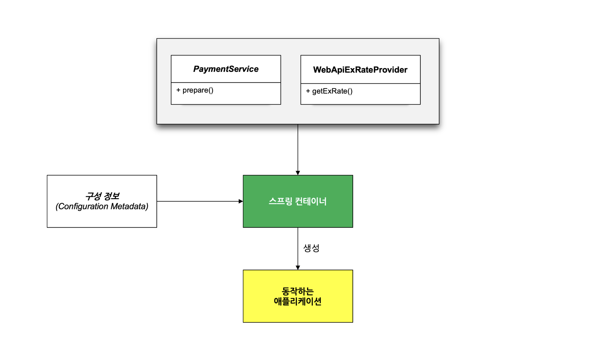
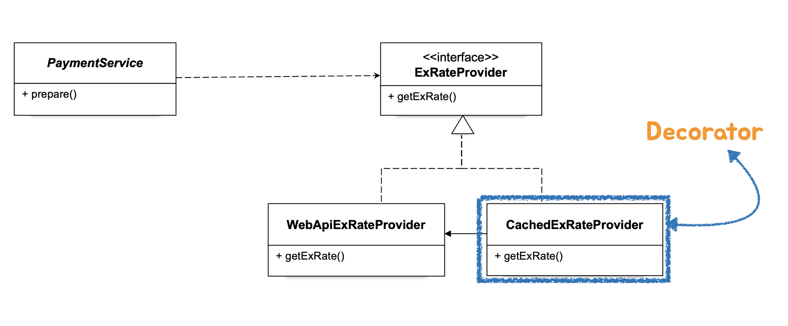
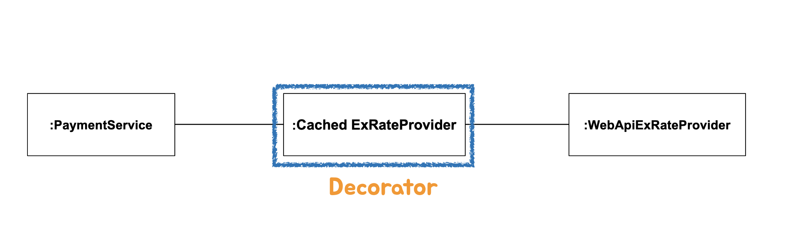
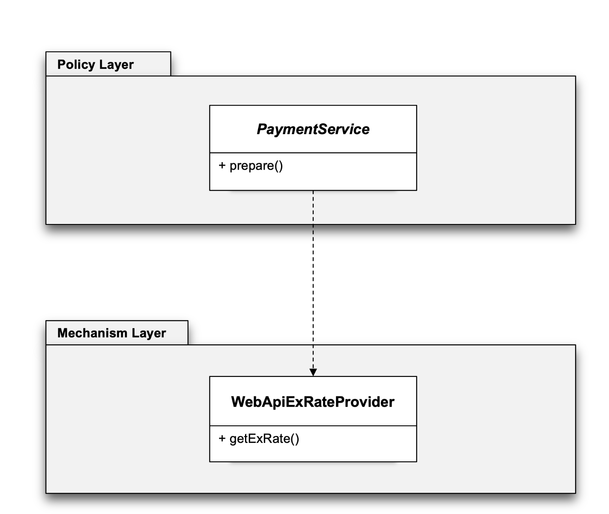
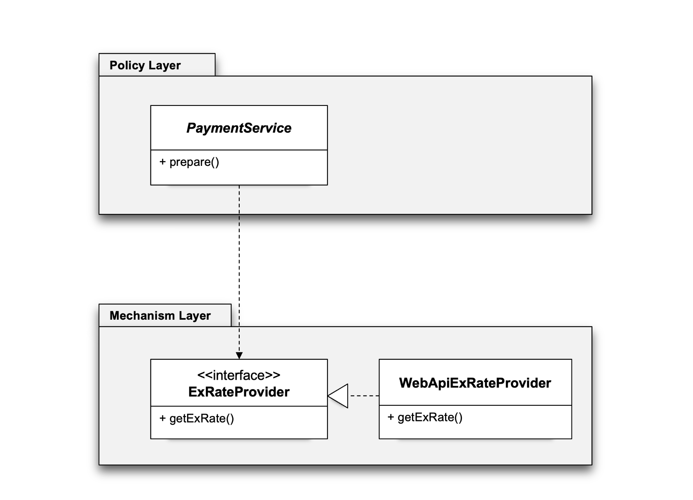
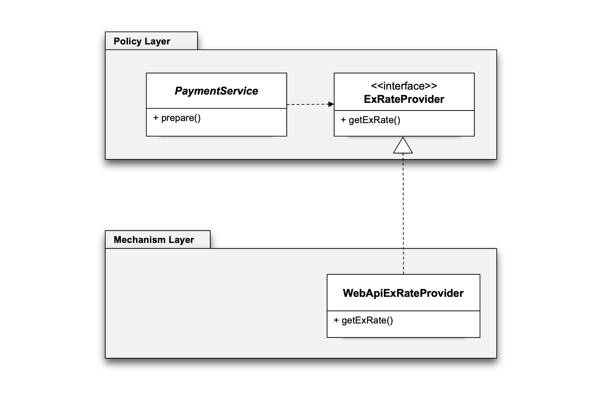

## pushpin: 토비의 스프링6

#### 오브젝트와 의존관계
- 오브젝트 (Object): OOP, 객체, 클래스?

#### 클래스와 오브젝트
- 클래스의 인스턴스(Class Instance) = 오브젝트
- 자바에서는 배열(Array)도 오브젝트
- 위 두가지가 자바에서 오브젝트이다.

#### 의존관계 Dependency
- A ---> B
- A가 B에 의존한다.


- Client의 기능이 제대로 동작하려면 Supplier가 필요
- Client가 Supplier를 사용, 호출, 생성, 인스턴스화, 전송
- 클래스 레벨(코드 레벨)의 의존관계: Supplier가 변경되면 Client 코드가 영향을 받는다.

#### 관심사의 분리 (Separation of Concerns, SoC)
- 관심사: Separation of Concerns (SoC)
- 관심사 분리 전
  - PaymentService
    - prepare()

- 관심사 분리 후
  - PaymentService
    - prepare()
    - getExRate()


#### 상속을 통한 확장


#### 클래스의 분리


#### 인터페이스 도입


#### 관계설정 책임의 분리


#### 오브젝트 팩토리


#### 원칙과 패턴
- **개방 폐쇄 원칙 (Open-Closed Principle, OCP)**
  - 클래스나 모듈은 확장에는 열려 있어야 하고 변경에는 닫혀 있어야 한다
- **높은 응집도와 낮은 결합도 (High Coherence and low coupling)**
  - 응집도가 높다는 것은 하나의 모듈이 하나의 책임 또는 관심사에 집중되어 있다는 뜻.
  - 변화가 일어날 때 해당 모듈에서 변하는 부분이 크다
  - 책임과 관심사가 다른 모듈과는 낮은 결합도, 즉 느슨하게 연결된 형태를 유지하는 것이 바람직하다

#### 전략 패턴 Strategy Pattern
> 자신의 기능 맥락(context)에서 필요에 따라서 변경이 필요한 알고리즘을 인터페이스를 통해 통째로 외부로 분리시키고 이를 구현한 구체적인 알고리즘 클래스를 필요에 따라 바꿔서 사용할 수 있게 하는 디자인 패턴

```java
public class Sort {
    public static void main(String[] args) {
        List<String> scores = Arrays.asList("z", "x", "spring", "java");
        Collections.sort(scores, (o1, o2) -> o1.length() - o2.length());
        
        scores.forEach(System.out::println);
    }
}
```

#### 제어의 역전 (Inversion Of Control)
> 제어권 이전을 통한 제어관계 역전 - 프레임워크의 기본 동작 원리

#### 스프링 컨테이너와 의존관계 주입 (Dependency Injection)


#### 싱글톤 레지스트리 (Singleton Registry)



- 스프링 안에서 만들어지는 빈 오브젝트는 딱 한개만 만들어져서 이 오브젝트를 사용하는 다른 오브젝트가 여러개개 될지라도 동일한 오브젝트가 사용되어진다.

#### DI와 디자인 패턴 (1)
- Class 패턴: 상속
- Object 패턴: 합성
- 오브젝트 합성을 이용하는 디자인 패턴을 적용할 때 *스프링의 의존관계 주입(Dependency Injection)*을 사용

환율 정보가 필요할 때 매번 Web API를 호출해야할까?
- 환율 정보가 필요한 기능 증가
- 응답 시간
- 환율 변동 주기
- 환율 정보 캐시(Cache)의 도입

WebApiExRateProvider에 캐시 기능을 추가하려면?
- WebApiExRateProvider 코드 수정 (x)
- 데코레이터(Decorator) 디자인 패턴 
  - 오브젝트에 부가적인 기능/책임을 동적으로 부여한다.






#### 의존성 역전 원칙 (DIP)
1. 상위 수준의 모듈은 하위 수준의 모듈에 의존해서는 안된다. 둘 모두 추상화에 의존해야 한다.
2. 추상화는 구체적인 사항에 의존해서는 안된다. 구체적인 사항은 추상화에 의존해야 한다.



DIP 적용 1


인터페이스 소유권의 역전이 필요하다 (Separated Interface 패턴)


