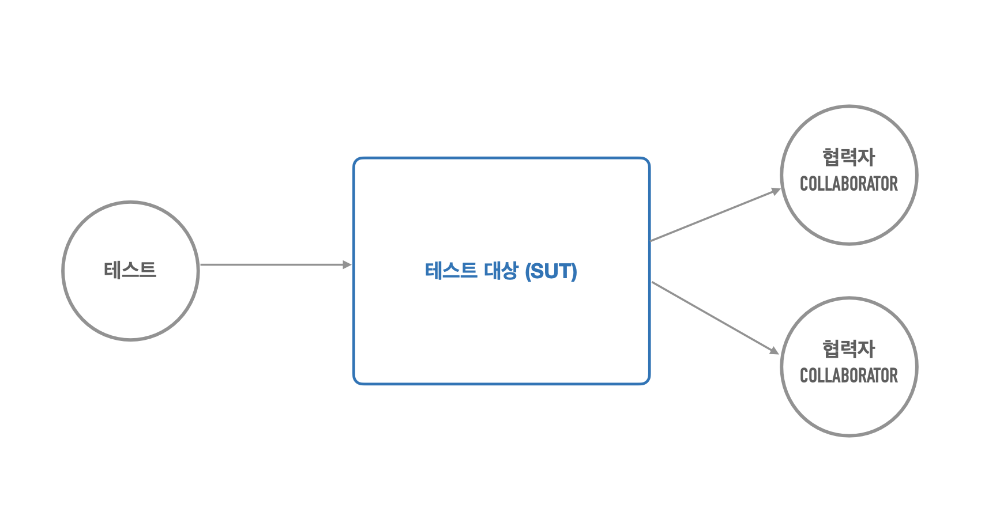
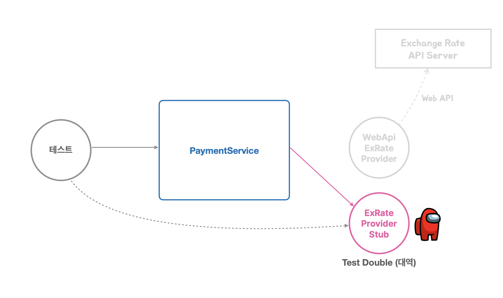

# pushpin: 토비의 스프링6
## :seedling: 테스트

### 자동으로 수행되는 테스트
#### 수동 테스트의 한계
1. 프린트된 메시지를 수동으로 확인하는 방법은 불편하다
2. 사용자 웹 UI까지 개발한 뒤에 확인하는 방법은 테스트가 실패했을 때 확인할 코드가 많다.
3. 테스트할 대상이 많아질수록 검증하는데 시간이 많이 걸리고 부정확함

### 작은 크기의 자동 수행되는 테스트 (Automated Test)
#### 개발자가 만드는 테스트
- 개발한 코드에 대한 검증 기능을 코드로 작성한다.
- 자동으로 테스트를 수행하고 결과를 확인한다.
- 테스팅 프레임워크를 활용한다.
- 테스트 작성과 실행도 개발 과정의 일부이다.

#### JUnit 5
- `@Test` 테스트 메소드
- `@BeforeEach` 테스트: 각 테스트 전에 실행된다
- 테스트마다 새로운 인스턴스가 만들어진다.

#### PaymentService 테스트
PaymentService 개발
- 요구사항
  - 해외직구를 위한 원화 결제 준비 기능 개발
  - 주문번호, 외국 통화 종류, 외국 통화 기준 결제 금액을 전달받아서 다음의 정보를 더해 Payment를 생성한다.
    - 적용 환율 
    - 원화 환산 금액
    - 원화 환산 금액 유효 시간
- PaymentService.prepare() 메소드로 개발
  - Payment 오브젝트 리턴

- 테스트 대상
  - 적용 환율
  - 원화 환산 금액
  - 원화 환산 금액 유효 시간 

```java
package tobyspring.hellospring.payment;

import static org.assertj.core.api.Assertions.assertThat;

import java.io.IOException;
import java.math.BigDecimal;
import java.time.LocalDateTime;
import org.junit.jupiter.api.Test;
import tobyspring.hellospring.exrate.WebApiExRateProvider;

class PaymentServiceTest {

    @Test
    void prepare() throws IOException {
        PaymentService paymentService = new PaymentService(new WebApiExRateProvider());

        Payment payment = paymentService.prepare(1L, "USD", BigDecimal.TEN);

        // 환율정보 가져온다
        assertThat(payment.getExRate()).isNotNull();

        // 원화환산금액 계산
        assertThat(payment.getConvertedAmount())
            .isEqualTo(payment.getExRate().multiply(payment.getForeignCurrencyAmount()));

        // 원화환산금액의 유효시간 계산
        assertThat(payment.getValidUntil()).isAfter(LocalDateTime.now());
        assertThat(payment.getValidUntil()).isBefore(LocalDateTime.now().plusMinutes(30));
    }
}
```

#### PaymentService 테스트의 문제점
1. 우리가 제어할 수 없는 외부 시스템에 문제가 생기면?
2. ExRateProvider가 제공하는 환율 값으로 계산한 것인가?
3. 환율 유효 시간 계산은 정확한 것인가?

#### 테스트의 구성 요소





#### 테스트와 DI
수동 DI를 이용하는 테스트
- 테스트용 협력자(Collborator)/의존 오브젝트를 테스트 대상에 직접 주입하고 테스트

스프링 DI를 이용하는 테스트
- 테스트용 협력자(Collborator)/의존 오브젝트를 스프링의 구성 정보를 이용해서 지정하고 컨테이너로부터 테스트 대상을 가져와서 테스트
- `@ContextConfiguration`
- `@Autowired`