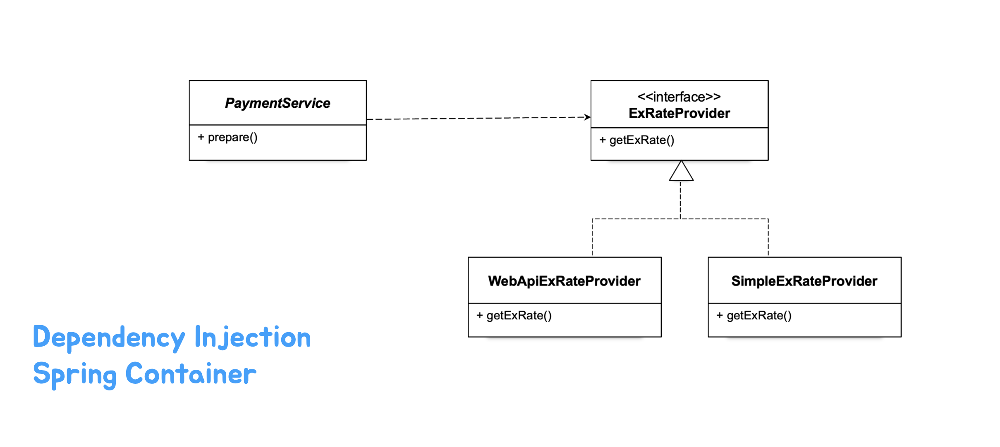

# pushpin: 토비의 스프링6
## :seedling: 템플릿

### 스프링과 JDK 업그레이드

### 템플릿 (Template)
#### 개방 폐쇄 원칙 (OCP)
- 클래스나 모듈은 확장에는 열려 있어야 하고 변경에는 닫혀 있어야 한다
- 변화의 특성이 다른 부분을 구분하고 각각 다른 목적과 이유에 의해 다른 시점에 독립적으로 변경될 수 있는 효율적인 구조를 만들어야 한다



#### 템플릿
> 코드 중에서 변경이 거의 일어나지 않으며 일정한 패턴으로 유지되는 특성을 가진 부분을 
> 자유롭게 변경되는 성질을 가진 부분으로부터 독립시켜서 효과적으로 활용할 수 있도록 하는 방법

- 변경이 거의 일어나지 않ㅇ며 일정한 패턴으로 유지되는 특성을 가진 부분: 템플릿
- 자유롭게 변경되는 성질을 가진 부분: 콜백


#### WebApiExRateProvider 리팩토링 

#### 변하는 코드 분리하기 (메소드 추출)
WebApiExRateProvider의 구성
1. URI를 준비하고 예외처리를 위한 작업을 하는 코드
2. API를 실행하고 서버로부터 받은 응답을 가져오는 코드
3. JSON 문자열을 파싱하고 필요한 환율 정보를 추출하는 코드

```java
public BigDecimal getExRate(String currency) {
    String url = "http://open.er-api.com/v6/latest/" + currency;
    
    URI uri;
    try {
        uri = new URI(url);
    } catch (URISyntaxException e) {
        throw new RuntimeException(e);
    }
    
    String response;
    try {
        HttpURLConnection connection = (HttpURLConnection) uri.toURL().openConnection();
        try (BufferedReader br = new BufferedReader(new InputStreamReader(connection.getInputStream()))) {
            reponse = br.lines().collect(Collectors.joining());
        } 
    } catch (IOException e) {
        throw new RuntimeException(e);
    }
    
    try {
        ObjectMapper mapper = new ObjectMapper();
        ExRateData data = mapper.raedValue(response, ExRateData.class);
        return data.rates().get("KRW");
    } catch (JsonProcessingException e) {
        throw new RuntimeException(e);
    }
}
```

- 일단 메소드 추출로 분리해봅시다

```java
public class WebApiExRateProvider implements ExRateProvider {

    @Override
    public BigDecimal getExRate(String currency) {
        String url = "https://open.er-api.com/v6/latest/" + currency;

        URI uri;
        try {
            uri = new URI(url);
        } catch (URISyntaxException e) {
            throw new RuntimeException(e);
        }

        String response;
        try {
            response = executeApi(uri);
        } catch (IOException e) {
            throw new RuntimeException(e);
        }

        try {
            return parseExRate(response);
        } catch (JsonProcessingException e) {
            throw new RuntimeException(e);
        }
    }

    private static BigDecimal parseExRate(String response) throws JsonProcessingException {
        ObjectMapper mapper = new ObjectMapper();
        ExRateData data = mapper.readValue(response, ExRateData.class);
        return data.rates().get("KRW");
    }

    private static String executeApi(URI uri) throws IOException {
        String response;
        HttpURLConnection connection = (HttpURLConnection) uri.toURL().openConnection();
        try (BufferedReader br = new BufferedReader(new InputStreamReader(connection.getInputStream()))) {
            response = br.lines().collect(Collectors.joining());
        }
        return response;
    }
}
```


#### 변하지 않는 코드 분리하기 (메소드 추출 - 템플릿의 탄생)
**템플릿(Template)**: 템플릿은 어떤 목적을 위해 미리 만들어둔 모양이 있는 틀. 
고정된 틀 안에 바꿀 수 있는 부분을 넣어서 사용하도록 만들어진 오브젝트.
템플릿 메소드 패턴도 템플릿을 사용


#### 템플릿 메소드 패턴?
템플릿 메소드 패턴은 고정된 틀의 로직을 가진 템플릿 메소드를 슈퍼클래스에 두고, 바뀌는 부분을 서브클래스의 메소드에 두는 구조로 이뤄진다

#### 지금 만들고 있는 템플릿에 적용되는 디자인 패턴은?
- 일단 메소드 추출로 분리해봅시다

#### ApiExecutor 분리
- 인터페이스 도입과 클래스 분리

#### ApiExecutor 콜백과 메소드 주입
**콜백(Callback)**
- 콜백은 실행되는 것을 목적으로 다른 오브젝트의 메소드에 전달되는 오브젝트
- 파라미터로 전달되지만 값을 참조하기 위한 것이 아니라 특정 로직을 담은 메소드를 실행시키는 것이 목적
- 하나의 메소드를 가진 인터페이스 타입(SAM)의 오브젝트 또는 람다 오브젝트

#### 템플릿/콜백은 전략 패턴의 특별한 케이스
- 템플릿은 전략 패턴의 컨텍스트
- 콜백은 전략 패턴의 전략
- 템플릿/콜백은 메소드 하나만 가진 전략 인터페이스를 사용하는 전략 패턴


#### 메소드 주입
- 의존 오브젝트가 메소드 호출 시점에 파라미터로 전달되는 방식
- 의존관계 주입의 한 종류
- 메소드 호출 주입(method call injection)이라고도 한다.


#### ApiTemplate 분리
- 환율정보 API로부터 환율을 가져오는 기능을 제공하는 오브젝트
- API 호출과 정보 추출의 기본 틀 제공
- 두 가지 콜백을 이용
- 유사한 여러 오브젝트에서 재사용 가능


#### 스프링이 제공하는 템플릿
> RestTemplate, JdbcTemplate, JmsTemplate, TransactionTemplate, JpaTemplate, HibernateTemplate...

RestTemplate: HTTP API 요청을 처리하는 템플릿
- HTTP Client 라이브러리 확장: ClientHttpRequestFactory
- Message Body를 변환하는 전략: HttpMessageConverter

ClientHttpRequestFactory: HTTP Client 기술을 사용해서 ClientHttpRequest를 생성하는 전략
- SimpleClientHttpRequest (HttpURLConnection)
- JdkClientHttpRequest (HttpClient)
- NettyClientRequest (HttpClient)
- NettyClientRequest
- JettyClientRequest
- OkHttp3ClientRequest

doExecute(): HTTP API 호출 workflow를 가지고 있는 템플릿 메소드로 두 개의 콜백을 받음
- RequestCallback
  - void doWithRequest(ClientHttpRequest request) throws IOException;
- ResponseExtractor
  - T extractData(ClientHttpResponse response) throws IOException;
- execute(), getForObject(), postForEntity(), ... 등등의 편리한 메소드 제공 


#### 스프링의 템플릿
- JdbcTemplate
- JmsTemplate
- TransactionTemplate
- HibernateTemplate
- ~~JpaTemplate~~

MyBatis
- SqlSessionTemplate