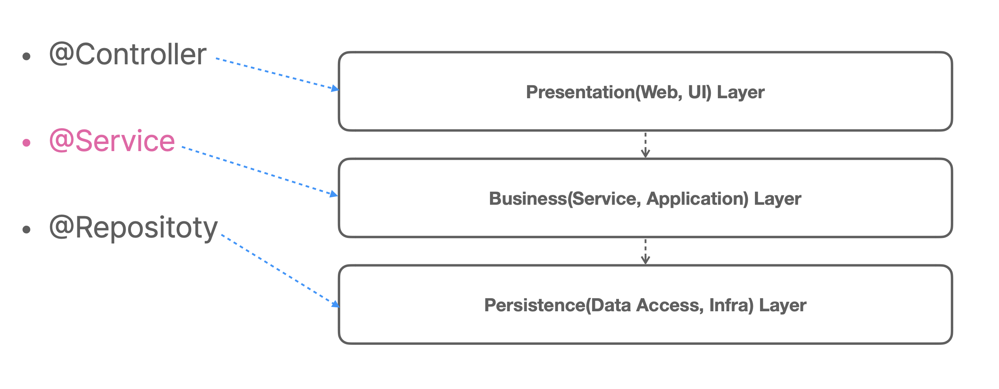

# pushpin: 토비의 스프링6
## :seedling: 서비스 추상화 (Service Abstraction)

### 스프링에 대한 오해
- 스프링은 `@Controller`, `@Service`, `@Repository`만 기계적으로 찍어내는 개발 방법이다.

### 스프링 애플리케이션의 빈이 존재하는 계층 구조
- 3개의 전형적인(stereotype) 애노테이션을 사용하는 애플리케이션 빈의 위치

### 서비스는 일반적인 용어라서 쓰이는 곳에 따라 다른 의미를 가진다

1. 서비스는 클라이언트에게 서비스를 제공해주는 오브젝트나 모듈 
2. 서비스는 일반적으로 상태를 가지지 않음 
   - 상태없는(stateless) 싱글톤 스프링 빈을 사용하기 적합 (`@Component`, `@Service`)

### 서비스의 종류
- 애플리케이션 서비스 (application service)
- 도메인 서비스(domain service)
- 인프라 서비스 (infrastructure service)
    - 도메인/애플리케이션 로직에 참여하지 않는 기술을 제공하는 서비스
    - 메일, 캐시, 트랜잭션, 메시징, ...
    - 서비스 추상화 대상!!