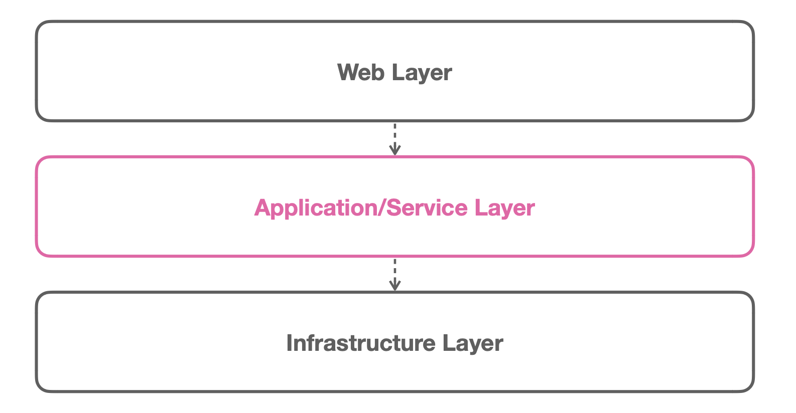
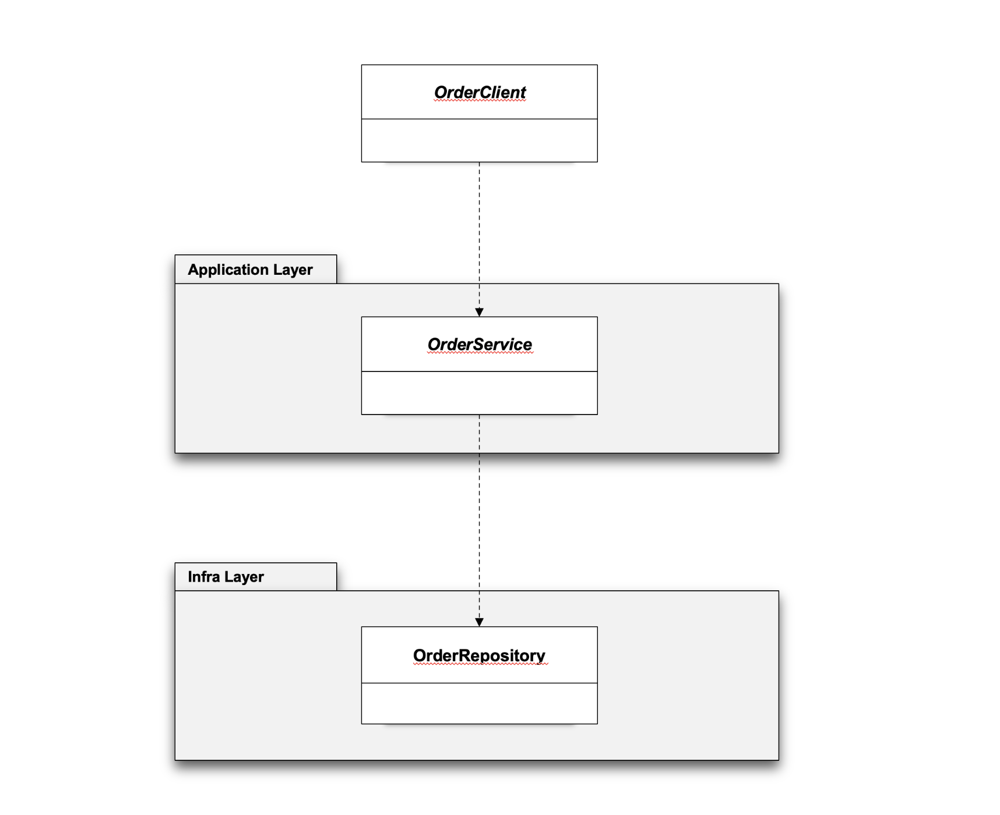
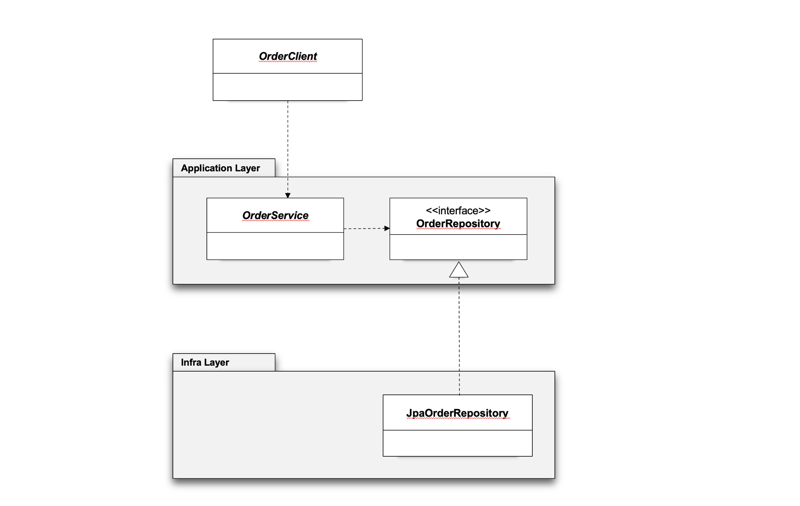
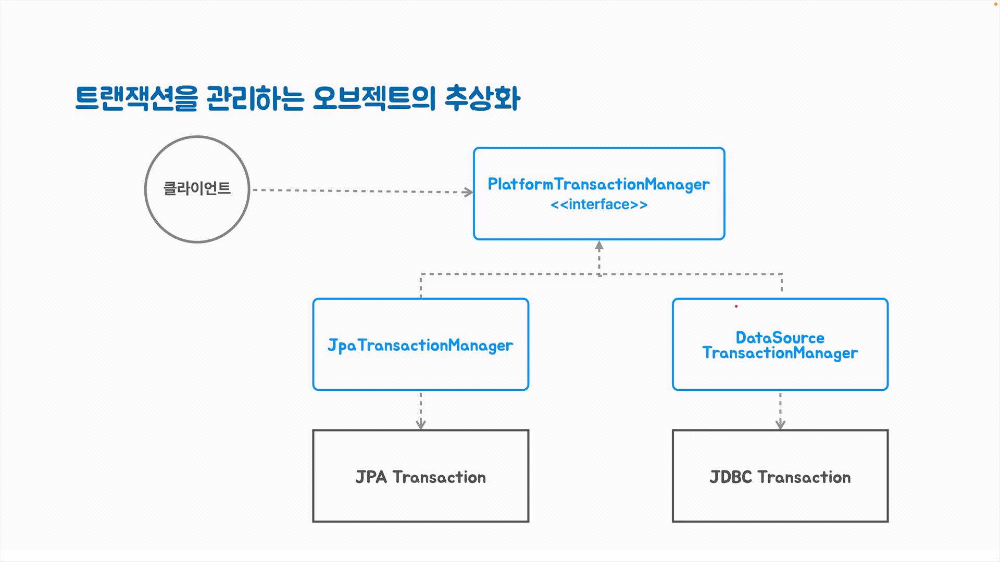

# pushpin: 토비의 스프링6
## :seedling: 서비스 추상화 (Service Abstraction)

### 스프링에 대한 오해
- 스프링은 `@Controller`, `@Service`, `@Repository`만 기계적으로 찍어내는 개발 방법이다.

### 스프링 애플리케이션의 빈이 존재하는 계층 구조
- 3개의 전형적인(stereotype) 애노테이션을 사용하는 애플리케이션 빈의 위치


### 서비스는 일반적인 용어라서 쓰이는 곳에 따라 다른 의미를 가진다

1. 서비스는 클라이언트에게 서비스를 제공해주는 오브젝트나 모듈 
2. 서비스는 일반적으로 상태를 가지지 않음 
   - 상태없는(stateless) 싱글톤 스프링 빈을 사용하기 적합 (`@Component`, `@Service`)

### 서비스의 종류
- 애플리케이션 서비스 (application service)
- 도메인 서비스(domain service)
- 인프라 서비스 (infrastructure service)
    - 도메인/애플리케이션 로직에 참여하지 않는 기술을 제공하는 서비스
    - 메일, 캐시, 트랜잭션, 메시징, ...
    - 서비스 추상화 대상!!

### 애플리케이션 서비스
- `@Service` 빈으로 구성
- Application/Service 계층에 존재
- 애플리케이션/도메인 로직 - 도메인 오브젝트/엔티티 활용
- 인프라 서비스의 도움이 필요
- 가장 중요한 도메인/애플리케이션/비즈니스 로직
- 인프라 레이어에 존재하는 기술에 가능한 의존하지 않도록 만들어야 함
- PaymentService - ExRateService에 적용된 DIP



### 기술에 독립적인 애플리케이션 서비스
OrderService
- 데이터 액세스 기술의 하나인 JPA에 의존
- JPA를 사용하는 Repository 클래스에 의존
- JPA Transaction Manager에 의존

Order
- @Entity가 붙은 JPA 엔티티로 작성
- 컴파일 시점에만 JPA 라이브러리에 의존
- 클래스 코드에는 JPA 기술과 관련된 내용이 들어가지 않음
- JPA를 사용하지 않으면 런타임에는 JPA 라이브러리에 의존하지 않음

#### Order에서 JPA 메타데이터 분리
- 애노테이션(`@Entity`)은 컴파일타임 라이브러리 의존성만 가진다
- 엔티티의 동작에는 영향을 주지 않기 때문에 엔티티 클래스를 다른 데이터 기술에 사용해도 된다
- 그래도 제거하고 싶다면 외부 XML 디스크럽터를 사용할 수 있다

#### /META-INF/orm.xml


#### 특정 기술(JPA)에 의존하지 않는 애플리케이션 서비스 만들기
- JPA Repository - OrderRepository에 의존하지 않도록 변경
- 의존관계 역전 (DIP)



- DIP 적용




#### 트랜잭션 서비스 추상화 (Platform Transaction Manager)
OrderService
- JPA를 사용하는 Repository 클래스에 의존
- JPA Transaction Manager에 의존

#### Transaction은 데이터 기술에 따라 방법이 다르다
- JDBC
- JPA
- MyBatis
- Jooq

JPA 트랜잭션
```text
EntityTransaction txn = entityManager.getTransaction();
txn.begin();
...
txn.commit();
```

JDBC 트랜잭션
```text
Connection con = ...
con.setAutoCommit(false);
...
con.commit();
```

추상화
- 구현의 복잡함과 디테일을 감추고 중요한 것만 남기는 기법
- 여러 인프라 서비스 기술의 공통적이고 핵심적인 기능을 인터페이스로 정의하고 이를 구현하는 어댑터를 만들어 일관된 사용이 가능하게 만드는 것이 서비스 추상화




#### JdbcClient
- Spring 6.1에서 추가
- SQL을 사용하는 JDBC 데이터 처리 코드를 유연하게 작성하도록 도와줌
- 일종의 템플릿/콜백
- 스프링의 JdbcTemplate의 대체 기술 

#### DataSource Transaction Manager
- JDBC의 Connection을 이용하는 트랜잭션 매니저
- Connection을 리턴하는 DataSource 오브젝트 필요 

#### JDBC 데이터 액세스용 구성 정보
- DataSource
- DataSourceTransactionManager