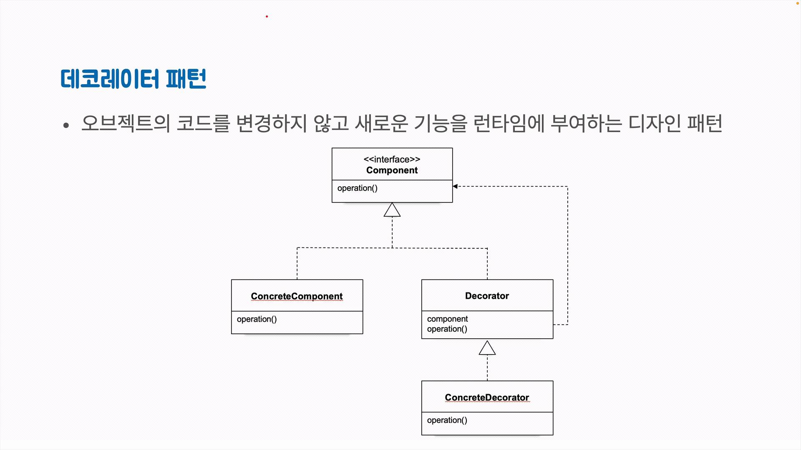
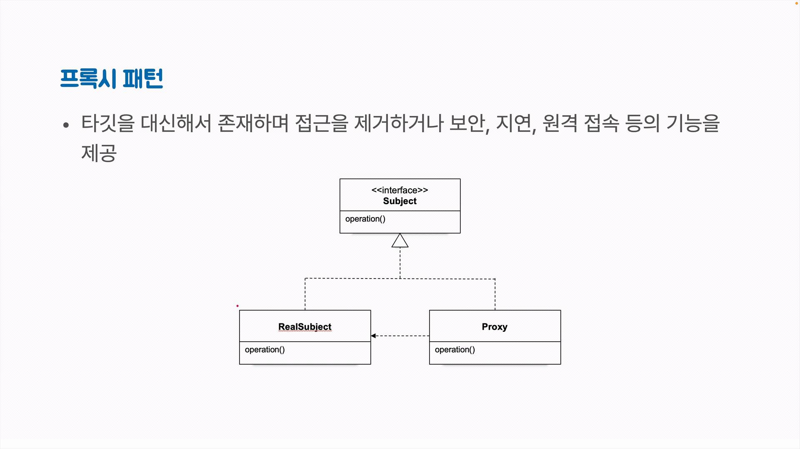
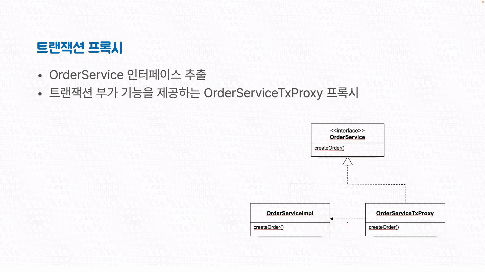
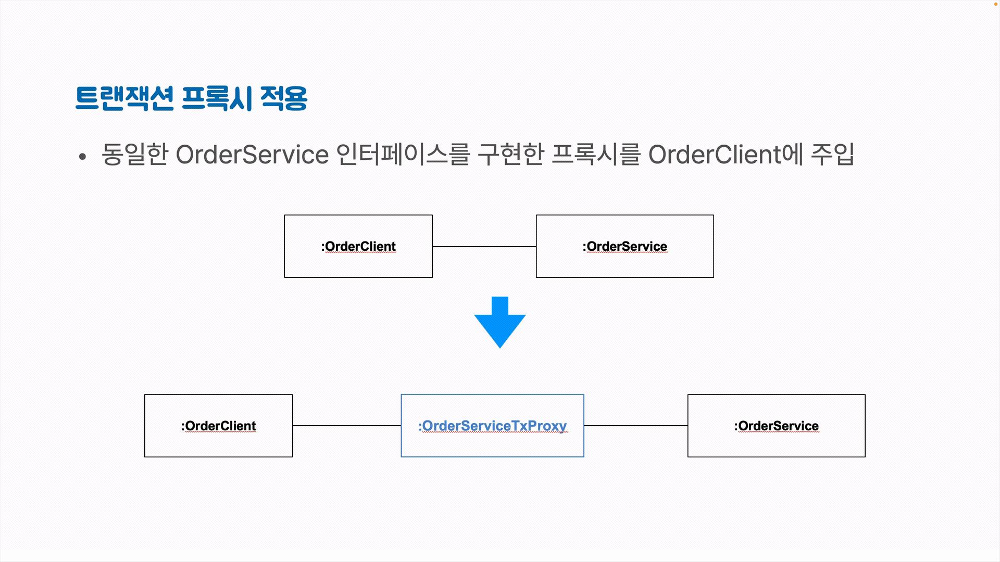

# pushpin: 토비의 스프링6
## :seedling: 트랜잭션 프록시

#### OrderService에서 기술 관련 코드 제거
- 데이터 기술이 변경되어도 기존 코드는 영향을 받지 않음
- TransactionTemplate, PlatformTransactionManager와 같은 기술과 연관된 코드가 계속 등장함
- 트랜잭션의 시작과 종료는 보통 애플리케이션 서비스 메소드 실행 전후

```java
public Order createOrder(String no, BigDecimal total) {
    return new TransactionTemplate(transactionManager).execute(status -> {
        Order order = new Order(no, total);
        
        orderRepository.save(order);
        
        return order;
    });
}
```

#### 트랜잭션 테스트
- 트랜잭션이 필요한 곳에 정확하게 적용되었는지 테스트하기는 매우 어려움
- JDBC처럼 자동 커밋이 되거나 Spring Data JPA처럼 기본 리포지토리 구현에서 트랜잭션을 알아서 적용해주는 기술을 사용할 때 트랜잭션이 바르게 적용되지 않은 것을 놓치기 쉬움
- 모든 작업이 성공하면 하나의 트랜잭션으로 진행된 것인지 여러개의 트랜잭션으로 쪼개진 것인지 확인하기 어려움
- 트랜잭션 중간에 실패하는 케이스를 만들 수 있다면 롤백 여부로 확인할 수 있음


#### 트랜잭션 프록시
- 데코레이터 패턴: 오브젝트의 코드를 변경하지 않고 새로운 기능을 런타임에 부여하는 디자인패턴 
  


- 프록시 패턴: 타깃을 대신해서 존재하며 접근을 제거하거나 보안, 지연, 원격 접속 등의 기능을 제공 



- 트랜잭션 프록시
  - OrderService 인터페이스 추출
  - 트랜잭션 부가 기능을 제공하는 OrderServiceTxProxy 프록시




#### 트랜잭션 프록시 적용
- 동일한 OrderService 인터페이스를 구현한 프록시를 OrderClient에 주입



#### 스프링이 만들어주는 트랜잭션 프록시
- `@Transactional` 애노테이션이 붙은 클래스의 메소드가 트랜잭션 안에서 실행되도록 프록시를 만들어줌