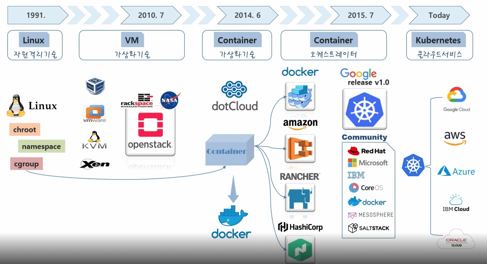
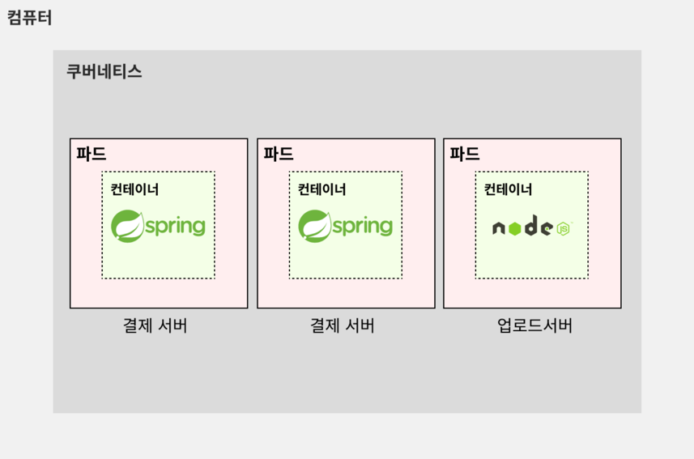

# :book: 인프런 - 쿠버네티스 강의

## :pushpin: 기초편

### Introduction
- 컨테이너 가상화기술은 서비스 간에 자원 격리를 하는데 OS를 별도로 안띄워도 됨
- OS 기동시간이 없기 때문에 자동화 시 엄청 빠르고 자원 효율도 매우 높음 
- 도커 자체는 하나의 서비스를 컨테이너로 가상화시켜서 배포를 하는거지 엄청 많은 서비스들을 운영할때 일일이 배포하고 운영하는 역할을 해주지 않음.
- 이런 것을 해주는 것이 `컨테이너 오케스트레이터`라는 개념으로 여러 컨테니어들을 관리해주는 솔루션

### Why Kubernetes?

