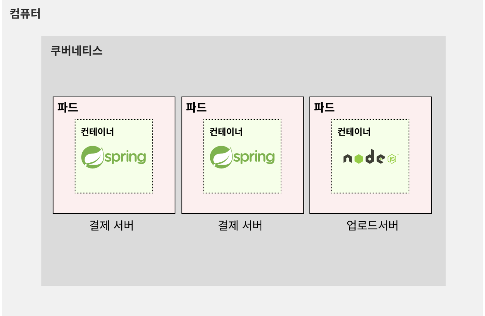
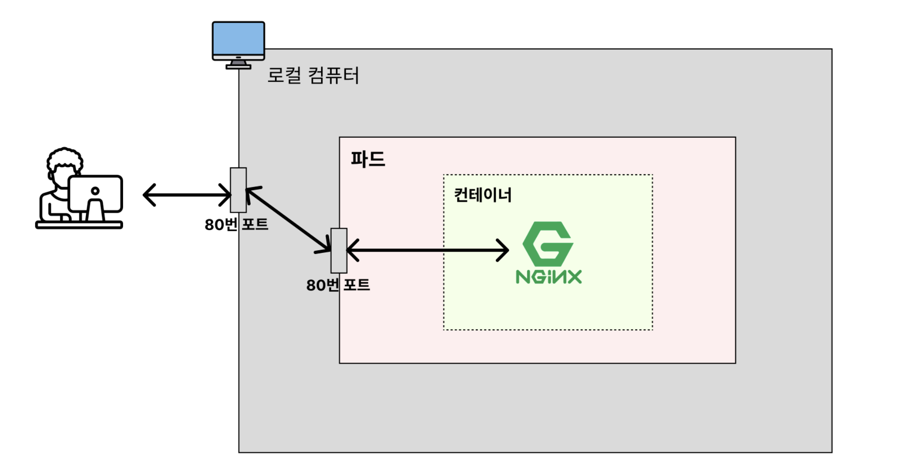
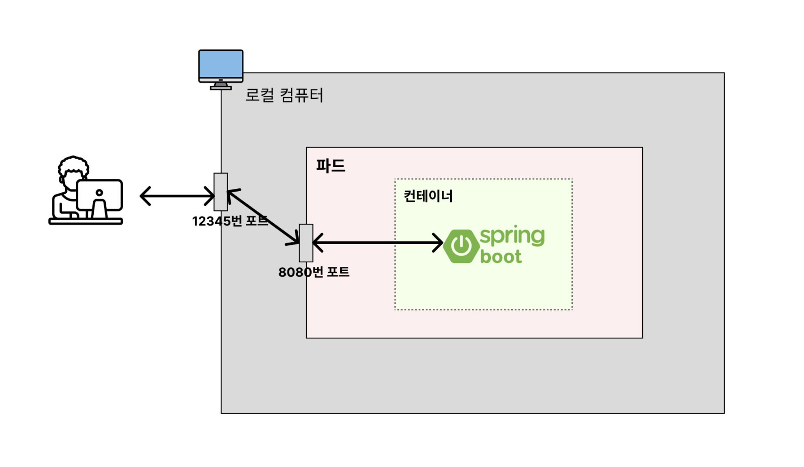

# :book: 인프런 - 쿠버네티스 강의
## :pushpin: 쿠버네티스 입문/실전편


### 쿠버네티스란?
쿠버네티스(Kubernetes)란?
- 쿠버네티스는 *다수의 컨테이너를 효율적으로 배포, 확장 및 관리*하기 위한 오픈 소스 시스템이다.
- 쿠버네티스는 Docker Compose와 비슷한 느낌을 가지고 있다. Docker Compose도 다수의 컨테이너를 쉽게 관리하기 위해 활용하기 때문

쿠버네티스의 장점 
- 컨테이너 관리 자동화 (배포, 확장, 업데이트)
- 부하 분산 (로드밸런싱)
- 쉬운 스케일링
- 셀프 힐링


### 로컬에서의 쿠버네티스 설치 (Docker Desktop)
- 1. Docket Desktop을 활용해서 쿠버네티스를 설치해서 사용
- 2. kubectl 설치
  - kubectl (Kubernetes Control)의 줄임말: 쿠버네티스에 명령어를 입력할 수 있게 해주는 CLI 툴
- 3. 잘 작동하는지 확인
  - kubectl version

kubenetes 설치 link: https://soojae.tistory.com/87
kubectl 설치 link: https://kubernetes.io/ko/docs/tasks/tools/install-kubectl-macos/
  

### 파드(Pod)란?
- 도커에서는 하나의 프로그램을 실행시키는 단위를 `컨테이너`라고 불렀음
- 쿠버네티스에서는 하나의 프로그램을 실행시키는 단위를 `파드(Pod)`라고 한다.
- 파드(Pod): **쿠버네티스에서 하나의 프로그램을 실행시키는 단위**
  - 쿠버네티스에서 가장 작은 단위
  - 일반적으로 하나의 파드가 하나의 컨테이너를 가진다.
  - 예외적으로 하나의 파드가 여러 개의 컨테이너를 가지는 경우도 있다.
  

- 2개의 결제 서버가 띄워져 있다 = 2개의 결제 서버 파드(Pod)가 띄워져있다.
- 1개의 결제 서버가 죽었다 = 1개의 결제 서버 파드(Pod)가 죽었다
- 업로드 서버를 하나 띄우자 = 업로드 서버 하나를 파드(Pod)로 띄우자


### 웹 서버(Nginx)를 파드(Pod)로 띄워보기
- 파드(Pod)를 생성할 때 CLI를 활용하는 방법이 있고 yaml 파일을 활용하는 방법이 있다.
- 실제 현업에서는 yaml 파일을 활용하는 경우가 많다. 따라서 yaml 파일을 활용해서 파드(Pod)를 생성해볼 것이다.

nginx-pod.yaml
````
apiVersion: v1
kind: Pod

metadata:
  name: nginx-pod

spec:
  containers:
    - name: nginx-container
      image: nginx
      ports:
        - containerPort: 80
````

```
kubectl apply -f nginx-pod.yaml

kubectl get pods
```

- yaml 파일: 매니페스트 파일
- 매니페스트 파일 (Manifest File): 쿠버네티스에서 다양한 여러가지의 리소스를 생성하고 관리하기 위해 사용하는 파일 


### 파드(Pod)로 띄운 프로그램이 접속이 안되는 이유
- 도커는 컨테이너 내부와 컨테이너 외부의 네트워크가 서로 독립적으로 분리되어 있다.
- 쿠버네티스에서는 파드(Pod) 내부의 네트워크를 컨테이너가 공유해서 같이 사용한다.
- 파드(Pod)의 네트워크는 로컬 컴퓨터의 네트워크와는 독립적으로 분리되어 있다. 
- 이때문에 파드(Pod)로 띄운 Nginx에 아무리 요청을 보내도 응답이 업던 것이다.

따라서 Nginx가 띄우는 웹 페이지에 접근하려면 2가지 방법이 있다.
1. 파드(Pod) 내부로 들어가서 접근하기
2. 파드(Pod) 내부 네트워크를 외부에서도 접속할 수 있도록 포트 포워딩(=포트 연결) 활용


### 파드 내부로 들어가서 접근하기

```text
kubectl exec -it nginx-pod -- bash

curl localhost:80
```


### 포트 포워딩을 활용해 Nginx로 요청보내기



```
kubectl port-forward pod/nginx-pod 80:80 (pod/nginx-pod: pod 이름)

sudo kubectl port-forward pod/nginx-pod 80:80 (mac은 sudo 권한 필요)

kubectl delete pod ngin-pod (pod 삭제)

kubectl get pods (pod 삭제 확인)
```

### 백엔드(Spring Boot) 서버를 파드(Pod)로 띄워보기

1. Spring Boot 프로젝트 셋팅
2. 간단한 코드 작성
3. Dockerfile 생성

```text
FROM openjdk:17-jdk

COPY build/libs/*SNAPSHOT.jar app.jar

ENTRYPOINT ["java", "-jar", "/app.jar"]
```

4. 명령어 실행 
```text
./gradle clean build

docker build -t spring-server . (docker 이미지 생성)

dokcer image ls
```

5. 매니페스트 파일 만들기

spring-pod.yaml
```text
apiVersion: v1
kind: Pod

metadata:
  nqme: spring-pod
  
spec:
  containers:
    - name: spring-contaier
    image: spring-server
    ports:
      - containerPort:8080
```
- 위의 매니페스트 파일에서는 이미지 풀 정책을 따로 설정하지 않음. 이럴때는 아래와 같이 작동함
  - 이미지의 태그가 latest 이거나 명시되지 않은 경우: imagePullPolicy는 Always로 설정됨
  - 이미지의 태그가 latest가 아닌 경우: imagePullPolicy는 IfNotPresent로 설정됨

6. 매니페스트 파일 기준으로 Pod 생성

```
kube apply -f spring-pod.yaml
```


### 이미지가 없다고 에러가 뜨는 이유 (이미지 풀 정책)

이미지가 없다고 에러가 뜨는 이유
- Spring Boot 프로젝트를 이미지로 빌드해서 파드로 띄웠다. 
- 하지만 `ImagePullBackOff` 라는 에러가 발생함
이 문제는 이미지 풀 정책(Iamge Pull Policy)때문에 발생한 것

### 이미지 풀 정책 (Image Pull Policcy)
- **이미지 풀 정책(Image Pull Policy)**: 쿠버네티스가 yaml 파일을 읽어들여 파드를 생성할 때, 이미지를 어떻게 Pull을 받아올 것인지에 대한 정책으리 의미

1) Always: 로컬에서 이미지를 가져오지 않고 무조건 레지스트리(= Dockerhub, ECR과 같은 원격 이미지 저장소)에서 가져온다.
2) IfNotPresent: 로컬에서 이미지를 먼저 가져온다. 만약 로컬에 이미지가 없는 경우에만 레지스트에서 가져온다.
3) Never: 로컬에서만 이미지를 가져온다.


#### 매니페스트 파일에 이미지 풀 정책 설정하는 방법

```text
apiVersion: v1
kind: Pod
metadata:
  name: spring-pod
spec:
  containers:
    - name: spring-container
    image: spring-server
    ports:
      - containerPort: 8080
    imagePullPolicy: Always
```

명령어 실행
```text
kubectl delete pod spring-pod

kubectl apply -f spring-pod.yaml

kubectl get pods (STATUS가 Running인지 확인)
```

Hello, World 확인하기
```text
1) Pod 내부에 들어가서 확인 
kubectl exec -it spring-pod -- bash

curl localhost: 8080

2) 포트포워딩 활용
kubectl port-forward pod/spring-pod 12345:8080

localhost:12345로 접속해서 확인 
```




Pod 삭제
```text
kubectl delete pod spring-pod

kubectl get pods
```
