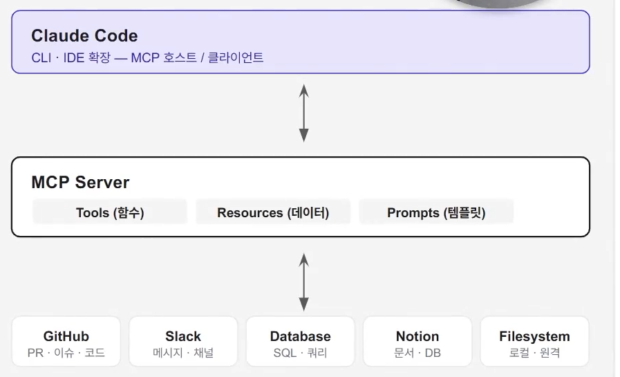
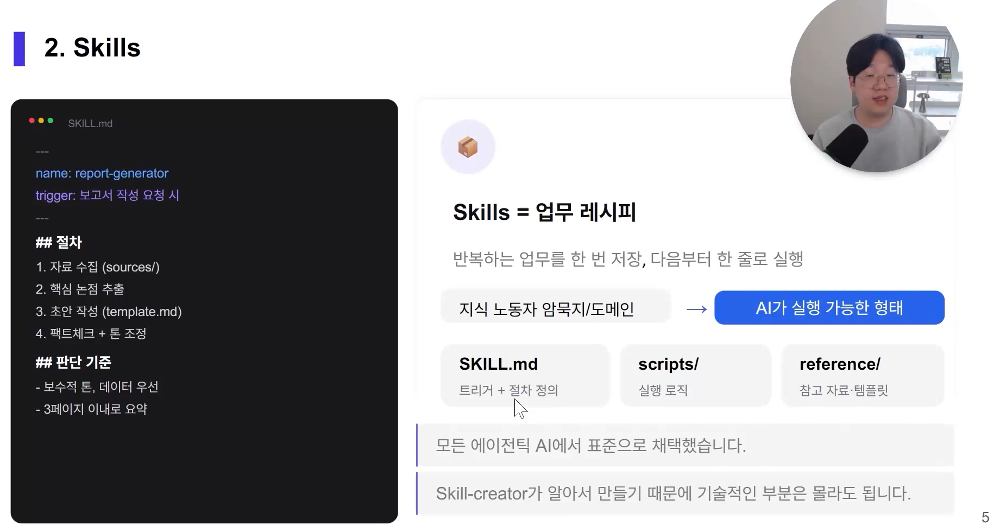
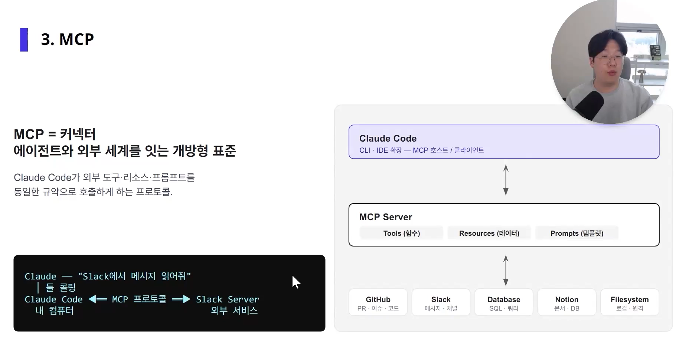
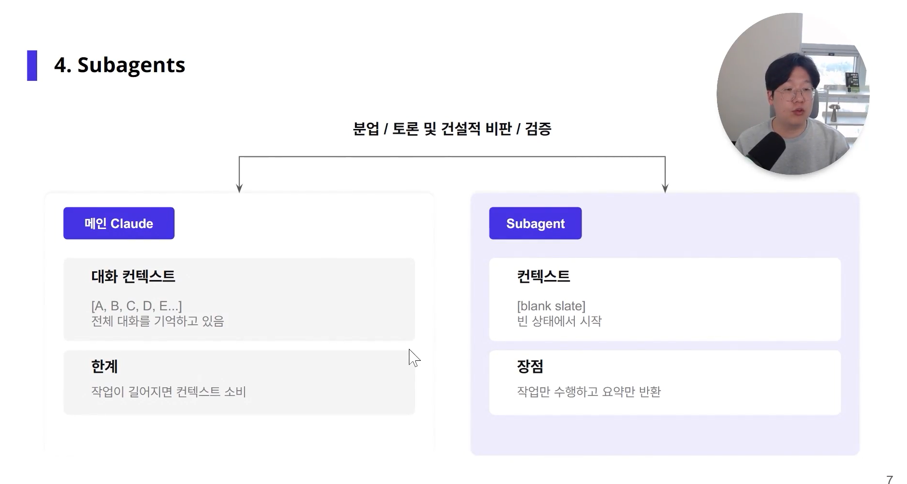
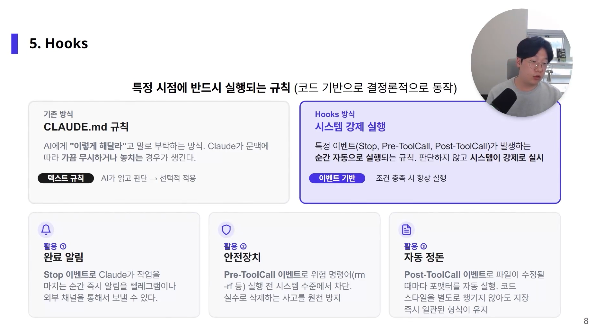

# :pushpin: Claude Skills와 하네스 엔지니어링


### 1. AI 에이전트 시작하기
- AI 에이전트란?
  - 복잡하고 번거로운 것을 대신해주는 존재 (광고 에이전트, 해외 진출 에이전트...)
  - 목표를 받아 스스로 계획하고 도구를 써서 일을 완수하는 AI

#### 왜 AI 에이전트인가?
- 멀티 보고서 생성 (한번의 명령으로 docx, pdf, ppt)
- 멀티 콘텐츠 생성 및 등록 자동화 (뉴스레터/buffer api)
- 자동 회의록 요약 및 발송
- 데이터 분석 자동화 
- 웹사이트 크롤링 조사
- 개발 자동화
- 콘텐츠 변환 자동화 
- 여러 디자인 제작 생성

> 내 컴퓨터에 LLM이 들어와 무한한 작업이 가능함 (컴퓨터와 인터넷에 대한 접근 권한 부여)

#### AI 에이전트 도구
- Claude Code
- ChatGPT Codex

#### AI 에이전트 시작하기
AI 에이전트에 업무를 위임해야하는 이유
- 복잡하고 번거로운 일을 대신 해결해주는 대행자라는 어원에서 유래
- 기존 챗봇(ChatGPT, 클로드 등)이 사용자의 질문에 단순히 답변만 제공했다면 AI에이전트는 인간에게 목표를 부여 받은 뒤는 스스로 계획을 세우고 다양한 디지털 도구를 사용해 업무를 끝까지 완수하는 존재
- 예) 질문에 답을 하는 수준을 넘어 실제 PPT 슬라이드 제작, 웹사이트 데이터 크롤링 후 엑셀 정리, 이메일 발송 등
- 컴퓨터와 인터넷에 대한 접근 권한을 가지고 움직임

### 2. AI 트렌드: 물어보는 AI에서 일하는 AI로
AI 전환 3단계
- 증강: 질문하고 답받기
- 자동화: 반복 업무를 에이전트에게 위임한다. (진짜 생산성 도약은 여기서)
- 조직화: 여러 에이전트가 협업하는 시스템 (개인의 도구가 조직의 파이프라인으로 묶인다.)

+바이브코딩: 조직 내부 문제 해결을 위한 도구를 직접 만들어 사용 -> 가장 쉽게 실천할 수 있는 자동화 


### 에이전트 업무 처리의 핵심: Skills / MCP

- Skills가 에이전트 전문성의 핵심이다 -> 에이전트 재사용성 증대

SKILL.md
```text
---
name: report-generator
trigger: 보고서 작성 요청 시
---

## 절차
1. 자료 수집(sources/)
2. 핵심 논점 추출
3. 초안 작성 (template.md)
4. 팩트체크 + 톤 조정

## 판단 기준
- 보수적 톤, 데이터 우선
- 3페이지 이내로 요약
```

- 반복하는 업무를 한번 저장, 다음부터 한 줄로 실행
- 지식 노동자 암묵지/도메인 -> AI가 실행 가능한 형태

- Skills = 업무 레시피
    - SKILL.md : 트리거 + 절차 정의
    - scripts/ : 실행 로직
    - reference/ : 참고 자료, 템플릿
- 모든 에이전틱 AI에서 표준으로 채택
- Skill-creator가 알아서 만들기 때문에 기술적인 부분은 몰라도됨

#### MCP
- MCP는 에이전트를 외부 도구와 연결해준다 -> 데이터 입/출력 범위 확대
- MCP = 커넥터
- 에이전트와 외부 세계를 잇는 개방형 표준
- Claude Code가 외부 도구, 리소스, 프롬프트를 동일한 규약으로 호출하게 하는 프로토콜.



#### Scope
- User Code
- 모든 프로젝트에 전역 적용
- 주요 설정
  - 모델 선택
  - 전역 권한 (WebSearch, Bash 등)
  - 사용자 스킬
- Project Scope
- 해당 프로젝트에만 적용, Git 공유
- 주요 설정
  - 프로젝트 전용 스킬 & 에이전트
  - 프로젝트 규칙

클로드, 코덱스 데스크톱 앱 설치하면 설치되는 기본 스킬
- /docx
- /pptx
- /pdf

#### Skills와 MCP에 대하여
- Skills 는 실무자의 노하우나 도메인 지식을 에이전트가 이해하고 실행할 수 있는 형태로 패키징해둔 문서
- 하나의 폴더 형태로 정의되며, 다음의 3요소로 구성
1. 스킬 지침서 (스킬.md / skill.md)
2. 실행 스크립트 (scripts 폴더)
3. 참고 자료 (references 또는 assets 폴더)
- MCP는 에이전트가 로컬 폴더 외부의 다양한 소프트웨어 및 도구들과 연결할 수 있도록 지원하는 커넥터


### Skills & MCP 설치: 두가지 방식
단독 설치: 하나의 Skill 혹은 하나의 MCP 서버만 골라 필요한 기능만 가볍게 추가하는 방식
플러그인 통합 설치: Skill, MCP, Command, Agent를 패키지화한 플러그인으로 일관된 작업 환경을 한번에 구성

단독 설치 상세
1. Customize 진입 -> 키워드 검색 -> Install
2. Github 링크 + 자연어 요청 

#### Skill-creator로 나만의 스킬 만들기
- Github 활용의 가치
  - GibHub 는 파일 형태로 코드가 공유되기 때문에 에이전트가 소스를 분석하고 컴퓨터에 세팅하기 가장 좋은 매체
  - 여러 PC에서 작업 환경을 똑같이 공유하거나 에이전트의 실수 시 롤백, 팀 간 협업 관점에서도 유용

- 스코프(Scope)별 관리 구조의 차이
  - 스코프란?: 스킬(Skills)이나 MCP가 설치되고 작동하는 적용 범위
  - 사용 목적에 따라 아래의 두 가지 범위 중 하나를 지정하여 설치 요청
    - 유저 스코프: 전체 프로젝트에서 공통으로 사용, 개별 사용자 프로필 폴더 하위의 .claude 폴더나 .claude.json (MCP 서버 설정 보관 파일)에 기록
    - 프로젝트 스코프: 특정 프로젝트 폴더 안에서만 작동, 해당 작업 폴더의 .claude 폴더 및 mcp.json 파일에 독립적으로 저장
- 워크플로우 설계 시 시사점
- 개별 도구를 하나씩 쓰는데 그치지 않고, 외부 비즈니스 채널들을 MCP로 열어준 뒤 융합함으로써 업무의 인풋부터 아웃풋까지 하나의 유기적인 에이전트 시스템으로 설계하는 안목 필요

### Skills의 다양한 활동
스킬 크리에이터 활성화 워크플로우
- 에이전트의 슬래시 명령어 입력창에 /skill-creator를 검색하여 내장된 스킬 제작 도구 실행
- 자연어로 업무 묘사
- 스코프 지정
- 스킬 빌드 및 세팅
- 스킬 빌드가 완료되면 프로젝트 폴더 내부의 .claude/skills/[스킬명] 하위에 3요소 자동 세팅
- 에이전트가 새로운 스킬을 올바르게 로드할 수 있도록 클로드 코드를 완전히 종료한 후 재실행
- 슬래시 커맨드로 등록된 맞춤형 스킬을 자유롭게 호출해 반복 실행 가능 


### 에이전트 셋팅을 위한 배경 지식
프롬프트 엔지니어링에서 하네스 엔지니어링으로

프롬프트 (Prompt)
- "무엇을 시킬까"에 집중. 매번 좋은 질문을 만들어야 한다.
  - 일회성: 매번 프롬프트를 새로 작성
  - 의존성 높음: 잘하는 사람만 잘
  - 결과편차: 같은 의도여도 출력이 달라짐
- 지시(Instruction)

하네스 (Harness)
- 말의 고삐처럼 AI가 내 기준대로 움직이게 만드는 장치. "어떻게 일하게 할까"를 설계. 한번 세팅하면 반복적으로 동작한다.
  - 재사용: 스킬로 만들면 계속 쓸 수 있음
  - 표준화: 누가 써도 일정한 품질
  - 한계 극복: 환각/편차 등의 고질적인 문제를 해결
- 설계(Design)와 통제(Control)

> 프롬프트를 잘 쓰는 것이 아니라 AI가 일하는 방식 자체를 설계하는 것이 중요하다.


#### 에이전트 하네스 엔지니어링의 기능 구성 요소

1. Skills (CAPABILITY)
- 전문 작업 가이드
- 단일 업무 절차를 정형화해 필요할 때 호출되는 작업 단위.

2. MCP (INTEGRATION)
- 외부 도구 연동
- 서드파티 API, DB, 파일시스템을 에이전트로 끌어오는 다리

3. Subagent (BRANCHING)
- 하위 에이전트
- 독립된 컨텍스트로 작업을 위임해 병렬, 전문화 협업 에이전트 구조 셋팅

Hook
- 코드 기반 이벤트 자동화
- 특정 이벤트에서 자동 실행되는 트리거 - 필요할 때문 부착

FOUNDATION
CLAUDE.md / AGENTS.md
에이전트 전체 지침, 업무 지침(SOP), 기본 컨텍스트 반영

#### CLAUDE.md
매 세션마다 자동으로 읽혀서 주입되는 프로젝트 규칙

Step 1: 세션 시작
터미널에서 claude 입력

Step 2: CLAUDE.md 읽기
프로젝트 루트의 규칙서 로드

Step 3: 시스템 프롬프트 주입
규칙이 대화 컨텍스트에 자동 삽입

Step 4: 대화 시작
Claude가 규칙을 아는 상태로 응답

일반적으로는 직접 만들지 않습니다. Claude Code가 알아서 만들게 둡니다.
CLAUDE.md가 너무 길면 오히려 좋지 않습니다. 200줄 이하를 권장합니다. AI 유추해서 알만한 내용은 적지 않는게 좋다고 합니다.

#### Skills



Skills = 업무 레시피
반복되는 업무를 한 번 저장, 다음부터 한 줄로 실행

지식 노동자 암묵지/도메인 -> AI가 실행 가능한 형태
SKILL.md: 트리거 + 절차 정의
scripts/: 실행 로직
reference/: 참고 자료, 템플릿

모든 에이전틱 AI에서 표준으로 채택했습니다.
Skill-creator가 알아서 만들기 때문에 기술적인 부분은 몰라도 됩니다.


#### MCP



MCP = 커넥터
에이전트와 외부 세계를 잇는 개방형 표준
- Claude Code가 외부 도구, 리소스, 프롬프트를 동일한 규약으로 호출하게 하는 프로토콜

Claude Code: CLI, IDE 확장, MCP 호스트 / 클라이언트

MCP Server
- Tools (함수)
- Resources (데이터)
- Prompts (템플릿)

Github
Slack
Database
Notion
FIlesystem


#### Subagent


메인 Claude
대화 컨텍스트 [A, B, C, D, E...]: 전체 대화를 기억하고 있음
한계: 작업이 길어지면 컨텍스트 소비

Subabent
컨텍스트 [blank slate]: 빈 상태에서 시작
장점: 작업만 수행하고 요약만 반환


#### Hooks


특정 시점에 반드시 실행되는 규칙 (코드 기반으로 결정론적으로 동작)

기존 방식 
- CLAUDE.md 규칙
  - AI에게 이렇게 해달라고 말로 부탁하는 방식. Claude가 문맥에 따라 가끔 무시하거나 놓치는 경우가 생긴다.
    - 텍스트 규칙: AI가 읽고 판단 -> 선택적 적용

hooks 방식
- 시스템 강제 실행
  - 특정 이벤트(Stop, Pre-ToolCall, Post-ToolCall)가 발생하는 순간 자동으로 실행되는 규칙.
  - 판단하지 않고 시스템이 강제로 실행
  - 이벤트 기반: 조건 충족시 항상 실행
- 활용 1
  - 완료 알림: Stop 이벤트로 Claude가 작업을 마치는 순간 즉시 알림을 텔레그렘이나 외부 채널을 통해서 보낼 수 있다.
- 활용 2
  - 안전장치: Pre-ToolCall 이벤트로 위험 명령어(rm -rf 등) 실행 전 시스템 수준에서 차단. 실수로 삭제하는 사고를 원천 방지
- 활용 3
  - Post-ToolCall 이벤트로 파일이 수정될 때마다 포맷터를 자동 실행. 코드 스타일을 별도로 챙기지 않아도 저장 즉시 일관된 형식이 유지

#### Plugin
위의 모든 기능을 묶어서 팀에 한 줄로 배포 (Plugin 하나면 Skills + Hooks + MCP 서버가 가능)
Plugin 설치를 통한 기능 확장: 앱스토어에서 앱을 설치하듯이 웹 검색, 문서 생성, 외부 서비스 연동 등 새로운 기능이 추가됨

1. /plugin 명령어로 마켓 플레이스 탐색
2. plugin 선택 및 원클릭 설치
3. 설치 범위 (유저/프로젝트 스코프 결정)

구성 1
Skills
/명령어로 실행하는 기능. /plugin, /slide 처럼 원하는 순간 직접 호출해 특정 작업을 수행하는 확장 명령어다.

구성 2
Hooks
백그라운드에서 자동 실행되는 규칙. 특정 이벤트가 발생하는 순간 사용자 개입없이 자동으로 동작한다.
예: 작업 완료시 macOS 알림 발송

구성 3
MCP 서버
외부 서비스와 연결하는 통로. GitHUb, Google Drive 같은 외부 플랫폼을 Claude Code와 직접 연동해 데이터를 주고받을 수 있게 해준다.


