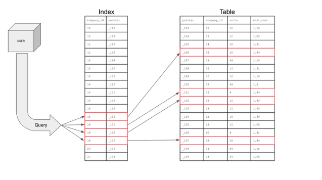

# :book: selab-study
## :pushpin: Topic. DB Index

### 인덱스란?

> -  인덱스란 추가적인 쓰기 작업과 저장 공간을 활용하여 데이터베이스 테이블의 검색 속도를 향상시키기 위한 자료 구조
> - 만약 우리가 책에서 원하는 내용을 찾는다고 하면, 책의 모든 페이지를 찾아보는 것은 오랜 시간이 걸림
> - 책의 저자들은 책의 맨 앞 또는 맨 뒤에 색인을 추가하는데, 데이터베이스의 index는 책의 색인과 같음
> - 테이블의 모든 데이터를 검색하면 시간이 오래 걸리기 떄문에 데이터와 데이터의 위치를 포함한 자료구조를 생성하여 빠르게 조회할 수 있도록 도움

### 인덱스 활용
- 만약 index를 사용하지 않은 컬럼을 조회해야 하는 상황이라면 전체를 탐색하는 `Full Scan`을 수행해야 함
- `Full Scan`은 전체를 비교하여 탐색하기 때문에 처리 속도가 떨어짐

### 인덱스(index)의 장점과 단점

- 장점
    - 테이블을 조회하는 속도와 그에 따른 성능을 향상시킬 수 있음
    - 전반적인 시스템의 부하를 줄일 수 있음
- 단점
    - 인덱스를 관리하기 위해 DB의 약 10%에 해당하는 저장공간이 필요
    - 인덱스를 관리하기 위해 추가 작업이 필요
    - 인덱스를 잘못 사용할 경우 오히려 성능이 저하되는 역효과가 발생할 수 있음
    

### 인덱스 사용 시 주의할 점

- DBMS는 index를 항상 최신의 정렬된 상태로 유지해야 원하는 값을 빠르게 탐색할 수 있음

- 인덱스가 적용된 컬럼에 `INSERT`, `UPDATE`, `DELETE`가 수행된다면 다음과 같은 연산을 추가적으로 해주어야함
    - `INSERT: 새로운 데이터에 대한 인덱스를 추가`
    - `DELETE: 삭제하는 데이터의 인덱스를 사용하지 않는다는 작업을 진행함`
    - `UPDATE: 기존의 인덱스를 사용하지 않음 처리하고, 갱신된 데이터에 대한 인덱스를 추가`
    
- 만약 `CREATE`, `DELETE`, `UPDATE` 가 빈번한 속성에 인덱스를 걸게 되면 인덱스의 크기가 비대해져서 성능이 오히려 저하되는 역효과가 발생할 수 있음
- UPDATE와 DELETE는 기존의 인덱스를 삭제하지 않고 '사용하지 않음'으로 처리함
- 만약 어떤 테이블에 UPDATE와 DELETE가 빈번하게 발생된다면 실제 데이터는 10만 건이지만 인덱스는 100만 건이 넘어가게 되어, sQL 문 처리 시 
비대해진 인덱스에 의해 오히려 성능이 떨어지게 됨. 