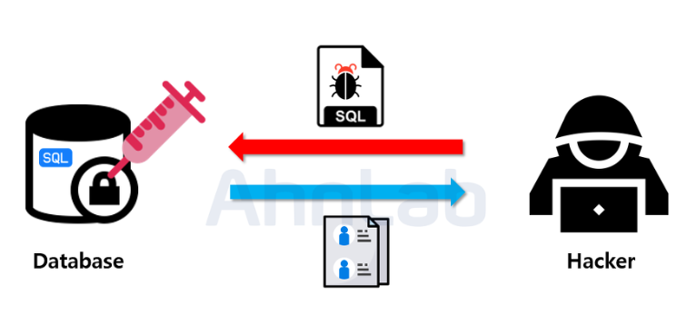

# :book: selab-study
## :pushpin: Topic. SQL Injection


### SQL Injection

- 악의적인 사용자가 보안 상의 취약점을 이용하여 `임의의 SQL문을 주입하고 실행되게 하여 데이터베이스가 비정상적인 동작을 하도록 조작하는 행위`
- OWASP TOP 10 중 첫번째에 속해 있으며, 공격이 비교적 쉬운 편이고 공격에 성공할 경우 큰 피해를 입힐 수 있음
- OWASP TOP 10 (https://oingdaddy.tistory.com/483)


 
 
### 웹 페이지의 SQL
- `SQL Injection`은 일반적으로 사용자에게 `사용자 이름`/`사용자 ID`와 같은 입력을 요청하고 이름/ID 대신 사용자가 데이터베이스에서 무의식적으로 실행할 SQL 문을 입력할 때 발생함
- 예시
```
txtUserId = getRequestString("UserId");
txtSQL = "SELECT * FROM Users WHERE UserId = " + txtUserId;
```

### 1=1 을 기반으로 하는 SQL 주입은 항상 TRUE 이다
- 사용자가 잘못된 입력을 입력하는 것응 방지할 방법이 없다면 사용자는 다음과 같이 입력할 수 있음

```
사용자 ID: 105 OR 1=1
```

- 그러면 SQL문은 다음과 같이 된다.

```
SELECT * FROM Users WHERE UserID = 105 OR 1=1;
```

- 위의 SQL은 유효하며 OR 1=1 이 항상 TRUE 이기 때문에 `"Users"` 테이블의 모든 행을 반환함
- 만약 `"Users"` 테이블에 이름과 암호가 포함되어 있다면?
- 위의 SQL문은 아래 SQL문과 거의 동일함

```
SELECT UserId, Name, Password FROM Users WHERE UserId = 105 or 1=1;
```

- 해커는 단순히 `105 OR 1=1`을 입력 필드에 삽입하여 데이터베이스의 모든 사용자 이름과 암호에 액세스할 수 있음

### ""=""에 기반한 SQL 주입은 항상 TRUE 이다

- 다음은 웹 사이트의 사용자 로그인 예시
```
사용자 이름: YYUN
비밀번호: 1234
```

````
uName = getRequestString("username");
uPass = getRequestString("userpassword");

sql = 'SELECT * FROM Users WHERE Name = "' + uName + '" AND Pass = "' + uPass + '"'
````

- 결과
```
SELECT * from Users WHERE Name = "YYUN" AND Pass = "1234"
```

- 해커는 사용자 이름 또는 암호 입력 박스에 " OR ""="를 삽입하기만 하면 데이터베이싀 사용자 이름과 암호에 액세스할 수 있음

```
사용자 이름: "or ""="
비밀번호: " or""="
```

- 결과
```
SELECT * FROM Users WHERE Name = "" or ""="" AND Pass = "" or ""=""
```

- OR ""==""는 항상 TRUE 이므로 위의 SQL은 유효하며 "Users" 테이블의 모든 행 반환

### 대응 방안
- 입력 값에 대한 검증
- Prepared Statement 구문 사용
- Error Message 노출 금지
- 웹 방화벽 사용


### 참고
- https://noirstar.tistory.com/264