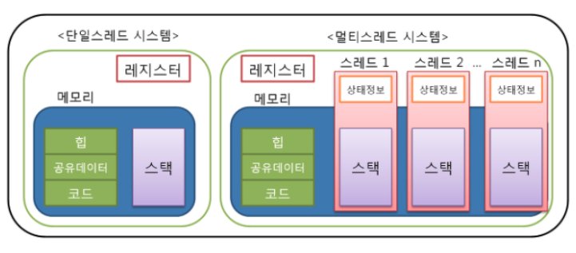

# :book: selab-study
## :pushpin: Topic. 멀티 프로세스와 멀티 스레드 차이

### 프로세스와 스레드
- 프로세스는 `운영체제`로부터 `자원을 할당받는 작업의 단위`
- 스레드는 `프로세스`가 할당받은 `자원을 이용하는 실행의 단위`

### 멀티 프로세스 (Multi Process)
> 두 개 이상 다수의 프로세서(CPU)가 협력적으로 하나 이상의 작업(Task)를 동시에 처리하는 것 (병렬처리)
> 각 프로세스 간 메모리 구분이 필요하거나 독립된 주소 공간을 가져야할 경우 사용함

#### 장점
- 독립된 구조로 안정성이 높은 장점
- 프로세스 중 하나에 문제가 생겨도 다른 프로세스에 영향을 주지 않아, 작업 속도가 느려질 수는 있지만
정지되거나 하는 문제는 발생하지 않음
- 여러 개의 프로세스가 처리되어야할 때 동일한 데이터를 사용하고, 이러한 데이털르 하나의 디스크에 두고
모든 프로세서(CPU)가 이를 공유하면 비용적으로 저렴

#### 문제점
- 독립된 메모리 영역이기 때문에 작업량이 많을수록 (Context Switching이 자주 일어나서 주소공간의 공유가 잦을 경우)
오버헤드가 발생하여 성능 저하가 발생할 수 있음

### 멀티 스레드 (Multi Thread)

> 하나의 프로세스에 여러 스레드로 자원을 공유하며 작업을 나우어 수행하는 것 

#### 장점
- 프로세스를 생성하여 자원을 할당하는 시스템 콜이 줄어 자원을 효율적으로 관리할 수 있음

#### 문제점
- 자원을 공유하기에 동기화 문제가 발생할 수 있음 (병목현상, 데드락 등)
- 하나의 스레드에 문제가 생기면 전체 프로세스가 영향을 받음 