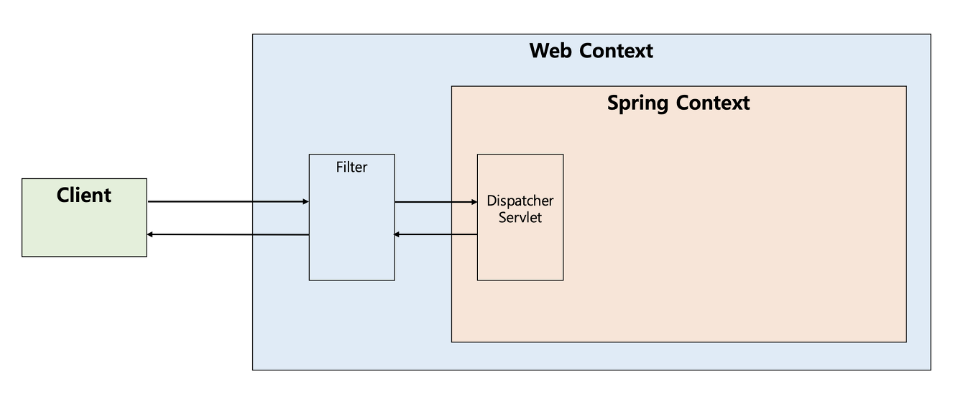
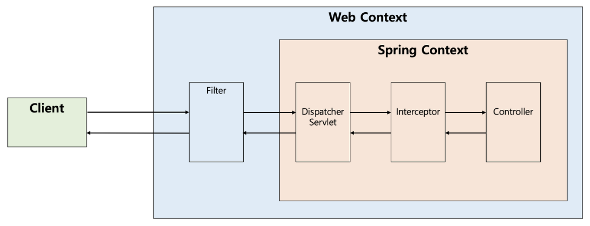

# :book: selab-study
## :pushpin: Topic. filter, interceptor, aop

### 필터 (Filter)
- `J2EE` 표준 스펙 기능
- `디스패처 서블릿(Dispatcher Servlet)`에 요청이 전달되기 전/후에 url 패턴에 맞는 모든 요청에 대해 부가작업을 처리할 수 있는 기능을 제공
- `디스패처 서블릿`은 스프링의 가장 앞단에 존재하는 프론트 컨트롤러이므로 필터는 `스프링 범위 밖에서 처리됨`
- 즉 스프링 컨테이너가 아닌 톰캣(tomcat)과 같은 웹 컨테이너에 의해 관리가 됨 
- 디스패처 서블릿 전/후에 처리함



### 필터(Filter) 메소드
- 필터를 추가하기 위해서는 javax.servlet의 Filter 인터페이스를 구현(implements)해야함
- 다음 3가지 메소드가 있음
    - init 메소드
    - doFilter 메소드
    - destroy 메소드
    
    
````java
public interface Filter {
    public default void init(FilterConfig filterConfig) throws ServletException {}
    
    public void doFilter(ServletRequest request, ServletResponse response,
        FilterChain chain) throws IOException, ServletException;
    
    public default void destroy() {}
}
````

### init 메서드
- init 메서드는 필터 객체를 초기화하고 서비스에 추가하기 위한 메서드
- 웹 컨테이너가 1회 init 메서드를 호출하여 필터 객체를 초기화하면 이후의 요청들은 doFilter를 통해 처리됨


### doFilter 메서드
- url-pattern에 맞는 모든 HTTP 요청이 디스패처 서블릿으로 전달되기 전에 웹 컨테이너에 의해 실행되는 메서드

### destroy 메서드
- 필터 객체를 서비스에서 제거하고 사용하는 자원을 반환하기 위한 메서드
- 웹 컨테이너에 의해 1번 호출되며 이후에는 이제 doFilter에 의해 처리되지 않음


### 인터셉터(Interceptor)
- `인터셉터`는 J2EE 표준 스펙인 필터와 달리 `Spring`이 제공하는 기술
- 디스패처 서블릿이 `컨트롤러를 호출하기 전과 후에 요청과 응답을 참조하거나 가공할 수 있는 기능`을 제공
- 즉 웹 컨테이너에서 동작하는 필터와 달리 인터셉터는 스프링 컨텍스트에서 동작



- 인터셉터를 추가하기 위해서는 org.springframework.web.servlet의 HandlerInterceptor 인터페이스를 구현해야 함
- 다음 3가지 메서드가 있음
    - preHandle 메서드
    - postHandle 메서드
    - afterCompletion 메서드
    
 ```java
public interface HandlerInterceptor {
    default boolean preHandle(HttpServletRequest request, httpServletResponse resp)
}
```