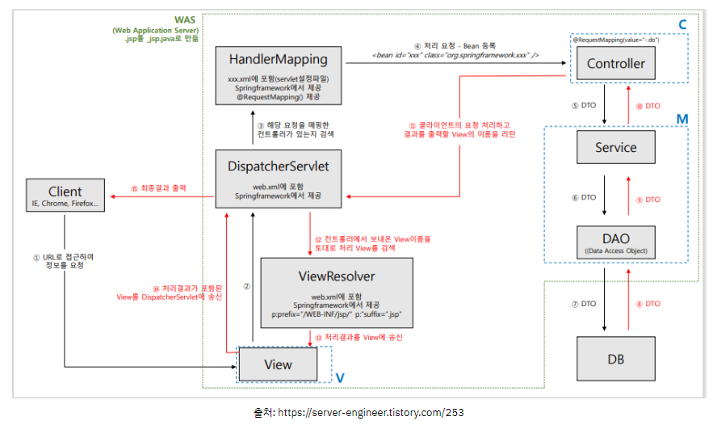
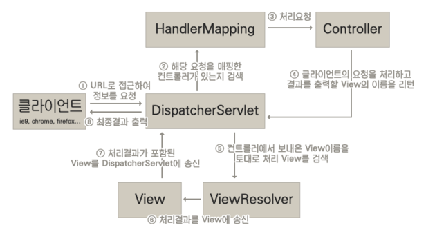

# :book: selab-study
## :pushpin: Topic. 스프링 동작 원리

### 스프링 동작 원리

▶ 스프링 프레임워크란?
- 자바 엔터프라이즈 개발을 편하게 해주는 경량급 오픈소스 애플리케이션 프레임워크

▶ 스프링 MVC 동작 순서

- Request -> DispatcherServlet(web.xml) -> HandlerMapping (servlet-context.xml) -> Controller (Controller -> Service -> DAO
-> DB -> DAO -> Service -> Controller) -> DispatcherServlet -> ViewResolver -> View -> Response

1. 클라이언트가 Request 요청을 하면 DispatchServlet이 요청을 가로챔. 이때 DispatcherServlet이 모든 요청을 가로채는건 아니고
web.xml에 <url-pattern>에 등록된 내용만 가로챈다.

2. DispatcherServlet이 가로챈 요청을 HandlerMapping에게 보내 해당 요청을 처리할 수 있는 Controller를 찾음

3. 실제 로직 처리 (Controller -> Service -> DAO -> DB -> DAO -> Service -> Controller)

4. 로직 처리 후 DispatcherServlet에 View 이름을 리턴함

5. ViewResolver(p:prefix="/WEB-INF/jsp/" p:"suffix=".jsp")를 통해 결과를 출력할 View 화면을 검색

6. 처리 결과를 View에 송신하고 View 화면을 최종 클라이언트에게 전송함 

### Spring MVC 구성 요소

▶ DispatcherServlet
- Front Controller를 담당
- 모든 HTTP 요청을 받아들여서 다른 객체들 사이의 흐름을 제어
- Spring MVC에서 제공하는 DispatcherServlet 클래스를 그대로 적용

▶ HandlerMapping
- 클라이언트의 요청을 바탕으로 어떤 Handler(Controller 메소드)를 실행할지 결정

▶ Model
- Controller에서 View로 넘겨줄 객체가 저장되는 곳
- Key(String)-Value Pair

▶ View Resolver 
- view name을 바탕으로 View 객체를 결정

▶ View
- 뷰에 화면 표시 처리를 의뢰

▶ 비즈니스 로직
- 비즈니스 로직을 실행

▶ Controller
- 클라이언트 요청에 맞는 presentation layer의 처리를 실행해야 한다.

▶ 뷰 (ex. JSP, Thymeleaf)
- 클라이언트에 화면을 표시한다.

 