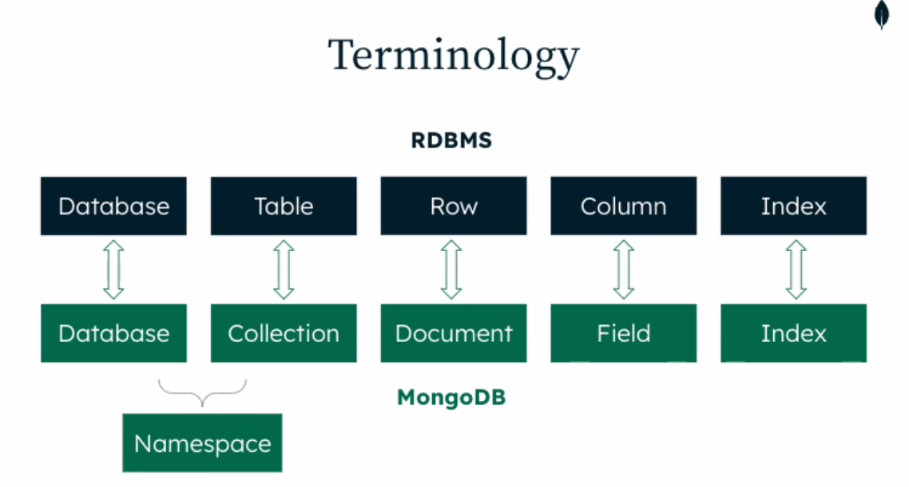

# :book: MongoDB
## :pushpin: Topic. MongoDB


### Why a new Database?
- Data: Volume, Velocity, Variety
- Time: Iterative, Agile, Short Cycles
- Risk: Always-on, Global, Scale
- Cost: Open Source, Cloud, Pay by Usage

### MongoDB
- Modern Document-model Database.
- Designed to back the modern-day business applications.
    - Developer and Operations oriented
    - Easy to scale horizontally
    - Business Critical
    - Lessons learned from 50 years of RDBMS


### Terminology




###  What is different in MongoDB
- You can Query with SQL but normally don't
    - Interaction is from code using Object-based APIs
    - Rather than constructing SQL Strings
    - SQL is used only to enable third-party BI tools.

- Documents/Objects are first-order data types
    - Data modeling/Schema design is done differently
    - Dynamic schemas can be used if desired
- The primary key field is always called _id


### MongoDB Database

- MongoDB's original product: A Document model
    - Similarities to RDBMS
    - BSON not JSON - Data stored as binary typed objects
    - Container types: Document and Array
    - Fewer 'tables', more denormalization
    - 3rd normal form isn't optimal in many cases.
    - Optimized for Availability, Usability, Scailing, and Speed
    - Idiomatic development drivers
   
    
### Atlas Managed Cluster
- MongoDB Atlas is MongoDB as a service.


### 저장 및 검색

- Single Document
    - Create: `insertOne(doc)`
    - Read: `findOne(query, projection)`
    - Update: `updateOne(query, change)`
    - Delete: `deleteOne(query)`
    
- Multiple Documents
    - Create: `insertMany([doc,doc,doc])`
    - Read: `find(query, projection)`
    - Update: `updateMany(query,change)`
    - Delete: `deleteMany(query)`
    
    
### Creating new documents - insertOnes()

- insertOnes() adds a document to a collection.
- Documents are essentially Objects.
- `_id` field must be unique, it will be added if not supplied

```text
MongoDB> db.customers.insertOne({
    _id : "yunyoung1819@gmail.com",
    name" "Robert Smith", orders: [], spend: 0,
    lastpurchase: null
})
```

### Add Multiple Documents - insertMany()
### Order of operations in insertMany()


### Reading documents

- findOne() retrieves a single document
- Empty object (or no object) matches everything.
- projection: choosing the fields to return
- Fetch multiple documents using find()


### Cursors
- Here, we store the result of find to a variable
- We then 


### Exercise
- Add two documents to a collection called diaries using the commands shown here.

```text
db.diaries.insertMany([
    {
        name: "dug", day: ISODate("2022-11-08"),
        txt: "went for a walk"
    },
    {
        name: "dug", day: ISODate("2022-11-09"),
        txt: "got a treat"
    }
])
```


