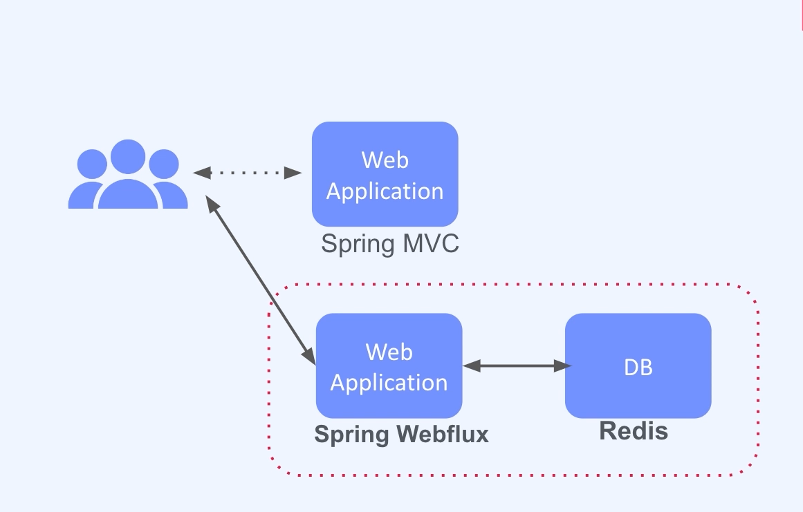

### :pushpin: 프로젝트 - 접속자 대기열 시스템

#### :seedling: 요구사항 분석

- 접속자 대기열 시스템
  - Ticketing
  - E-commerce marketing event
  - Course registration date

- 접속자 대기열 시스템
  - 예측 가능한 시기
  - 짧은 시간동안 대량의 트래픽 인입되는 상황
  - 특정 웹페이지에 대해 사용자 진입 수 제한
  - 대기 사용자에 대해 순차적 진입

#### :seedling: 아키텍처 설계 

