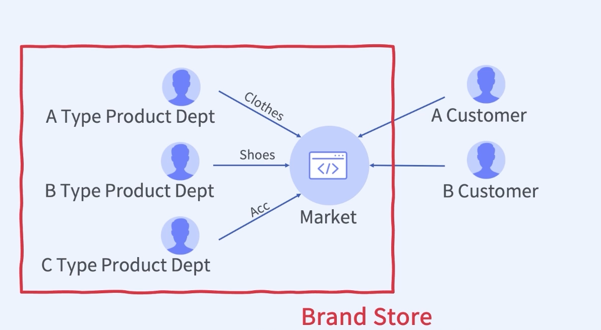
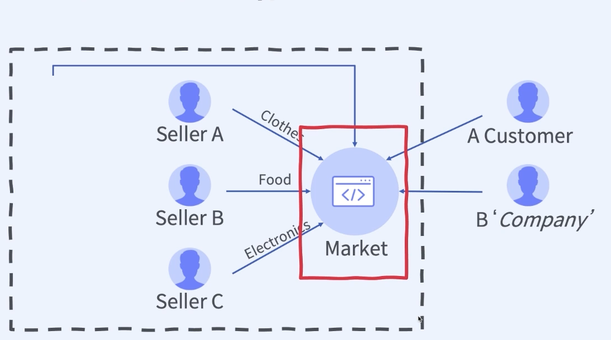

## :pushpin: 9개 프로젝트로 경험하는 대용량 트래픽 & 데이터 처리 초격차 패키지

### :seedling: 최저가 서비스와 상품 추천 서비스

### chapter 01. E-Commerce 비즈니스 타입과 환경
E-commerce: 전자상거래

E-commerce Business Type 1: nike

- Brand Store: 우리 제품을 어떻게 잘팔지?

E-commerce Business Type 2: coupang, naver

- Platform: Open Market
- Market을 어떻게 활성화시키지?

