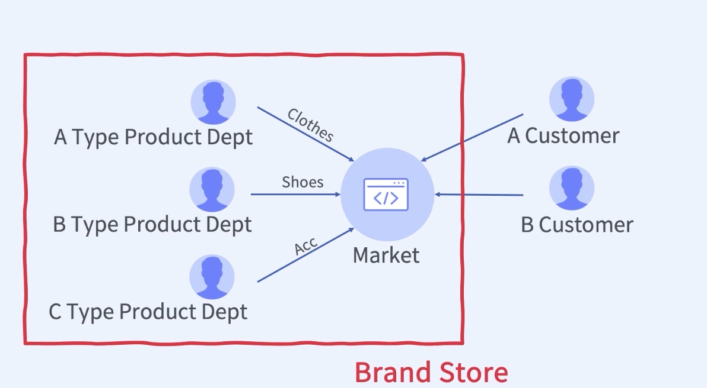
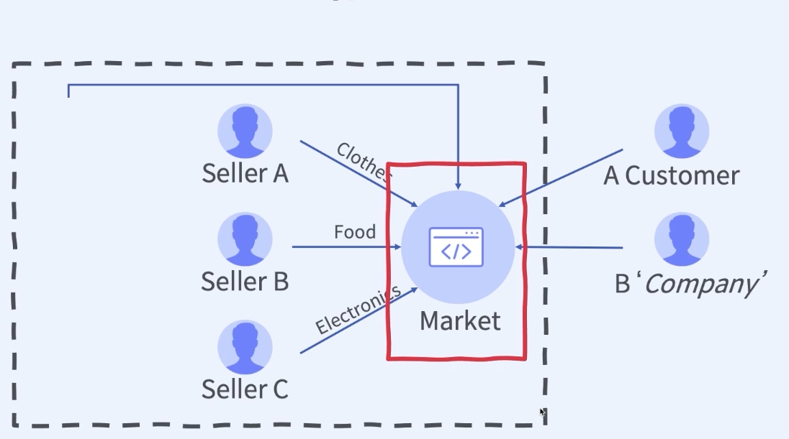

## :pushpin: 9개 프로젝트로 경험하는 대용량 트래픽 & 데이터 처리 초격차 패키지

### :seedling: 최저가 서비스와 상품 추천 서비스

### chapter 01. E-Commerce 비즈니스 타입과 환경
E-commerce: 전자상거래

E-commerce Business Type 1: nike

- Brand Store: 우리 제품을 어떻게 잘팔지?

E-commerce Business Type 2: coupang, naver

- Platform: Open Market
- Market을 어떻게 활성화시키지?

### E-commerce data
1. 상품의 개수 많음
- 상품 데이터가 많음, 같은 상품이라도 판매자에 따라 노출하고자 하는 정보가 다르기 때문에 각 별도로 존재한다.
2. 상품의 다양성
- 데이터의 cataloging, categorazing이 중요
3. 통제의 어려움 존재
- 일관된 상품의 정보를 요구하거나 Generation 해야한다.
4. 판매자의 정보 관리, 지표화
- policy, margin, quantity, quality
5. 즉각적
- 검색을 위한 keyword 완성, 검색한 keyword를 대상으로 추천, 연관 데이터를 반환
6. 이력 데이터가 엄청나게 많음 
7. 파레토 vs 롱테일