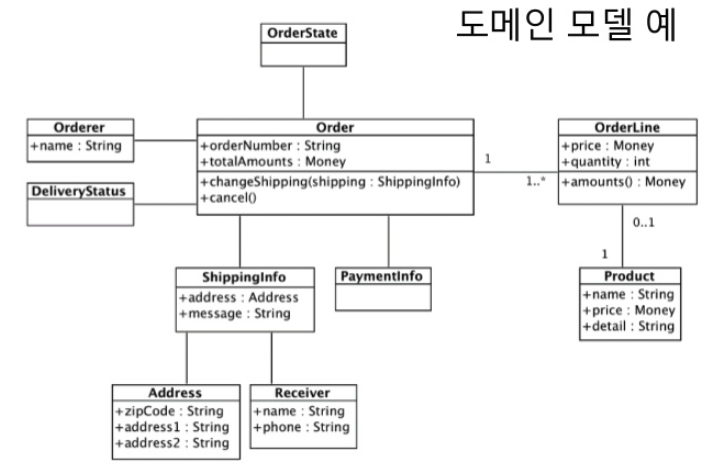

# :book: 도메인 주도 개발 시작하기 (Domain Driven Design)
## :pushpin: Chapter 1. 도메인 모델 시작하기

> 최범균님의 도메인 주도 개발 시작하기를 읽고 1장을 요약한 내용 입니다.
> 
### 도메인이란?
- 도메인(domain): 소프트웨어로 해결하고자 하는 문제 영역
- 한 도메인은 다시 하위 도메인으로 나눌 수 있다.
- 예를 들어 온라인 서점 도메인은 다음과 같이 몇 개의 하위 도메인으로 나눌 수 있다.
  - 회원
  - 혜택
  - 카탈로그
  - 주문
  - 결제
  - 배송
  - 리뷰
  - 정산
- 카탈로그 하위 도메인은 고객에게 구매할 수 있는 상품 목록을 제공
- 주문 하위 도메인은 고객의 주문을 처리함
- 한 하위 도메인은 다른 하위 도메인과 연동하여 완전한 기능을 제공함. 예를 들어 고객이 물건을 구매하면 주문, 결제, 배송, 혜택 하위 도메인의 기능이 엮이게 됨
- 도메인마다 고정된 하위 도메인이 존재하는 것은 아님
- 하위 도메인을 어떻게 구성할지 여부는 상황에 따라 달라짐

### 도메인 모델
- 도메인 모델: 특정 도메인을 개념적으로 표현한 것



```java
public class Order {
  private OrderState state;
  private ShippingInfo shippingInfo;

  public void changeShippingInfo(ShippingInfo newShippingInfo) {
    if (!state.isShippingChangeable()) {
      throw new IllegalStateException("can't change shipping in " + state);
    }
    this.shippingInfo = newShippingInfo;
  }

}
	
public enum OrderState {
	PAYMENT_WAITING {
		public booelan isShippingChangeable() {
			return true;
		}
	},
	PREPARING {
		public boolean isShippingChaneable() {
			return true;
		}
	},
  SHIPPED, DELIVERING, DELIVERY_COMPLETED;
  public boolean isShippingChangeable() {
		return false;
  }
}

```