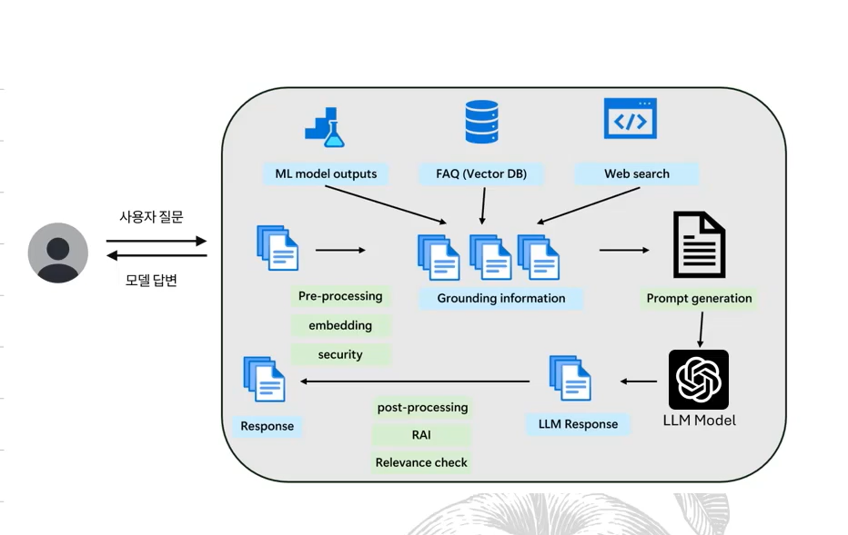

## :pushpin: Part 1. Overview

### 02. LLM overview
#### LLM
- LLM: 거대 언어 모델 (Large Language Model)

#### 짧은 역사
- 1950: Birth of AI
  - Alan Turing and the Turing Test
- 1970: AI Maturation
  - John McCarthy: LIST, Used for AI research 
- 1980: AI Winter
  - Low interest in AI 
- 2010: AGI - New Boom
  - Deep Blue
  - Speech recognition
  - Roomba
  - AI used by Twitter, FB, Netflix
  - Watson, Siri

#### 챗GPT 이전의 AI
생성형 AI 이전에도 AI에 엄청난 발전이 있었음

- 스팸 필터: Naive Bayes 모델
- 추천 시스템: 넷플릭스, 유튜브, 아마존과 같은 플랫폼들은 사용자의 이전 활동, 검색 기록 및 선호도를 분석하여 개인 맞춤형 추천을 제공하는데 AI를 사용
- 음성 인식: 시리, 구글 어시스턴트, 알렉사와 같은 음성 인식 기반의 개인 비서는 사용자의 명령을 이해하고 반응
- 자율 주행 자동차: 테슬라와 같은 회사에서 자율주행 기술 개발에 AI를 사용
- 의료 진단: 인공지능은 의료 이미지 분석(예: X-레이, MRI)을 통해 질병을 진단하고, 환자 데이터를 분석하여 치료 계획을 제안하는데 사용
- 금융 서비스: ai는 신용평가, 주식 시장 분석, 사기 탐지 등에 사용
- 광고: 페이스북, 인스타 등에서의 맞춤 광고
- 게임: ai는 게임 내 npc의 행동을 제어하거나 게임 플레이의 난이도를 조절 

#### 왜 언어 모델은 다른가
언어 모델
- 나의 의도를 이해하는 도구

#### 무엇이 바뀌는가 - 인간 명령어를 시스템어로 통역
가장 폭발적인 변화
- 인간적으로 이해하고 기계에게 명령 가능
- 현존하는 모든 기계를 사람처럼 부릴 수가 있음 

#### 지금 기업에서 가장 빨리 바뀌는 부분
모든 시스템의 UI
- 모든 시스템의 UI 방식이 바뀜 - 자연어
- UI 흐름 디자인이 단순해지고 복잡해짐

#### 모든 시스템의 자연어 처리
- 기계어 output - 로그에서 API call
- 자연어 input - 일처리 결과를 전화로

### 03. 단어, 컨셉 정리
- LLM (Large Language Model): 거대 언어 모델

- 

- Prompt Engineering
- AI
- Model / Foundation Model
- Pre-training
- Fine-tuning
- Deploy
- API / "serving" the model
- Post / pre processing
- Embedding
- LLM Ops (LLM Operations)

