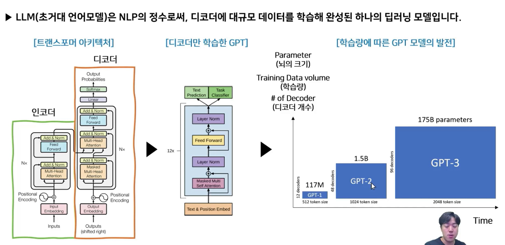
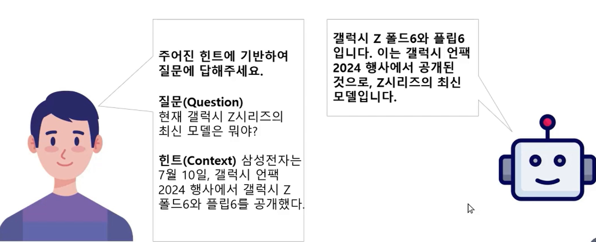

## :pushpin: RAG의 기초 이해

### RAG의 필요성 - LLM의 한계
- LLM(초거대 언어모델)은 NLP의 정수
- 디코더에 대규모 데이터를 학습해 완성된 하나의 딥러닝 모델
- 딥러닝 모델은 긴 길이의 문장을 입력받거나 출력하는데 어려움이 있음
- 또한 학습된 데이터 이외의 것을 만들어내는 것에 취약하다는 한계점이 있음
- 이는 곧 LLM의 한계로 작용한다.

### LLM의 한계
- 환각 현상
  - 딥러닝 모델은 학습된 데이터 이외의 정보에 취약
  - 오픈 AI의 최신 모델인 GPT-4o는 2023년 9월까지, Claude Sonnet 3.5는 2024년 4월까지의 데이터로 학습되어, 이 이후의 정보는 알지 못함
- 기억 불가
  - LLM은 사전학습 시에 받아들인 정보 외의 것은 배우지 못함
  - 따라서 오늘 나와 대화하고 있는 LLM은 어제 나와 대화했던 내용을 기억하지 못함
- 토큰 제한
  - LLM은 입력값의 길이가 길어지면 계산량이 크게 늘어나 대부분의 모델이 길이를 ㅈ한하고 있음
  - GPT-4o의 입력값 제한은 128,000토큰(문자 단위), Claude sonnet 3.5는 200,000 토큰

### RAG의 개념
- RAG(Retrieval Augmented Generation)은 LLM의 한계 중 환각 현상 해결에 특효약
- LLM에게 어떤 질문을 할 때, 이에 힌트가 될만한 문장을 함께 넣어줌으로써 환각 현상을 방지

