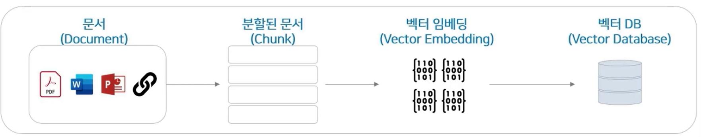
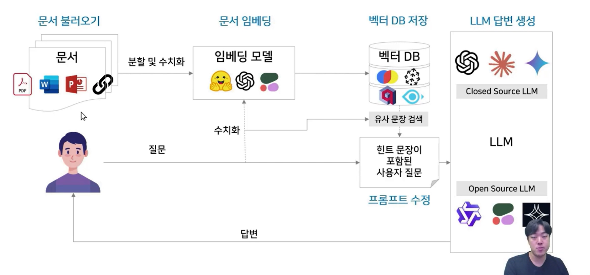

## :pushpin: RAG 파이프라인

### RAG 파이프라인
- RAG는 문서를 숫자로 변환하여 저장하는 인덱싱, 검색하고 답변을 생성하는 검색/생성 두가지 구조로 나뉘어 있다.

#### 데이터 인덱싱 
문서 (Document) -> 분할된 문서 (Chunk) -> 벡터 임베딩 (Vector Embedding) -> 벡터 DB (Vector DB)

#### 데이터 검색 및 생성
질문 (Query) -> 벡터 임베딩 (Vector Embedding) -> 벡터 DB 검색 (Retrieval) -> 유사 문장 출력 (Top-K chunks) -> LLM -> 답변 생성 (Answer)

#### RAG의 핵심 컴포넌트
- RAG를 구성하기 위해서는 문서 로더, 임베딩 모델, 벡터 DB, LLM 등 다양한 컴포넌트가 필요

#### 실제 적용 사례
- ChatGPT의 GPTs나 Claude의 Project와 같은 맞춤형 챗봇 문서 업로드 기능은 RAG 시스템이 기반

#### 도메인 특화 챗봇
- 도메인 지식이 중요한 법률, 금융, 의료 분야에서는 LLM의 부족한 전문 지식을 RAG로 보완