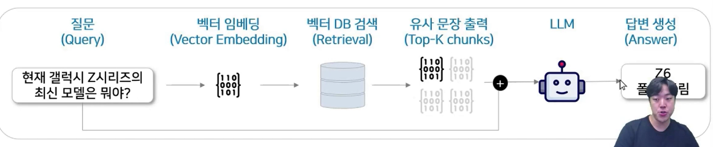
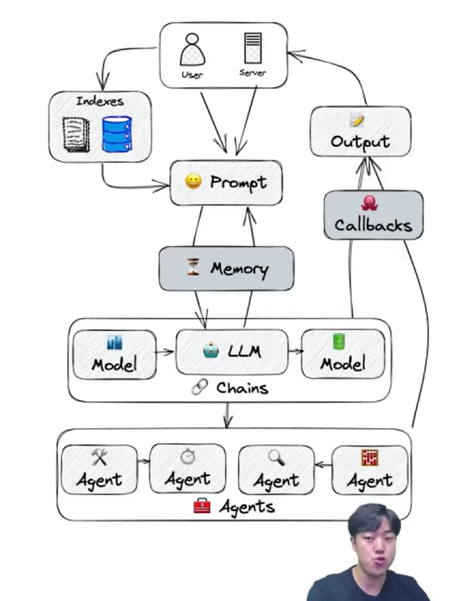
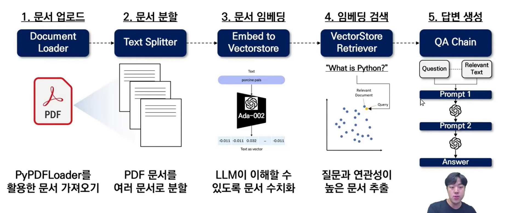

## :pushpin: Langchain의 이해와 활용

### Langchain 이란?
- Langchain은 LLM 어플리케이션을 보조하는 프레임워크
- 다양한 언어 모델과 도구를 쉽게 통합할 수 있으며, 유연성과 재사용성이 높아 많은 기업에서 활용

> LangChain is a framework for developing applications powered by large language models (LLMs). 
> 
> LangChain은 대규모 언어 모델(LLM)로 구동되는 애플리케이션을 개발하기 위한 프레임워크

### Langchain은 왜 필요할까?
- LLM의 발전과 함께 LLM에게 어떻게 질문하는가가 중요해짐
- 이를 프롬프트 엔지니어링이라고 함
- Langchain은 프롬프트 엔지니어링의 번거로움을 줄이기 위해 Prompt Template이라는 모듈을 지원
- RAG도 사용자의 질문에 힌트 문장을 합하여 LLM에게 전달하는 일종의 프롬프트 엔지니어링이다.



#### Langchain의 아키텍처
- Langchain은 프롬프트 엔지니어링뿐만 아니라 RAG, Agent 등의 시스템을 만들기 위한 모듈을 모두 갖춤

```text
Models: OpenAI, Google, Anthropic
Prompts: Prompt Template, Partial, ...,
Example Selectors: Dynamic Example Selector, ...
Document Loaders: PDF, PPTX, Word, ...
Text Splitters: Recursive, HTML, ...
Vector Stores: Chroma, FAISS, Qdrant, ...
Output Parsers: CSV, JSON, ...
Tools: Web Search, SQL, Pandas
```



- LLM: 초거대 언어모델로, Langchian의 엔진과 같은 역할 
  - 예시: GPT-4, Gemini, LlaMa, Solar, ...
- Prompts: 초거대 언어모델에게 지시하는 명령문 
  - 요소: Prompt Template, Chat Prompt Template, ...
- Index: LLM이 문서를 쉽게 탐색할 수 있도록 구조화
  - 요소: Document Loaders, Text Splitters, Vector Store, Retriever, ...
- Memory: 채팅 이력을 저장하여 이를 기반으로 대화 가능케 함
  - 예시: ConversationBufferMemory, Entity Memory, ...
- Chain: LLM 사슬을 형성하여 연속적인 LLM 호출
  - 예시: LLM Chain, QA Chain, Summarization Chain, ...
- Agents: LLM이 스스로 어떤 작업을 수행할지 계획하고 수행
  - 예시: Websearch Agent, SQL Agent, ...

### Langchain을 활용한 RAG 구축
- 어떤 형태의 문서이든지 Langchain을 활용해 RAG 시스템을 구축한다면, 아래 흐름을 따라 구축하게됨

1. 문서 업로드 
- Document Loader 
- PyPDFLoader를 활용한 문서 가져오기

2. 문서 분할
- Text Splitter
- PDF 문서를 여러 문서로 분할

3. 문서 임베딩
- Embed to VectorStore
- LLM이 이해할 수 있도록 문서 수치화

4. 임베딩 검색
- VectorStore Retriever
- 질문과 연관성이 높은 문서 추출

5. 답변 생성 
- QA Chain


