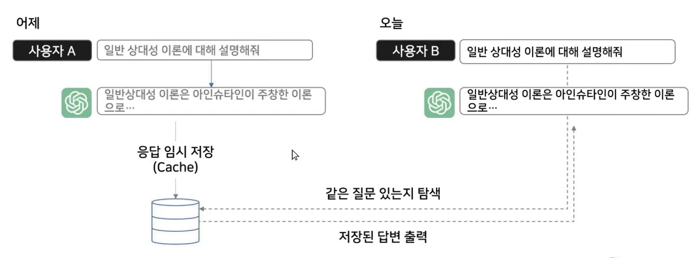

## :pushpin: Langchain의 이해와 활용

### RAG 구성 요소 실습 - Models
- Langchain을 활용하면 다양한 모델 API를 일관된 형식으로 불러올 수 있음
- 각 모델의 입력 형태 맞추어 호출
- 사용자의 질문 -> LangChain (Claude, GPT-4o, Gemini 1.5 Flash) -> LLM 답변

### 프롬프트 이해하기
- Langchain에서는 LLM에게 보내는 프롬프트의 형식을 크게 3가지로 구분함

### 프롬프트 종류
1. SystemMessage: LLM에게 역할을 부여하는 메시지
2. HumanMessage: LLM에게 전달하는 사용자의 메시지
3. AIMessage: LLM이 출력한 메시지

### LLM의 Temperature 이해하기
- LLM의 매개변수 중 하나인 Temperature는 답변의 일관성을 조정한다.

### LLM 답변 스트리밍하기
- Langchain을 활용하면 LLM의 답변을 ChatGPT처럼 스트리밍할 수 있음

### LLM 답변 캐싱하기
- LLM은 답변을 생성하는 데에 시간과 비용을 소모함
- 이를 효과적으로 관리하기 위해 같은 답은 캐싱하여 사용 

